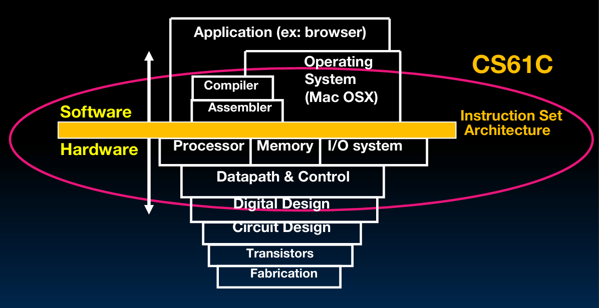
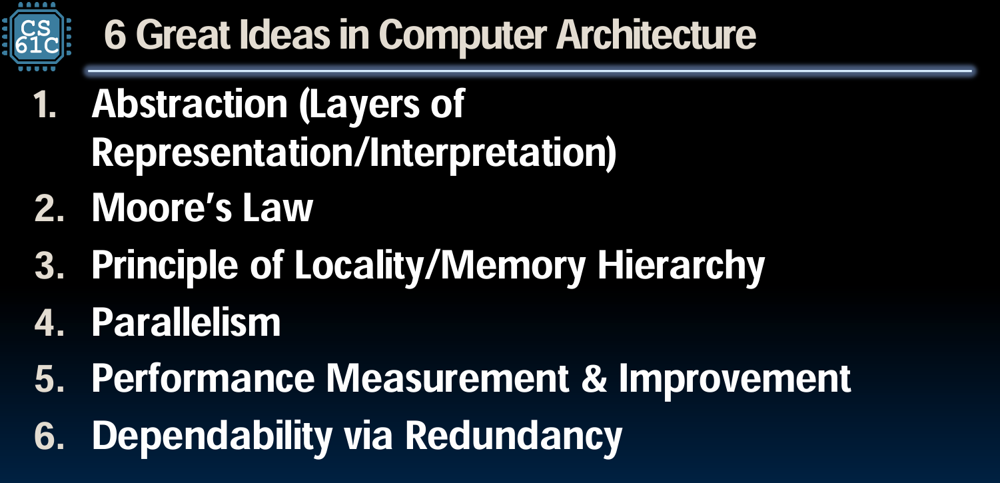
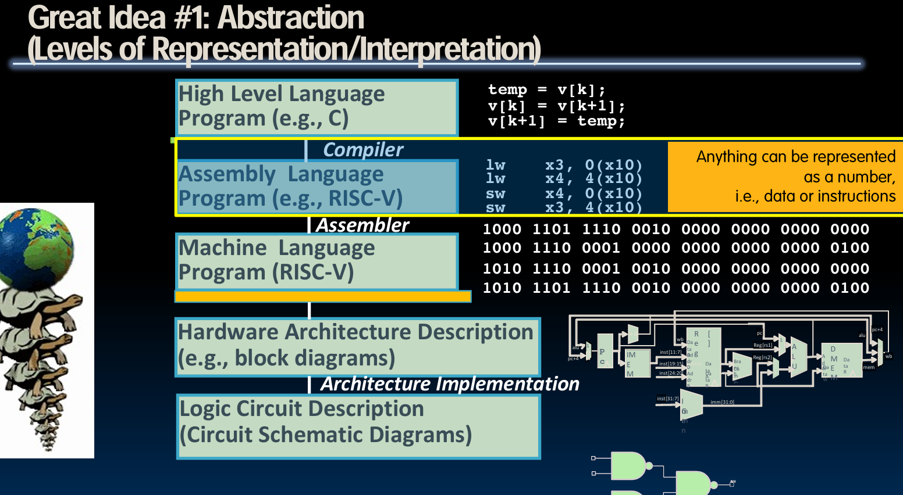
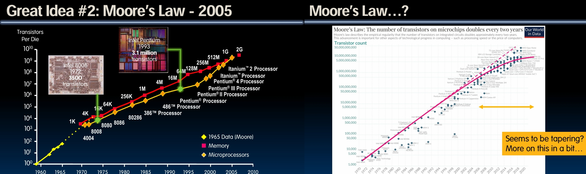
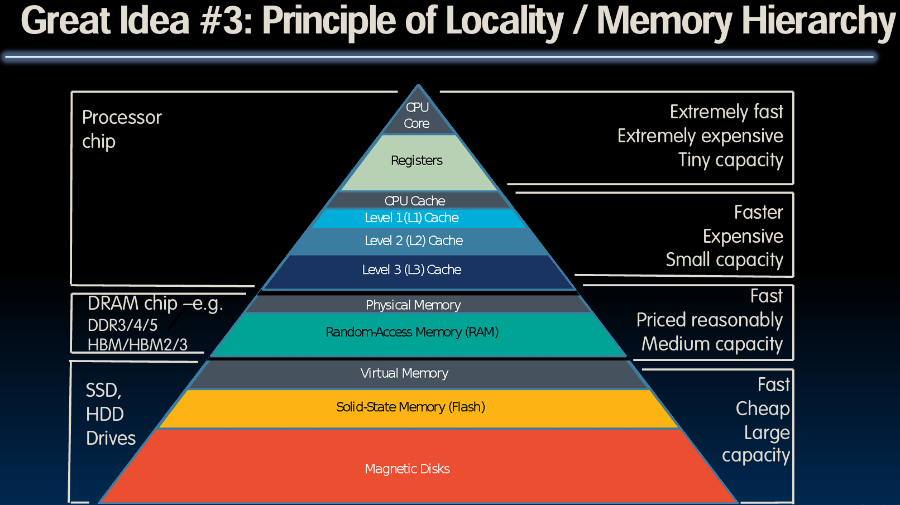
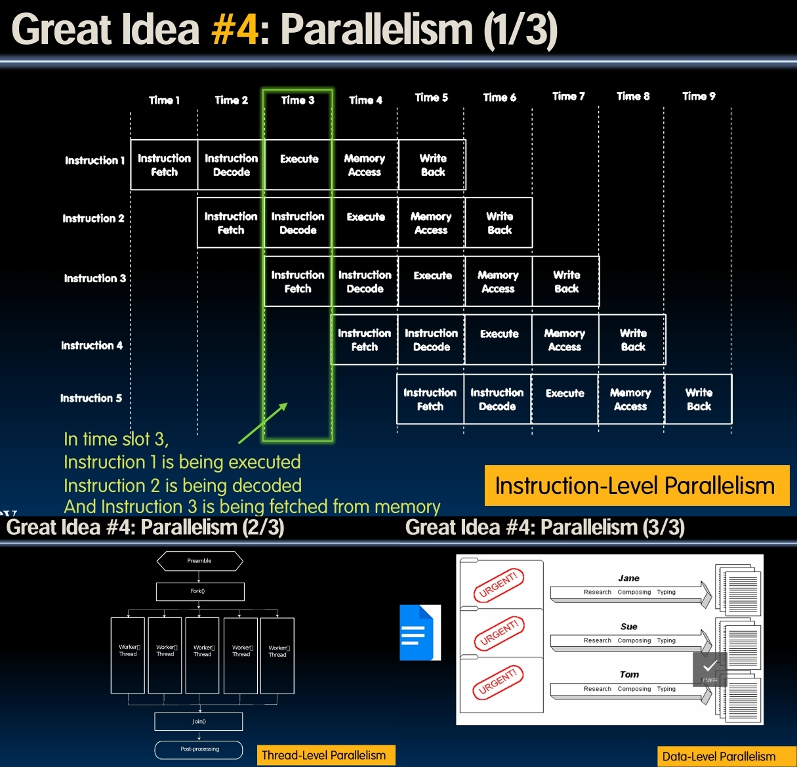

# 介绍

---

本节是 CS 61C L01 Intro.

Dan Garcia教授介绍了课程的主题——“计算机体系结构中的伟大思想”（Great Ideas in Computer Architecture），又称“机器结构”（Machine Structures）。他强调，尽管课程编号（CS 61C）可能让人误以为这是一门关于C语言的课程，实际上它更侧重于硬件与软件的交互接口，以及数据中心的运作方式。他说明了为什么选择C语言作为教学语言——因为它更接近硬件层面，有助于学生了解和操作硅基硬件。

Garcia教授还特别指出，这门课程不仅仅关注单个计算机的工作原理，而是要从更广阔的视角，探讨在云端和移动设备等多种环境中计算机如何运作。

---

## 计算机体系结构中的 6 个伟大构想

### No.1  抽象化（Abstraction ）

抽象化是计算机科学中一个核心概念，它允许我们在不考虑底层细节的情况下，处理复杂的问题和系统。在这门课程中，抽象化的讨论从Python编程语言的使用案例开始，强调了在编程中对函数、库、值等元素的命名和使用。这种抽象化的思维方式同样适用于硬件设计，例如，将所有信息编码为二进制数（0和1），这是数字逻辑和计算机硬件设计的基础。此外强调了从上至下连续抽象的重要性，即每一层的抽象都建立在下一层的抽象之上。

### No.2 摩尔定律（ Moore’s Law）

摩尔定律是由英特尔联合创始人戈登·摩尔在1965年提出的，预测了集成电路上可容纳的晶体管数量大约每两年翻一番。这个定律不仅预示了技术的进步速度，还影响了计算成本的下降和计算能力的提升，从而推动了计算机架构和技术创新的快速发展。在课程中，通过展示从1972年的Intel 8008芯片到后来的Pentium芯片晶体管数量的爆炸性增长，直观展示了摩尔定律的实际效果。同时，讨论了摩尔定律如何成为芯片制造商的一种自我实现的预言，即他们总是以这个定律为目标，不断推动技术的极限。

### No.3 局部性原理（Principle of Locality/Memory Hierarchy）

局部性原理是计算机科学中的一个重要概念，它解释了为什么近距离存取数据比远距离存取数据要快得多。这一原理通过一个与人类大脑回忆过程相类比的例子来阐述：从大脑快速回忆近期信息，到较慢地回想起较远处或久远的信息，类似于从计算机的寄存器（最快）、缓存（较快）、主内存（较慢）、硬盘（最慢）中取数据的过程。这种类比帮助学生理解，在设计计算机系统时如何通过优化数据存取的“局部性”来提升系统性能。这种层次化的存储系统确保了高效访问频繁使用的数据，同时在成本和性能之间取得平衡。

### No.4 并行性（Parallelism）

并行性涵盖了在计算过程中同时执行多个计算任务的能力，这是提高计算效率的关键方式之一。在讲座中介绍了三种类型的并行性：

1. **指令级并行性（Instruction Level Parallelism, ILP）**：这种并行性发生在CPU内部，多条指令在同一时间周期内在不同的处理阶段同时进行。

2. **线程级并行性（Thread Level Parallelism, TLP）**：在这种并行性中，不同的线程可以同时执行，各自处理计算任务的一部分，最后汇总结果。

3. **数据级并行性（Data Level Parallelism, DLP）**：涉及到数据被分割处理，每部分数据由不同的处理单元并行处理，最终结果被合并。

这些并行处理方式大幅度提高了处理效率，但也受到Amdahl定律的限制，该定律指出，一个程序的加速比最终受限于其必须顺序执行的部分。即使增加处理单元数量，总体性能提升也受到顺序执行代码部分的制约。

### No.5 性能测量与提升（Performance Measurement and Improvement）

性能测量与提升是计算机体系结构中关键的一环，涉及对系统性能的优化。这一思想不仅关注使系统运行更快或更高效，而且强调对“快速”和“高效”这些概念进行精确测量和持续改进。在这方面，延迟（latency）和吞吐量（throughput）是两个主要的衡量指标：

- **延迟** 是指完成一个任务所需的总时间。
- **吞吐量** 是系统在单位时间内处理数据的能力。

通过优化这些指标，可以显著提高系统的性能和响应速度，使得计算机能够更加高效地处理更多的任务。

### No.6 通过冗余提高可靠性（Dependability via Redundancy）

冗余是确保系统可靠性的重要手段，特别是在数据存储和处理过程中。冗余意味着复制关键组件或数据，以防止故障或数据丢失对系统造成严重影响。例如，数据中心常用的冗余技术包括：

- **RAID（冗余阵列独立磁盘）**：通过在多个硬盘中存储数据的副本或片段，即使一部分硬盘失败，也能保证数据的完整性和可用性。
- **错误更正码（Error Correcting Codes, ECC）**：通过在数据中添加额外的信息位来检测和修正错误，提高数据传输或存储过程的准确性。

这种冗余策略不仅应用于硬件，还广泛应用于软件和网络架构中，以确保即使部分系统组件失败，整个系统也可以继续运行，从而大大提高了系统的整体可靠性。

---

## Why is computer architecture exciting today?

这里提出了几个关键的观点和趋势，解释了计算机体系结构领域的动态性和持续的创新需求。

### 设备与应用的多样化

随着时间的推移，从1970年的大型科学计算机到个人电脑，再到现在的智能手机和云计算，计算设备及其应用场景持续增长和多样化。这不仅包括常规的计算任务，还扩展到了健康监测、虚拟现实（VR）、增强现实（AR）和各种娱乐形式。每一种新技术和应用都对计算机体系结构提出了新的需求和挑战。

### 摩尔定律的极限与域特定计算的兴起

讲座提到，虽然摩尔定律预测的晶体管密度增长开始放缓，但计算机体系结构的发展并未停滞。为了继续提高性能，设计师们不再仅仅依赖于晶体管数量的增加，而是转向增加更多核心（core）和并行处理能力，以及专门针对特定任务优化的域特定架构。

例如，谷歌的张量处理单元（TPU）就是一个专为机器学习设计的芯片，展示了域特定计算在实际应用中的重要性和有效性。这种设计哲学的转变，从一种通用的“一刀切”架构，到为特定领域量身定做的解决方案，标志着计算机体系结构领域的一个重大转变。

### 教育和研究的前沿

加州大学伯克利分校在这些变革中扮演了重要角色，不仅在教育未来的计算机科学家方面处于前沿，还在推动计算机体系结构创新方面发挥了领导作用。通过提供涉及这些前沿技术和概念的课程，伯克利大学确保其学生能够在这一不断进化的领域中保持领先。

总之，计算机体系结构的兴奋之处在于它的不断进化和对新技术的适应性。随着新的计算需求的出现，体系结构的设计也在不断地适应和创新，从而支持更广泛的应用和更高效的性能。这一领域的动态变化和技术的深度涉猎使得计算机体系结构成为一个持续吸引人才和创新思维的领域。

---

后面是伯克利大学课程的具体安排和教学资源以及一系列学术和行政策略。
