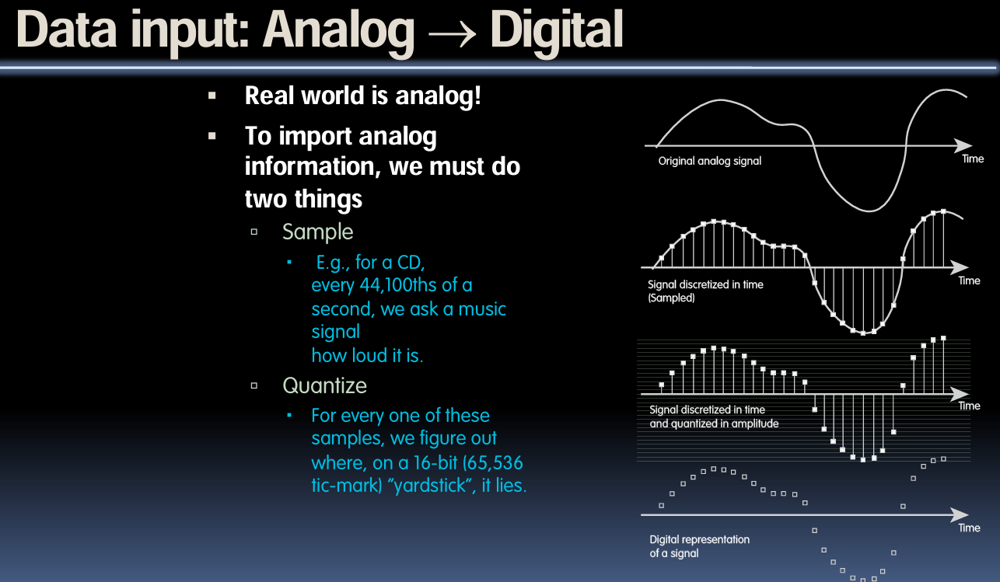
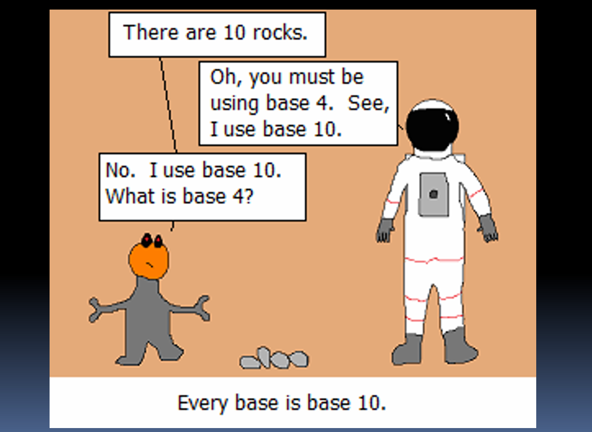
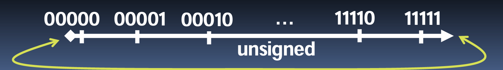
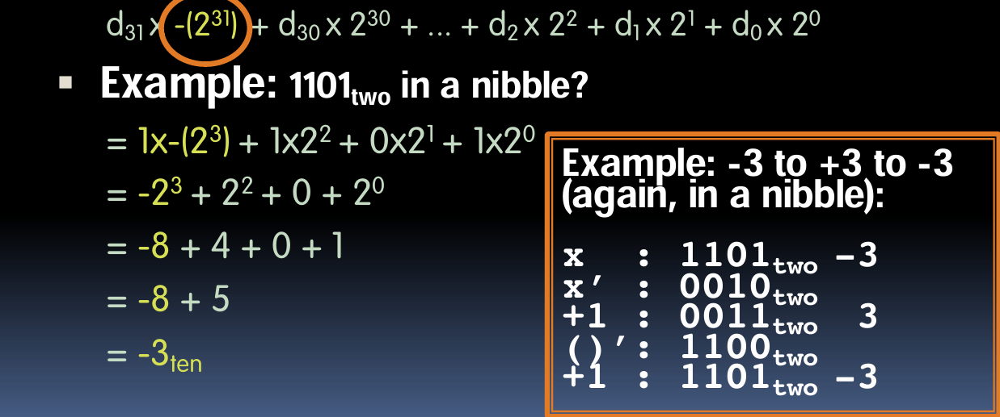
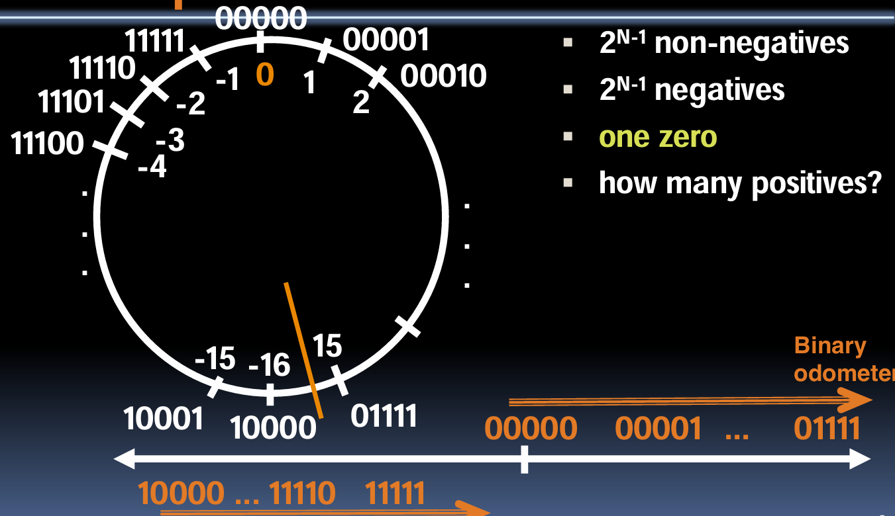
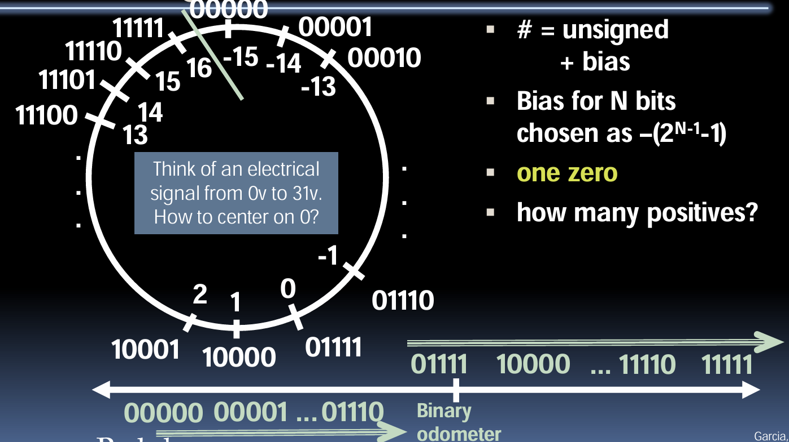

# 数字表示

---

本节是 CS 61C L02 Number Representation.

这一讲座主题为数字表示，一开始讲解了模拟信号到数字信号的转换过程。首先是采样，即在规律的时间间隔内测量信号的强度或幅度，就像询问“你有多大声”来不断获取信号的瞬时值。其次是量化，指的是将采样得到的连续的模拟值转换为离散的数字值。量化过程中，需要使用一定数量的刻度来测量每个采样点的值，将其转换为数字形式存储在计算机中。

课程还讨论了数字数据的本质，指出数字数据可以是计算机内生成的，不必来源于对现实世界的采样。例如，程序员或艺术家可以在计算机中创造出美丽的3D图形，这些都是直接以数字形式存在的。

进一步，教授解释了数字数据可以表示的各种内容，如字符、颜色和情绪等。强调了位（bit）的概念，即计算机中用于存储和处理信息的基本单位。每个位可以是0或1，通过组合位，可以表示更多的信息，例如5位可以有32种不同的设置，足以编码26个字母。



###  Bits can represent anything!!

这部分强调了二进制位（bits）可以表示各种各样的事物。它概述了以下几点：

1. 字符：例如，26个字母可以用5个比特位来表示，因为2的5次方等于32，这足以覆盖所有字母。如果要表示大小写字母和标点符号，则可能需要7个比特位（在8比特位的ASCII码中）。

2. 逻辑值：在二进制中，0可以表示假（False），1可以表示真（True）。

3. 颜色：例如，红色可以用“00”（红），绿色可以用“01”（绿），蓝色可以用“11”（蓝）来表示。

4. 地址/指令等：在计算机中，比特位也用于表示内存地址、CPU指令等。

5. 需要记忆的关键点：N个比特位最多可以表示2的N次方个不同的事物。

### 表示π（圆周率）需要多少比特位？

A. 1个比特位

B. 9个比特位（因为π约等于3.14，所以用二进制的“011”表示“3”和“001 100”表示“.14”）

C. 64个比特位（因为Mac电脑是64位的机器）

D. 机器所有的每一个比特位

E. 无限个比特位

这部分关于用表示π（圆周率）的部分，实际上是一个关于编码和信息传输的哲学思考。在这个例子中，教授通过使用手指的二进制表示方法，向学生传达了关于圆周率的概念。他提出，如果双方已经默认了基础单位是π，那么只需要用一个二进制位就能传达关于π的整数倍数信息。

如果使用两个手指来代表四种可能的状态（00, 01, 10, 11），这些状态分别对应了0π, 1π, 2π, 3π。因此，在这个框架下，π的概念其实是“免费”附带的，而不需要用任何额外的位来表示。这种方式说明只需很少的信息（在这个案例中是两位二进制数），就可以在已有共识的基础上高效地传达复杂的信息。

这种方法展示了如何在特定的沟通上下文中，利用预设的信息（如π）来减少需要传递的数据量。这不仅是关于数学和编码的巧妙示例，也是对信息压缩和传输效率的一种探索。

## 二进制、十进制、十六进制

### 数字与数码（Numeral vs Number）

- 数码（Numeral）：代表数字的符号或名称，例如：4、four、cuatro、IV、....。
- 数字（Number）：我们脑海中的“想法”，只有一个，例如：“4”的概念。

这部分强调了数字和表示数字的数码之间的区别。数码是数字的符号表示，而数字是抽象的概念。此处的“抽象线”用于区分具象的数码和抽象的数字概念。

### 十进制（Base 10）数字，十进制

- 数码：0, 1, 2, 3, 4, 5, 6, 7, 8, 9
- 举例：3271可以表示为\(3271_{10}\)，也可以通过位置值分解表示为\\( (3 \times 10^3) + (2 \times 10^2) + (7 \times 10^1) + (1 \times 10^0) \\)。

这部分解释了十进制系统是如何工作的，其中每个位置的数码都是10的幂次方的乘积。

### 二进制（Base 2）数字，二进制转换为十进制

- 数码：0, 1（二进制数码 -> 比特）
- 举例：二进制中的“1101”（也写作'0b1101'）可以转换为十进制的13，通过位置值分解表示为\\( (1 \times 2^3) + (1 \times 2^2) + (0 \times 2^1) + (1 \times 2^0) \\)，即\\( 8 + 4 + 0 + 1 = 13 \\)。

这部分展示了如何将二进制数转换为十进制数，每个位置的数码是2的幂次方的乘积。

### 十六进制（Base 16）数字，十六进制转换为十进制

数字：0, 1, 2, 3, 4, 5, 6, 7, 8, 9, A, B, C, D, E, F
10,11,12,13,14,15

例子："A5"在十六进制中？

0xA5 = A5₁₆ = (10x16¹) + (5x16⁰)
      = 160 + 5
      = 165

十六进制是一种基数为16的计数系统，使用数字0-9和字母A-F来表示数值，其中A-F分别代表10-15。例子中，"A5"是一个十六进制数，将其转换为十进制数时，A代表10，因此用10乘以16的一次方，加上5乘以16的零次方，得出165作为结果。

### 每个基数都是 10.....

“有10个石头。”
“哦，你一定是使用4进制。我使用10进制。”
“不，我使用10进制。4进制是什么？”



这部分通过一幅幽默的漫画来解释数制的相对性。漫画中有两个角色，一个外星人和一个宇航员。外星人声称有10块石头，而宇航员误以为外星人是使用4进制，因为在10进制中10块石头就是10。这里的笑话在于，不同的数制中"10"代表的数量可能不同，但每个数制中的居民都认为他们使用的是“10进制”。

### 从十进制转换为二进制

例如，13转换为二进制？

从列开始

| **13** | 8    | 4    | 2    | 1    |
| ------ | ---- | ---- | ---- | ---- |
|        | 1    | 1    | 0    | 1    |

从左到右，列是否小于或等于数n？

如果是，将该列数量能放入n中的次数放入，从n中减去该列数量那么多次，继续进行。
如果不是，放0并继续进行。（并在0时停止）

这部分说明了如何将十进制数转换成二进制数。以13为例，它从高位到低位检查每个2的幂次是否可以从13中减去。从2的三次方开始，13大于8，所以在8的位置上放1，并从13中减去8，得到5；接下来，5小于4，所以在4的位置上放0；5大于2，所以在2的位置上放1，并从5中减去2，得到3；最后，3大于1，所以在1的位置上放1。这样就得到了13的二进制表示：1101。

### 从十进制转换为十六进制

例如，165转换为十六进制？

从列开始

| 165  | 4096 | 256  | 16   | 1    |
| ---- | ---- | ---- | ---- | ---- |
|      | 0    | 0    | A    | 5    |

从左到右，列是否小于或等于数n？

如果是，将该列数量能放入n中的次数放入，从n中减去该列数量那么多次，继续进行。
如果不是，放0并继续进行。（并在0时停止）

这部分讲述了如何将十进制数转换为十六进制数。例子中用的是165。过程是从最高位的十六进制位开始，检查该位的十六进制权值是否小于或等于当前的数。在这个例子中，165小于4096和256，所以这两个位置上是0。然后，165能被16整除10次，余5，所以在16的位置上是A（代表10），在1的位置上是5。因此，165的十六进制表示为A5。

### 转换二进制<=>十六进制

二进制转十六进制？简单！
* 始终用0左填充以制作完整的4位值，然后查找对应值。
* 例如，Ob11110转十六进制？
  * Ob11110 => Ob00011110
  * 然后查找：0x1E

十六进制转二进制？简单！
* 只需查找对应值，去掉前导的0。
  * 0x1E=>0b00011110=>0b11110

```
D  H  B
00 0  0000
01 1  0001
02 2  0010
03 3  0011
04 4  0100
05 5  0101
06 6  0110
07 7  0111
08 8  1000
09 9  1001
0A A  1010
0B B  1011
0C C  1100
0D D  1101
0E E  1110
0F F  1111
```

二进制数和十六进制数之间的转换非常简单，因为十六进制的每一位直接对应二进制的四位。例如，二进制的`11110`首先被左填充为`00011110`，根据上表，这可以直接转换为十六进制的`1E`。反过来，将十六进制的`1E`转换为二进制也是通过查找表来完成的，结果是`11110`。

### 十进制vs十六进制vs二进制

- 4位：
  - 1个“Nibble”
  - 1个十六进制数字 = 16件事物
- 8位：
  - 1个“Byte”
  - 2个十六进制数字 = 256件事物
  - 颜色通常是
    - 0-255 <span style="color:red;">红色</span>，
    - 0-255 <span style="color:green;">绿色</span>，
    - 0-255 <span style="color:blue;">蓝色</span>。
    - #<span style="color:red;">D0</span><span style="color:green;">36</span><span style="color:blue;">7F</span> => 

这部分解释了二进制、十进制和十六进制之间的转换关系，并指出了它们在计算机科学和编程中的应用，如颜色代码表示。一个字节包含8位，可以表示256种不同的值，这在颜色编码中非常有用，例如，一个十六进制的颜色代码#D0367F。

### 我们使用哪种进制？

- 十进制：非常适合人类，尤其是在进行算术运算时。
- 十六进制：如果人类观察长字符串的二进制数字，将其转换为十六进制并查看4位/符号会更容易。
  - 纸上算术非常糟糕。
- 二进制：电脑所使用的；
  - 你会学到电脑是如何进行加、减、乘、除运算的。
  - 对于电脑来说，数字永远是二进制的。
  - 无论数字如何写：
    - 32₁₀ = 32₁₆ = 0x20 = 100000₂ = 0b100000
  - 使用下标“ten”、“hex”、“two”在书本、幻灯片中可能会混淆。

不同进制在不同的用途中具有不同的优势。十进制适合人类日常使用，十六进制则在处理长的二进制数时更为高效。二进制是计算机的语言，在学习计算机科学时，理解不同的数制以及它们之间的转换非常重要。

### 电脑也知道...

```c
#include <stdio.h>

int main() {
    const int N = 1234;
    
    printf("Decimal: %d\n",N);
    printf("Hex: %x\n",N);
    printf("Octal: %o\n",N);

    printf("Literals (not supported by all compilers):\n");
    printf("0x4d2           = %d (hex)\n", 0x4d2);
    printf("0b10011010010   = %d (binary)\n", 0b10011010010);
    printf("02322           = %d (octal, prefix 0 = zero)\n", 0x4d2);
    
    return 0;
}

Output：
Decimal: 1234
Hex: 	 4d2
Octal: 	 2322
Literals (not supported by all compilers):
0x4d2          = 1234 hex
0b10011010010  = 1234 (binary)
02322          = 1234 (octal, prefix 0 = zero)
```

这部分展示了如何在C语言中表示不同进制的数值，以及如何打印它们。它还提到了一些字面量表示法可能不被所有编译器支持。这为学习者提供了一个清晰的框架来理解和应用在编程语言中的不同数制。

## 数字表示

### 如何使用数字表示？

- 使用数字表示要做什么？
  - 加它们
  - 减它们
  - 乘它们
  - 除它们
  - 比较它们

- 例子：10 + 7 = 17
  - ...二进制加法如此简单，我们可以构建电路来实现！
  - 减法就像你在十进制中做的那样
  - 比较：你如何判断 X > Y？

在数字的二进制表示中，我们可以执行基本的算术操作，如加法、减法、乘法和除法。举个例子，数字10（二进制1010）和7（二进制0111）相加等于17（二进制10001），这可以通过简单的位对位加法来实现。这种基础的操作使得计算机能够进行更复杂的计算。除此之外，我们还可以比较两个数字的大小，这在排序和决策制作过程中非常重要。

### 如何表示负数？

- 目前为止，都是**无符号**数字
- 显然的解决方案：定义最左边的位为符号位！
  - 0 表示正，1 表示负 …—剩下的位表示数值
- 这种表示称为**符号和大小**

在计算机科学中，表示数字时常常需要考虑正负号。一种常见的方法是使用最高位作为符号位，0代表正数，1代表负数。这种方法称为“符号和大小”表示法。例如，最高位为1的二进制数在这种表示法下是负数。这允许计算机理解和操作正负数值，尽管这样的表示法在数值溢出和算术运算时可能会增加一些复杂性。

### 如果太大？

- 二进制位模式只是数字的**代表**。抽象！
  - 严格来说它们被称为“数码”。
- 数码实际上有无限个数位
  - 几乎所有都是相同的（0…0 或 1…1），除了一些最右边的数位
- 通常不显示前导零
- 如果加法（或 -、*、/）的结果不能被这些最右边的硬件位表示，我们说**溢出**发生了



在数字表示中，二进制位模式并不直接等同于它们所代表的数字，而是作为数字的抽象表达。在计算机科学中，数字是以二进制形式表达的，这称为数码。数码可以有无限长的位数，尽管我们通常只看到数值的有效位。当进行数值运算时，如果结果超出了硬件所能表示的位数范围，就会发生溢出。溢出是计算机科学中常见的问题，需要特别注意处理，以避免错误和不精确的计算结果。

例如，在一个5位的无符号数表示中，最大能表示的数字是`11111`（二进制），或者十进制的31。如果我们试图表示一个更大的数字，它将不能适当地表示，并且结果将不准确。溢出在计算时需要特别留意，以确保数值的准确性。

### 符号和大小表示法的不足之处？

- 算术电路复杂
  - 特殊步骤取决于符号是否相同
- 也有两个零
  - 0x00000000 = +0_{10}
  - 0x80000000 = -0_{10}
  - 两个零对编程意味着什么？
- 增加“二进制里程表”时，有时增加值，有时减少！
- 因此符号和大小表示法只在信号处理器中使用

#### 扩展解释
符号和大小表示法有一些不足之处。首先，算术运算相对复杂，因为需要额外的步骤来处理不同符号的数值。此外，这种表示法存在两个表示零的数值：+0和-0，这可能会在程序设计中引起混淆。再有，增加或减少二进制数时可能导致不直观的结果，例如，有时候增加二进制表示的数值实际上会导致数值减少。由于这些不足，符号和大小表示法通常只在信号处理器等特定应用中使用。

### 另一种尝试：比特位的补码

- 例子:

  -   7_10 = 00111_2
  -  -7_10 = 11000_2

- 称为**一的补码**

- 注意：正数前导为0，负数前导为1

  | Binary odometer    | 0        | 正                  |
  | ------------------ | -------- | ------------------- |
  | 负                 | 00000  → | 00001 ... 01111     |
  | 10000 ... 11110  → | 11111    | Ain’t no free lunch |

- -00000 是什么？ 答案：11111

- N位中有多少正数？

- N位中有多少负数？

一的补码通过反转二进制数中的每一位来表示负数，正数的前导位为0，负数的前导位为1。例如，十进制数7的二进制表示为00111，而-7则表示为11000。然而，这样的表示法导致有两个零的表示（00000和11111）。此外，一的补码在确定N位二进制可以表示的正数和负数数量时可能会导致一些混淆。

### 一的补码的不足之处？

- 算术运算仍然有点复杂
- 依然有两个零
  - 0x00000000 = +0_{10}
  - 0xFFFFFFFF = -0_{10}
- 虽然一的补码在一些计算机产品上使用了一段时间，但最终被放弃了，因为找到了更好的解决方案。

一的补码在表示负数时也有其局限性。它简化了负数的表示，但仍然存在算术运算复杂和有两个零（正零和负零）的问题。这导致在执行运算和比较时可能出现混淆。由于这些原因，计算机科学界最终发展出了更有效的数值表示方法，并逐渐放弃使用一的补码。


## 二的补码和偏移编码

二的补码是一种数值表示法，用于在计算机中表示整数。它解决了一的补码存在的问题，如两个零的表示和算术运算的复杂性。在二的补码表示法中，负数是通过将数值的二进制表示取反加一来得到的。这种表示法成为了现代计算机系统中表示有符号整数的标准。偏移编码是另一种编码形式，它在表示二进制数时加入一个偏移量，常用于特定类型的数字处理。

### 标准负数表示法

- 问题在于负数映射与正数映射“重叠”（两个0）。想要将负数映射向左移动一位。
  - 解决方案！对于负数，先取补码，然后再加1到结果上。
- 如同符号与大小表示法和一的补码一样，前导0表示正数，前导1表示负数
  - 00000...xxx 是 ≥ 0, 11111...xxx 是 < 0
  - 除了 1...1111 是 -1, 不是 -0（如符号与大小表示法中的情况）
- 这种表示法是二的补码
  - 这使得硬件简化！
  - （C's int, C18's intN_t, 又称为 "有符号整数"）

二的补码是一种标准的计算机数值表示法，主要解决了一的补码表示法中的问题，例如，正负数的前导位重叠和存在两个零的问题。在二的补码中，负数表示为其正数相反数的补码加1。这种方法简化了包括算术和逻辑运算在内的计算机硬件的设计与实现。例如，在C语言中，整数类型（int）使用二的补码来表示有符号的整数。

### 二的补码公式

- 可以用位值乘以2的幂来表示正数和负数：
  - d_{n-1} * (-2^{n-1}) + d_{n-2} * 2^{n-2} + ... + d_2 * 2^2 + d_1 * 2^1 + d_0 * 2^0
- 例子：在一个半字节中的 -3 是如何表示的？
  - = 1x(-2^3) + 1x2^2 + 0x2^1 + 1x2^0
  - = -2^3 + 2^2 + 0 + 2^0
  - = -8 + 4 + 0 + 1
  - = -8 + 5
  - = -3_{10}



二的补码公式允许在有限的位数内准确地表示正数和负数。在这个例子中，我们看到了如何在4位二进制数（一个半字节）中表示十进制数-3。最高位的1表示负号，并且是2的3次方的负数。然后，每个后续位的值是2的相应次方乘以该位的值。最终结果显示了，尽管二进制表示似乎复杂，但通过这种方法可以精确地进行数值的算术计算。

### 二的补码数“线”：N = 5

- 2^{N-1} 非负数
- 2^{N-1} 负数
- 一个零
- 有多少正数？

二的补码数“线”是指以环形方式排列的二进制数，可以用于解释在有限的N位中能够表示的正数和负数的数量。当N=5时，我们可以表示2^{N-1}（或者16）个非负数和同样多的负数。在这个环中，有一个零，其余的位分别表示从-16（10000）到15（01111）的数。这种环形的表示法有助于理解二的补码如何能够在有限位数中循环表示数字，也展示了正数和负数之间的对称性。



### 偏移编码：N = 5（偏移量 = -15）

- \# = 无符号 + 偏差
- 对于N位的偏差选择为 -(2^{N-1})
- 一个零
- 有多少正数？

想象一下一个电子信号从0v到3v。如何以0为中心？

偏移编码是一种数字表示方法，它通过给无符号数加上一个偏差（或偏移量）来表示负数。在这种情况下，N位二进制数的偏差被设定为 -(2^{N-1})，例如，当N=5时，偏差为-15。这种方法类似于模拟信号处理中如何从一系列正数信号中产生负数，例如通过调整信号的中心点。在偏移编码中，只有一个零的表示，这样可以避免二进制表示法中的双零问题。



### L02B 最佳表示-12.75的方式是什么？（解释移动二进制点）

- 二的补码（但移动二进制点）
- 偏差（但移动二进制点）
- 两种编码的结合
- 三种编码的结合
- 我们不能

这里讨论了如何在二进制中表示带有小数点的数字，例如-12.75。在不同的编码方法中，二进制点（等同于十进制中的小数点）的位置可能会发生移动。二的补码和偏差编码都可以通过移动二进制点来表示小数。在实际应用中，小数的表示可能会结合使用多种编码技术，例如浮点表示法，它结合了偏差和二的补码的概念。

### 总结

- 我们在计算机中将“事物”表示为特定的二进制模式：N位 => 2^N个事物
- 这五种整数编码各有优势，一的补码和符号/大小表示法问题最多。
- 无符号（C18的uintN_t）：
  - 00000 00001 ... 01111 10000 ... 11111
- 二的补码（C18的intN_t）通用，学习！：
  - 10000 ... 11110 11111  |  00000  |   00001 ... 01111
- 溢出：数字无穷大，计算机出错，错误！

这部分总结了不同的数字编码方法及其适用性。在计算机中，整数通常可以用固定位数的二进制数来表示，因此N位可以表示2^N个不同的值。五种主要的整数编码方法（无符号，二的补码，一的补码，符号和大小表示法，偏移编码）各有其适用场景和限制。无符号整数（例如C语言中的uintN_t）仅能表示非负数。二的补码是一种更通用的编码方法，它使得负数的表示和运算更为简便，是最常用的方法。最后，溢出是指当计算结果超出二进制数能表示的范围时发生的错误，这在所有编码方法中都是必须防止的。
