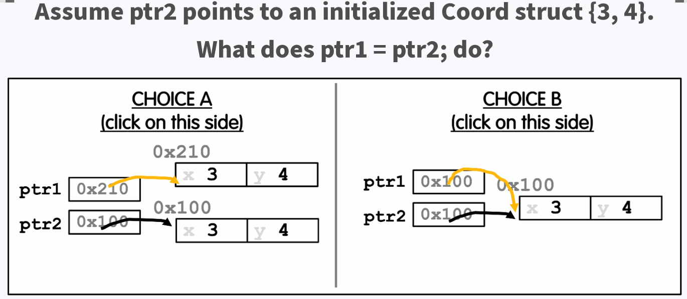
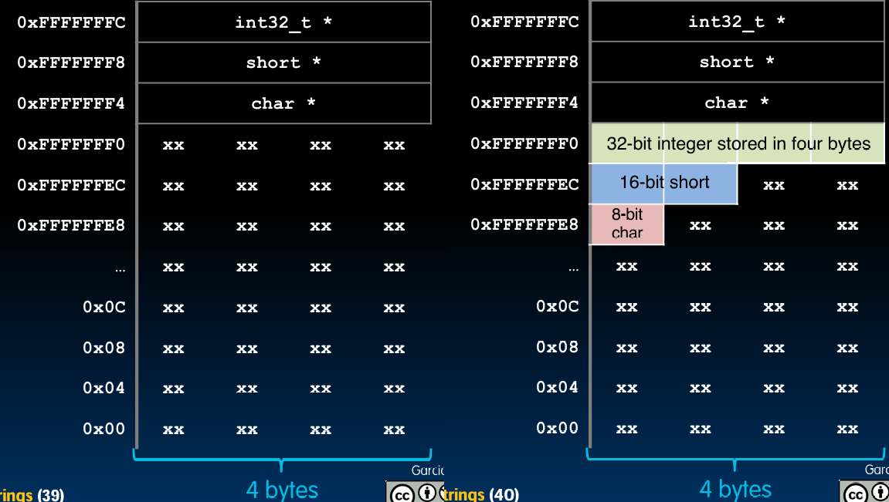

# C语言入门 - 指针、数组、字符串

---

本节是 CS 61C L04 C Intro - Pointers, Arrays, Strings

#  Pointers

## 内存是一个巨大的数组

1. **将内存视为一个字节寻址的数组**
   - **每个单元都有一个地址与之关联**：在内存模型中，可以将内存看作一个巨大的数组，其中每个单元（字节）都有一个唯一的地址。
   - **每个单元还存储一些值**：每个内存地址单元可以存储一个字节的数据。
   - **示例解释**：
     - 假设有两个变量 `x` 和 `y`，它们在内存中的地址分别是 `101` 和 `104`，它们存储的值分别是 `23` 和 `42`。
     - 图示：
       ```
       地址 (address)          101 102 103 104 105 ...
       存储的值 (value)         23  ... ... 42  ...
       变量名 (variable names)  x           y
       ```

2. **不要混淆地址和值**

   - ### 地址与值的区别

     1. **地址**
        - 地址是指向内存位置的指针，它表示内存中的一个单元。
        - 每个变量在内存中都有一个唯一的地址，通过这个地址可以访问或修改该变量的值。
     2. **值**
        - 值是存储在内存单元中的实际数据。
        - 变量名引用的是存储在某个内存地址中的值。
   - **重要性**：理解这一点对于正确操作指针和数组至关重要。例如：
     ```c
     int x = 42;
     int *p = &x; // p存储x的地址，而不是x的值
     ```

   > **指针声明和初始化**
   >
   > 1. **声明一个指针**
   >    - `int *p;` 声明一个指向 `int` 类型的指针变量 `p`。
   >    - `*p` 表示 `p` 是一个指针变量，它将存储一个 `int` 类型变量的地址。
   > 2. **获取变量的地址**
   >    - `&x` 表示获取变量 `x` 的地址。`&` 是取地址运算符。
   > 3. **将地址赋值给指针**
   >    - `int *p = &x;` 将变量 `x` 的地址赋值给指针变量 `p`。现在，`p` 指向 `x` 的地址，`p` 可以通过指针操作访问和修改 `x` 的值。

3. **抽象内存访问**

   - **从 0 开始的无限内存访问**：在抽象层面上，我们可以假设内存从地址 0 开始，可以一直访问下去。这是一种编程上的假设，实际硬件有其物理限制。


4. **地址指向特定的内存位置**

- **地址的含义**：地址是一个标识符，用于指向特定的内存单元。
- **指针的定义**：指针是一个变量，它存储了另一个变量的地址。指针的值是一个内存地址。

5. **指针：包含另一个变量地址的变量**

- **示例解释**：
  - 变量 `p` 是一个指针，它指向变量 `x` 的地址。如果 `x` 存储在地址 `104`，那么 `p` 的值就是 `104`。
  - 图示：
    ```
    地址 (address)          101 102 103 104 105 ...
    存储的值 (value)         23  ... ... 42  ...
    变量名 (variable names)  x           y
    ```

## 指针语法

1. **指针声明**
   - **声明指针变量**：声明一个指针变量，用于存储另一个变量的地址。
     ```c
     int *p;
     int x = 3;
     ```
   - **解释**：声明 `int *p;` 告诉编译器 `p` 是一个指针变量，它将存储一个 `int` 类型变量的地址。

2. **指针赋值和使用**
   - **指针赋值**：将变量的地址赋值给指针。
     ```c
     p = &x; // p存储x的地址
     ```
   - **访问指针指向的值**：使用解引用运算符 `*` 访问指针指向的值。
     ```c
     printf("p points to %d\n", *p); // 输出：p points to 3
     ```

3. **通过指针修改值**
   - **示例**：
     ```c
     *p = 5; // 修改p指向的变量x的值
     ```
   - **解释**：通过指针 `p` 修改 `x` 的值为 `5`。现在 `x` 的值是 `5`，可以通过 `*p` 访问到。

### 综合示例

完整示例代码和解释如下：

```c
#include <stdio.h>

int main() {
    int x = 3;
    int *p;

    p = &x; // p存储x的地址
    printf("p points to %d\n", *p); // 输出：p points to 3

    *p = 5; // 通过指针修改x的值
    printf("x is now %d\n", x); // 输出：x is now 5

    return 0;
}
```

### 解释

- **声明和初始化**：
  - `int x = 3;` 声明并初始化变量 `x`。
  - `int *p;` 声明一个指针变量 `p`。
- **指针赋值**：
  - `p = &x;` 将 `x` 的地址赋值给指针 `p`。
- **通过指针访问和修改值**：
  - `printf("p points to %d\n", *p);` 输出指针 `p` 指向的值。
  - `*p = 5;` 修改 `p` 指向的变量 `x` 的值。
  - `printf("x is now %d\n", x);` 输出变量 `x` 的新值。

通过这些内容的深入讲解，我们可以更好地理解内存模型、地址与值的区别以及指针的使用。这些知识对于编写高效和正确的C代码至关重要。

> **指针声明和初始化详解**
>
> 1. **单个指针声明**
>    ```c
>    int *p;
>    int* p;
>    ```
>    - 这两种声明方式都是合法的，并且它们的效果是完全相同的。两者都声明了一个指向 `int` 类型的指针变量 `p`。
>    - 在C语言中，`int *p` 和 `int* p` 的语法上没有区别，但从可读性角度考虑，通常更推荐使用 `int *p` 这种形式，因为它强调了 `*` 是与变量名 `p` 相关联的。
>
> 2. **多个变量声明**
>    ```c
>    int* p, q;
>    int *p1, *p2;
>    ```
>    - `int* p, q;` 这行代码声明了两个变量：`p` 是一个指向 `int` 类型的指针，而 `q` 是一个普通的 `int` 类型变量。这可能会导致误解，因为看起来 `*` 是类型的一部分，但实际上它只是与 `p` 相关联。
>    - `int *p1, *p2;` 这行代码声明了两个指向 `int` 类型的指针变量 `p1` 和 `p2`。这种写法更清晰，表明了两个变量都是指针。
>
> 3. **指针初始化**
>    ```c
>    int *p = &x;
>    int *p;
>    p = &x;
>    ```
>    - `int *p = &x;` 声明并初始化了一个指向 `int` 类型的指针变量 `p`，它指向变量 `x` 的地址。这里同时完成了声明和初始化。
>    - `int *p; p = &x;` 这两行代码首先声明了一个指向 `int` 类型的指针变量 `p`，然后在下一行将 `p` 初始化为 `x` 的地址。效果与前者相同，但分开了声明和初始化步骤。
>

## 指针语法（Pointer Syntax）

1. **声明指针**
   - 代码示例：
     ```c
     int *p;
     int x = 3;
     ```
   - **解释**：
     - `int *p;` 声明了一个指向 `int` 类型的指针变量 `p`。
     - `int x = 3;` 声明并初始化一个 `int` 类型的变量 `x`，其值为 `3`。
   - **作用**：这告诉编译器 `p` 是一个指向 `int` 类型的指针。

2. **将变量地址赋值给指针**
   - 代码示例：
     ```c
     p = &x;
     ```
   - **解释**：
     - `p = &x;` 将变量 `x` 的地址赋值给指针 `p`。这里的 `&` 是取地址运算符。
     - 图示：
       ```
       地址 (address)   0x100  0x104
       存储的值 (value)  ???    3
       变量名 (variable names) p      x
       p 的值 (value of p)   0x104
       ```

3. **通过指针访问值**
   - 代码示例：
     ```c
     printf("p points to %d\n", *p);
     ```
   - **解释**：
     - `*p` 是解引用运算符，它用于访问指针 `p` 所指向的地址上的值。在这个例子中，`*p` 将访问 `x` 的值，即 `3`。
     - 图示：
       ```
       地址 (address)   0x100  0x104
       存储的值 (value) 0x104  3
       变量名 (variable names) p      x
       ```

4. **通过指针修改值**
   - 代码示例：
     ```c
     *p = 5;
     ```
   - **解释**：
     - `*p = 5;` 通过指针 `p` 修改 `x` 的值为 `5`。这里 `*` 是解引用运算符，用于访问并修改指针 `p` 指向的地址上的值。
     - 图示：
       ```
       地址 (address)   0x100  0x104
       存储的值 (value) 0x104  5
       变量名 (variable names) p      x
       ```

5. **声明与解引用的双重使用**
   - **声明**：
     - `int *p;` 中的 `*` 表示 `p` 是一个指向 `int` 类型的指针。
   - **解引用**：
     - `*p = 5;` 中的 `*` 用于访问指针 `p` 指向的地址上的值，并将其修改为 `5`。

### 完整示例代码和逐行解释

```c
#include <stdio.h>

int main() {
    int x = 3;      // 声明并初始化变量 x
    int *p = &x;    // 声明并初始化指针变量 p，使其指向 x 的地址

    // 输出 x 的地址和值
    printf("Address of x: %p\n", (void*)&x);
    printf("Value of x: %d\n", x);

    // 输出指针 p 的值（即 x 的地址）和 p 指向的值
    printf("Pointer p points to address: %p\n", (void*)p);
    printf("Value pointed to by p: %d\n", *p);

    // 修改 p 指向的值（即 x 的值）
    *p = 5;
    printf("New value of x: %d\n", x);

    return 0;
}
```

### 输出解释

1. **地址**
   - `printf("Address of x: %p\n", (void*)&x);` 输出变量 `x` 的内存地址。例如，输出可能是 `0x7fffcabc1234`，这个地址是 `x` 在内存中的位置。
   - `printf("Pointer p points to address: %p\n", (void*)p);` 输出指针 `p` 存储的地址，它应该与 `x` 的地址相同。

2. **值**
   - `printf("Value of x: %d\n", x);` 输出变量 `x` 的值，初始值是 `3`。
   - `printf("Value pointed to by p: %d\n", *p);` 输出指针 `p` 指向的值，应该也是 `3`，因为 `p` 指向 `x`。

3. **通过指针修改值**
   - `*p = 5;` 通过指针 `p` 修改 `x` 的值为 `5`。
   - `printf("New value of x: %d\n", x);` 输出修改后的 `x` 的值，应该是 `5`。

**总结**

- `int *p;` 和 `int* p;` 都是合法的语法，表示声明一个指向 `int` 类型的指针变量 `p`。
- `p = &x;` 将变量 `x` 的地址赋值给指针变量 `p`，使得 `p` 指向 `x`。
- `*p` 是解引用运算符，用于访问指针 `p` 指向的地址上的值。
- `*p = 5;` 通过指针 `p` 修改 `x` 的值为 `5`。

理解指针的声明、地址赋值和解引用操作对于C语言编程至关重要，有助于正确操作内存和编写高效的代码。

---

## 指针在传递参数时的作用

### 参数按值传递

1. **Java 和 C 都是按值传递参数**：
   - 当一个过程/函数/方法获取参数时，它得到的是参数的副本。
   - 改变函数中的副本不会改变原始变量。

2. **示例：按值传递**
   ```c
   void addOne(int x) {
       x = x + 1;
   }
   
   int y = 3;
   addOne(y);
   // y 的值仍然是 3
   ```
   - 解释：在调用 `addOne(y)` 时，`y` 的值被复制给 `x`。在函数内部，`x` 的值被增加，但这不会影响到 `y` 的值。

### 使用指针传递参数

1. **为了让函数改变一个值，可以传递指针**：
   - 传递一个变量的地址，使得函数可以通过指针访问和修改这个变量。

2. **示例：按指针传递**
   ```c
   void addOne(int *p) {
       *p = *p + 1;
   }
   
   int y = 3;
   addOne(&y);
   // y 的值现在是 4
   ```
   - 解释：在调用 `addOne(&y)` 时，`y` 的地址被传递给指针 `p`。在函数内部，通过 `*p` 修改 `y` 的值。

## 指针的优缺点

### 为什么使用指针？

1. **传递大结构体或数组到函数**：
   - 传递指针比复制大量数据更容易/更快。
   - 例如：
     ```c
     void processLargeArray(int *array, int size);
     ```

2. **历史背景**：
   - 在 C 语言发明时（20世纪70年代初），编译器并不高效。通过指针操作可以提升效率。
   - 现在的计算机速度快了10万倍，编译器也高效得多，但指针仍然用于低级系统代码和实现其他语言中的“传递引用”对象范式。

3. **指针使代码更简洁、更紧凑**：
   - 使用指针可以避免冗余的数据复制，使得代码更为高效。

### 指针的缺点

1. **指针是 C 语言中最大的问题来源**：
   - 动态内存管理时问题尤其严重。
   - 例如：悬挂引用和内存泄漏。

2. **示例：悬挂引用**
   ```c
   int *ptr = malloc(sizeof(int));
   *ptr = 5;
   free(ptr);
   *ptr = 10; // 悬挂引用，危险操作
   ```

## 常见的 C 语言错误：垃圾地址

### 指针声明并未初始化

1. **声明指针只分配存储指针的空间**：
   - 并不会分配指针所指向的内存空间。

2. **局部变量在 C 语言中未初始化**：
   - 它们可能包含任何数据。

3. **示例：未初始化指针**
   ```c
   void f() {
       int *ptr;
       *ptr = 5; // 未定义行为，ptr 未初始化，指向一个垃圾地址
   }
   ```
   - 解释：`int *ptr;` 声明了一个指针，但未初始化。`*ptr = 5;` 试图通过未初始化的指针写入数据，这会导致未定义行为。

**总结**

- 使用指针可以有效地传递大数据结构，避免数据复制的开销。
- 指针使得代码更简洁和高效，但同时也增加了出错的风险，特别是在动态内存管理时。
- 理解指针的声明和初始化，以及它们在函数参数传递中的作用，对于编写健壮和高效的C代码至关重要。

---

# Using Pointers Effectively

### 指向不同数据类型的指针

#### 指针可以指向任何数据类型

1. **指针用于指向任何数据类型**
   - **示例**：
     ```c
     int *xptr;
     char *str;
     struct llist *foo_ptr;
     ```
   - 指针的基本功能是存储某种数据类型的变量的地址，通过指针可以访问或修改该地址上的数据。

2. **通常，一个指针只能指向一种类型**
   - **泛型指针 `void *`**：
     - `void *` 是一种特殊类型的指针，可以指向任何类型的数据（称为泛型指针）。
     - 使用 `void *` 需要谨慎，因为它容易导致程序错误和安全问题。
     - **示例**：
       ```c
       void *ptr;
       int x = 10;
       ptr = &x; // ptr 可以指向 int 类型
       ```

3. **函数指针**
   - 指针不仅可以指向数据，还可以指向函数。
   - **示例**：
     ```c
     int (*fn) (void *, void *) = &foo;
     // fn 是一个函数指针，指向接受两个 void * 参数并返回 int 的函数 foo
     (*fn)(x, y); // 调用函数 fn
     ```
   - **解释**：
     - `int (*fn) (void *, void *)` 声明一个函数指针 `fn`，它指向一个接受两个 `void *` 参数并返回 `int` 的函数。
     - `(*fn)(x, y)` 使用函数指针调用函数。

### NULL 指针

#### 特殊的 NULL 指针

1. **所有 0 的指针是特殊的**
   - 在C语言中，NULL 指针表示不指向任何有效的内存地址。
   - **示例**：
     ```c
     char *p = NULL;
     // p 是一个空指针，不指向任何地址
     ```
   - **解释**：NULL 指针在内存中通常表示为地址 `0x00000000`。

2. **NULL 指针的测试**
   - 因为 "0" 被视为假，所以很容易测试指针是否为 NULL。
   - **示例**：
     ```c
     if (!p) {
         // p 是一个 NULL 指针
     }
     if (q) {
         // q 不是 NULL 指针
     }
     ```

3. **对 NULL 指针的读写操作**
   - 如果对 NULL 指针进行读写操作，程序将崩溃。
   - **示例**：
     ```c
     int *p = NULL;
     *p = 10; // 尝试写入 NULL 指针，程序将崩溃
     ```

> ### 扩展
>
> #### 使用指针指向不同数据类型
>
> - **不同数据类型的指针声明和使用**：
>
>   - 指针可以指向基本数据类型（如 `int`，`char`），也可以指向复杂的数据结构（如结构体）。
>
>   - **示例**：
>
>     ```c
>     int x = 5;
>     int *xptr = &x; // 指向 int 类型
>     char str[] = "Hello";
>     char *strptr = str; // 指向 char 类型
>     struct llist {
>         int data;
>         struct llist *next;
>     };
>     struct llist node;
>     struct llist *node_ptr = &node; // 指向结构体类型
>     ```
>
> - **泛型指针的使用**：
>
>   - `void *` 可以指向任意类型的数据，但在使用时需要进行类型转换。
>
>   - **示例**：
>
>     ```c
>     void *ptr;
>     int x = 10;
>     ptr = &x; // 指向 int 类型
>     printf("%d\n", *((int *)ptr)); // 类型转换并解引用
>     ```
>
> #### NULL 指针的重要性
>
> - **NULL 指针的定义和用途**：
>
>   - NULL 是一个宏，定义为 `(void *)0`，表示空指针。
>
>   - 使用 NULL 指针可以避免悬挂指针问题。
>
>   - **示例**：
>
>     ```c
>     int *p = NULL; // p 是一个空指针
>     if (p != NULL) {
>         *p = 10; // 只有在 p 不为 NULL 时才进行操作
>     }
>     ```
>
> - **测试和处理 NULL 指针**：
>
>   - 在操作指针之前，检查指针是否为 NULL 是一个良好的编程习惯，可以防止程序崩溃。
>
>   - **示例**：
>
>     ```c
>     if (!p) {
>         printf("p is a NULL pointer\n");
>     } else {
>         *p = 10; // 安全操作
>     }
>     ```
>
> 通过这些深入讲解，我们可以更好地理解指针在C语言中的重要性和使用方法。理解指针的概念、如何声明和初始化指针、如何使用泛型指针以及如何处理 NULL 指针是编写健壮和高效C代码的基础。

### 结构体的复习

#### 结构体的定义和使用

1. **定义结构体**
   - 使用 `typedef` 定义一个名为 `Coord` 的结构体：
     ```c
     typedef struct {
         int x;
         int y;
     } Coord;
     ```

2. **结构体变量和指针的声明**
   - 声明两个结构体变量 `coord1` 和 `coord2`，以及两个指向 `Coord` 结构体的指针变量 `ptr1` 和 `ptr2`：
     ```c
     Coord coord1, coord2;
     Coord *ptr1, *ptr2;
     ```

#### 结构体的访问和修改

1. **点号表示法（dot notation）**
   - 使用点号表示法访问和修改结构体成员：
     ```c
     int h = coord1.x;       // 获取 coord1 的 x 成员
     coord2.y = coord1.y;    // 将 coord1 的 y 成员赋值给 coord2 的 y 成员
     ```

2. **箭头表示法（arrow notation）**
   - 使用箭头表示法通过指针访问和修改结构体成员：
     ```c
     int k;
     k = ptr1->x;            // 通过指针 ptr1 获取结构体成员 x 的值
     k = (*ptr1).x;          // 等价的写法，通过解引用指针访问成员
     ```

#### 指针赋值操作的含义

1. **指针赋值**
   - `ptr1 = ptr2;` 这行代码将 `ptr2` 的值（即它指向的地址）赋值给 `ptr1`。因此，`ptr1` 和 `ptr2` 都将指向同一个结构体。

2. **图示解释**
   - 假设 `ptr2` 指向一个已初始化的 `Coord` 结构体 `{3, 4}`，其地址为 `0x100`。
   - 执行 `ptr1 = ptr2;` 后，`ptr1` 也指向地址 `0x100`，即与 `ptr2` 指向相同的结构体。



#### 选择题解释

1. **选择 A**（错误选项）
   - 选择 A 图示中 `ptr1` 和 `ptr2` 指向不同的地址，这是错误的。
   - `ptr1` 的值被赋值为 `ptr2` 的值，所以 `ptr1` 和 `ptr2` 应该指向相同的地址。

2. **选择 B**（正确选项）
   - 选择 B 图示中 `ptr1` 和 `ptr2` 都指向地址 `0x100`，这是正确的。
   - 说明 `ptr1` 和 `ptr2` 指向同一个 `Coord` 结构体 `{3, 4}`。

### 指针和结构体

1. **定义结构体**
   ```c
   typedef struct {
       int x;
       int y;
   } Coord;
   ```

2. **声明和初始化**
   ```c
   Coord coord1, coord2;
   Coord *ptr1, *ptr2;
   ```

3. **使用点号表示法访问和修改**
   ```c
   int h = coord1.x;
   coord2.y = coord1.y;
   ```

4. **使用箭头表示法通过指针访问和修改**
   ```c
   int k;
   k = ptr1->x;        // 通过指针访问
   k = (*ptr1).x;      // 等价的写法
   ```

5. **指针赋值**
   ```c
   ptr1 = ptr2;        // 将 ptr2 的地址赋值给 ptr1
   ```

### 进一步解释和示例

1. **声明和初始化结构体指针**
   ```c
   Coord coord1 = {1, 2};
   Coord coord2 = {3, 4};
   Coord *ptr1 = &coord1;
   Coord *ptr2 = &coord2;
   ```

2. **通过指针访问和修改结构体成员**
   ```c
   printf("ptr1 points to: (%d, %d)\n", ptr1->x, ptr1->y);
   printf("ptr2 points to: (%d, %d)\n", ptr2->x, ptr2->y);
   
   // 修改指针指向的结构体成员
   ptr1->x = 5;
   ptr2->y = 6;
   ```

3. **指针赋值和结果**
   ```c
   ptr1 = ptr2;    // 现在 ptr1 和 ptr2 指向相同的结构体
   printf("After ptr1 = ptr2:\n");
   printf("ptr1 points to: (%d, %d)\n", ptr1->x, ptr1->y);
   printf("ptr2 points to: (%d, %d)\n", ptr2->x, ptr2->y);
   ```

通过这些详细的讲解和示例，读者可以更好地理解结构体和指针在C语言中的使用方法，以及指针赋值操作的含义和效果。这对于编写和理解复杂的C代码非常重要。

---

# Pointer Arithmetic 指针运算

### C语言中的数组本质上是一个大块内存

#### 数组的声明

1. **声明一个数组**
   ```c
   int arr[2];
   ```
   - 这段代码声明了一个包含两个整数元素的数组 `arr`。

2. **声明和初始化数组**
   ```c
   int arr[] = {795, 635};
   ```
   - 这段代码声明并初始化了一个包含两个整数元素的数组 `arr`，其元素分别为 795 和 635。

3. **访问数组元素**
   ```c
   arr[0];
   ```
   - `arr[num]` 语法用于返回数组的第 `num` 个元素。在这里，`arr[0]` 返回数组的第一个元素，即 795。
   - **解释**：这种数组元素访问方式是指针算术的简写形式。

#### 指针算术

1. **指针加法**
   - 指针加法会增加 `n * sizeof(指针所指向的数据类型)` 个字节到内存地址中。
   - 例如，`pointer + n` 会将指针移动 `n` 个元素的位置，每个元素的大小由 `sizeof(指针所指向的数据类型)` 决定。

2. **指针减法**
   - 指针减法会减去 `n * sizeof(指针所指向的数据类型)` 个字节。
   - 例如，`pointer - n` 会将指针向后移动 `n` 个元素的位置。

3. **数组元素访问的等价写法**
   - `a[i]` 等价于 `*(a + i)`，即数组的第 `i` 个元素等于将指针 `a` 向前移动 `i` 个元素后指向的值。

#### 示例代码和解释

1. **声明和初始化数组**
   ```c
   int32_t arr[] = {50, 60, 70};
   int32_t *q = arr;
   ```
   - 这段代码声明了一个包含三个 `int32_t` 类型元素的数组 `arr`，并初始化为 `{50, 60, 70}`。
   - 同时声明了一个指向 `int32_t` 类型的指针 `q`，并将其初始化为指向数组 `arr` 的首元素。

2. **指针算术示例**
   ```c
   printf("*q: %d is %d\n", *q, q[0]);             // 输出：*q: 50 is 50
   printf("*(q+1): %d is %d\n", *(q+1), q[1]);     // 输出：*(q+1): 60 is 60
   printf("*(q-1): %d is ???\n", *(q-1), q[-1]);   // 输出：*(q-1): ??? is ???
   ```
   - `*q` 和 `q[0]` 都表示数组的第一个元素，即 50。
   - `*(q+1)` 和 `q[1]` 都表示数组的第二个元素，即 60。
   - `*(q-1)` 和 `q[-1]` 会访问数组开始之前的内存，这通常会导致未定义行为（undefined behavior）。

#### 图示解释

- 假设 `arr` 的起始地址为 `0x100`，则 `q` 指向 `arr` 的起始地址。
- 数组 `arr` 的布局如下：
  ```
  地址 (address)   0x100  0x104  0x108
  存储的值 (value)  50     60     70
  ```

- 指针 `q` 的布局和指针算术操作如下：
  ```
  q = 0x100;
  *q = 50;
  *(q + 1) = 60;
  *(q - 1) = 未定义行为
  ```

通过这些示例和图示，我们可以更清楚地理解C语言中的数组和指针算术操作。理解这些概念有助于编写高效和健壮的代码。

## 处理指针（Handling Pointers）

### 如何让函数改变指针指向的位置？

### 错误的做法

1. **假设我们希望 `increment_ptr` 函数改变指针 `q` 指向的位置**
   - 示例代码：
     ```c
     void increment_ptr(int32_t *p) {
         p = p + 1;
     }
     
     int32_t arr[3] = {50, 60, 70};
     int32_t *q = arr;
     increment_ptr(q);
     printf("*q is %d\n", *q);
     ```
   - 预期结果：`*q` 的值是 60。

2. **为什么这不工作？**
   - `C` 语言中参数传递是按值传递的。
   - 当我们调用 `increment_ptr(q)` 时，传递的是 `q` 的值（即指向 `arr` 的地址 `0x100`），而不是 `q` 本身。
   - 在 `increment_ptr` 函数内部，改变的是 `p` 的值，这只是 `q` 的副本，并不会影响到 `q` 的实际指向。
   - 因此，`q` 仍然指向 `arr[0]`，所以 `*q` 的值仍然是 50。

### 正确的做法

1. **记住：C 语言是按值传递的**
   - 要让函数改变指针指向的位置，需要传递一个指向指针的指针（"handle"）。
   - 声明为 `data_type **h`。

2. **示例代码**
   ```c
   void increment_ptr(int32_t **h) {
       *h = *h + 1;
   }
   
   int32_t arr[3] = {50, 60, 70};
   int32_t *q = arr;
   increment_ptr(&q);
   printf("*q is %d\n", *q);
   ```

3. **解释**
   - `increment_ptr(&q)` 传递的是 `q` 的地址，即指向 `q` 的指针。
   - 在 `increment_ptr` 函数内部，`h` 是一个指向指针的指针，通过 `*h` 访问 `q` 本身。
   - `*h = *h + 1;` 将 `q` 的值（指向 `arr[0]` 的地址）加 1，使其指向 `arr[1]`。
   - 因此，`q` 现在指向 `arr[1]`，所以 `*q` 的值是 60。

#### 图示解释

1. **错误的做法**
   - 初始状态：
     ```
     arr[3] = {50, 60, 70}
     q -> arr[0] (地址 0x100)
     ```
   - 调用 `increment_ptr(q)` 后，`q` 仍然指向 `arr[0]`：
     ```
     arr[3] = {50, 60, 70}
     q -> arr[0] (地址 0x100)
     *q = 50
     ```

2. **正确的做法**
   - 初始状态：
     ```
     arr[3] = {50, 60, 70}
     q -> arr[0] (地址 0x100)
     ```
   - 调用 `increment_ptr(&q)` 后，`q` 指向 `arr[1]`：
     ```
     arr[3] = {50, 60, 70}
     q -> arr[1] (地址 0x104)
     *q = 60
     ```

### 总结

- 在 C 语言中，参数传递是按值传递的。这意味着函数接收到的是参数的副本，而不是原始变量本身。
- 要在函数中改变指针的指向位置，需要传递一个指向指针的指针。
- 通过这种方式，可以在函数内部修改原始指针的指向位置，实现预期的效果。

---

# Array Pitfalls

### 数组与指针（Arrays vs Pointers）

#### 数组几乎与指针相同

1. **声明和初始化**
   - `char *string` 和 `char string[]` 的声明几乎是相同的。
   - 它们之间的差异在于一些细微的地方，例如递增和已填充数组的声明等。
   - **指针声明**
     ```c
     char *string;
     ```
     - 声明一个字符指针 `string`，它可以指向一个字符数组的首元素。

   - **数组声明**
     ```c
     char string[];
     ```
     - 声明一个字符数组 `string`，它包含一组字符。

2. **访问数组元素**
   - 虽然数组是一个变量，但在许多方面看起来像指针（但并非完全相同）。
   - **数组访问示例**
     ```c
     int arr[3] = {1, 2, 3};
     printf("%d\n", arr[0]);    // 输出 1
     printf("%d\n", *arr);      // 输出 1
     printf("%d\n", arr[2]);    // 输出 3
     printf("%d\n", *(arr + 2));// 输出 3
     ```
   - **解释**
     - `arr[0]` 与 `*arr` 都表示数组的第一个元素。
     - `arr[2]` 与 `*(arr + 2)` 都表示数组的第三个元素。

3. **数组变量是指向第一个（第0个）元素的指针**

### 数组并不像你想象的那样实现

1. **示例代码**
   ```c
   int *p, *q, x;
   int a[4];
   p = &x;
   q = a + 1;
   ```

2. **指针操作**

​	**变量和指针声明**
```c
int *p, *q, x;
int a[4];
p = &x;     // p 指向变量 x 的地址
q = a + 1;  // q 指向数组 a 的第二个元素（地址 a + 1）
```

- 在这段代码中，`p` 被初始化为指向 `x` 的地址，而 `q` 被初始化为指向数组 `a` 的第二个元素。

```c
*p = 1;
printf("*p: %d, p: %x, &p: %x\n", *p, p, &p);
```

- 这段代码将 `p` 所指向的地址的值设置为 1，并打印出 `*p` 的值（1），`p` 的值（`x` 的地址），以及 `p` 的地址。

```c
*q = 2;
printf("*q: %d, q: %x, &q: %x\n", *q, q, &q);
```

- 这段代码将 `q` 所指向的地址的值设置为 2，并打印出 `*q` 的值（2），`q` 的值（`a[1]` 的地址），以及 `q` 的地址。

```c
*a = 3;
printf("*a: %d, a: %x, &a: %x\n", *a, a, &a);
```

- 这段代码将 `a` 所指向的地址的值设置为 3，并打印出 `*a` 的值（3），`a` 的值（`a[0]` 的地址），以及 `a` 的地址。

通过这些例子，我们可以更清楚地理解数组和指针在C语言中的使用方式，以及它们之间的相似和不同之处。理解这些概念对于编写高效和健壮的C代码非常重要。

### 数组非常原始（Array Are Very Primitive）

#### 1. 数组元素访问时不进行边界检查

1. **数组元素访问时不进行边界检查的后果**
   - C语言设计时为了高效，减少了运行时开销，因此不进行边界检查。
   - 后果是我们可以不小心访问数组末尾之外的元素，导致数据损坏或程序崩溃。
   - 缓冲区溢出是常见的安全漏洞，可能导致代码执行、数据泄露等问题。图中提到的 WhatsApp 漏洞（CVE-2019-11933）就是由于缓冲区溢出导致的。

2. **示例代码**
   ```c
   int ARRAY_SIZE = 100;
   int foo[ARRAY_SIZE];
   int i;
   ...
   for (i = 0; i <= ARRAY_SIZE; ++i) {
       foo[i] = 0;
   }
   ```
   - **问题解释**：
     - 上面的循环中，`i` 的条件应为 `< ARRAY_SIZE` 而不是 `<= ARRAY_SIZE`，这样会在访问 `foo[100]` 时超出数组边界。
     - 这种访问会损坏程序的其他部分，包括内部的C数据，可能会导致程序崩溃。

#### 2. 数组作为指针传递给函数

1. **数组作为指针传递的后果**
   - 在 C 语言中，数组名在表达式中会被转换为指向数组第一个元素的指针。
   - 数组作为指针传递给函数时，数组的大小信息会丢失。因此，必须显式地传递数组的大小。

2. **示例代码**
   ```c
   void bar(int arr[], unsigned int size) {
       ...
       arr[size - 1] ...
   }
   
   int main(void) {
       int a[5], b[10];
       ...
       bar(a, 5);
       bar(b, 10);
       ...
   }
   ```
   - **问题解释**：
     - 当数组 `a` 和 `b` 传递给函数 `bar` 时，它们实际上传递的是指针。
     - 因此，必须显式地传递数组的大小（例如 `bar(a, 5);`），以便函数知道数组的边界。

#### 3. 声明的数组仅在作用域内有效

1. **作用域问题**
   - 声明的数组仅在它们的作用域内有效，一旦超出作用域，数组内存将不再有效。

2. **示例代码**
   ```c
   char *foo() {
       char string[32];
       ...
       return string; // 这是不正确的
   }
   ```
   - **问题解释**：
     - `string` 数组在函数 `foo` 中声明，属于局部变量。
     - 当 `foo` 函数返回时，`string` 数组的内存将不再有效，返回这个地址会导致未定义行为。

3. **解决方案：动态内存分配**
   - 使用动态内存分配可以避免作用域问题，确保内存有效期在我们需要的时间段内。
   - **示例代码**：
     ```c
     char *foo() {
         char *string = malloc(32 * sizeof(char));
         if (string == NULL) {
             // 处理内存分配失败
         }
         // 使用 string
         return string; // 返回动态分配的内存
     }
     ```
   - **释放内存**：
     - 使用完动态分配的内存后，必须显式地释放它，以避免内存泄漏：
       ```c
       void bar() {
           char *str = foo();
           // 使用 str
           free(str); // 释放内存
       }
       ```

### 数组非常原始，总结

1. **元素访问时不进行边界检查**
   - 后果：可能会意外访问数组末尾之外的元素，导致数据损坏或程序崩溃。

2. **数组作为指针传递给函数**
   - 后果：数组大小信息丢失，必须显式传递数组的大小。

3. **声明的数组仅在作用域内有效**
   - 后果：超出作用域后，数组内存将不再有效。

### 分段错误和总线错误

- 这些错误很难找到，需要小心处理。
- 在实验中，您将学习如何使用 `gdb` 调试这些错误。

---

# Strings

### C 字符串（C Strings）

#### 字符串的定义

1. **C 字符串只是一个字符数组，以空终止符结尾**
   - 空终止符：字节 0（数字）或 `'\0'` 字符。
   - 例如，`char str[] = "abc";` 这个字符数组实际是 `{'a', 'b', 'c', '\0'}`。

2. **标准 C 库中的 `string.h` 假设字符串是以空终止符结尾的**
   - 特别是，字符串长度操作在获取字符串长度时不包括空终止符。
   - 示例代码:
     ```c
     int strlen(char s[]) {
         int n = 0;
         while (*(s++) != 0) {
             n++;
         }
         return n;
     }
     ```
   - **解释**：
     - 这个函数计算并返回字符串的长度（不包括空终止符）。
     - 如果我们调用 `strlen(str)`，返回值将是 3。

## 内存和地址（Memory and Addresses）

### 现代计算机是“字节可寻址”的

1. **字节可寻址的内存**
   - 硬件内存由8位（1字节）存储单元组成，每个字节都有一个唯一的地址。这意味着计算机内存中的每个字节都可以单独读取和写入。
   - **示例**：
     - 在内存中，每个字节都有一个地址。例如，假设内存地址从 `0x0000` 开始，每个地址对应一个字节：
       ```
       地址: 0x0000  0x0001  0x0002  0x0003 ...
       数据:   101     45     200     134  ...
       ```

### 我们通常以“字大小”来思考

1. **字大小（Word Size）**
   - “字大小”是指处理器一次可以处理的数据位数。通常以字节为单位。
   - 在32位体系结构中，字大小为4字节（32位）。
   - **示例**：
     - 在32位系统中，一个整数（`int`）和一个指针（`int *` 或 `char *`）的大小通常都是4字节。这意味着：
       ```c
       sizeof(int) == sizeof(int *) == sizeof(char *) == 4
       ```

### 内存对齐的必要性

1. **什么是内存对齐（Memory Alignment）**
   - 内存对齐指的是将数据存储在特定的内存地址上，这个地址是数据大小的整数倍。对齐的目的是提高内存访问的效率。
   - **对齐的好处**：
     - 对于对齐的数据，处理器可以一次性读取整个数据，而不需要多次内存访问。
     - 未对齐的数据可能需要处理器进行多次内存访问，从而降低性能。

2. **内存对齐的规则**
   - 不同的数据类型有不同的对齐要求：
     - 4字节（32位）的数据类型（如 `int` 和 `float`）通常对齐到4字节边界。
     - 2字节（16位）的数据类型（如 `short`）通常对齐到2字节边界。
     - 1字节（8位）的数据类型（如 `char`）可以存储在任何地址上。



### 示例图示

1. **内存对齐示例**
   - 考虑以下不同数据类型在内存中的对齐方式：
     ```c
     int32_t *p = (int32_t *)0xFFFF0000;
     short *q = (short *)0xFFFF0004;
     char *r = (char *)0xFFFF0006;
     ```
   - 在这个示例中：
     - `p` 指向一个32位整数，其地址 `0xFFFF0000` 是4的倍数。
     - `q` 指向一个16位短整数，其地址 `0xFFFF0004` 是2的倍数。
     - `r` 指向一个8位字符，其地址 `0xFFFF0006` 是1的倍数。
   - 内存布局示意图：
     ```
     地址: 0xFFFF0000  0xFFFF0004  0xFFFF0006 ...
     数据:   int32_t      short        char   ...
     ```

2. **内存对齐的重要性**
   - 当数据对齐到正确的边界时，处理器可以更高效地访问内存。例如，读取一个对齐的32位整数只需一次内存访问，而读取一个未对齐的32位整数可能需要两次内存访问。

3. **对齐的性能影响**
   - 未对齐的内存访问可能导致处理器性能下降，甚至引发错误。在某些架构上，未对齐的内存访问会抛出异常。
   - 因此，在编写C语言代码时，确保数据对齐到正确的内存边界是一个好的编程习惯。

## 结构体（Structures, Revisited, Again）

#### 结构体的定义和布局

1. **什么是结构体**
   - 结构体（struct）实际上只是一个指示C语言如何安排一组字节的指令。
   - 结构体为数据提供足够的空间，并且C语言会用填充（padding）对数据进行对齐。

2. **示例结构体**
   ```c
   struct foo {
       int32_t a;
       char b;
       struct foo *c;
   };
   ```

3. **结构体的实际内存布局**
   - 在32位架构上，这个结构体的实际布局如下：
     - `int32_t a` 占用4字节。
     - `char b` 占用1字节。
     - 随后有3字节的填充，使得下一个成员对齐到4字节边界。
     - `struct foo *c` 占用4字节。
     - 总大小为12字节。
   - **示例图示**
     ```
     |   a (4 bytes)  | b (1 byte) | padding (3 bytes) |   c (4 bytes)  |
     ```

4. **内存对齐的必要性**
   - 字对齐确保数据在内存中的高效访问。处理器更倾向于在对齐的地址上读取数据，这样可以减少访问内存的次数，提高性能。

### 调试时注意字节序（Endianness）

1. **小端序（Little Endian）**
   - 在小端序的机器上，数值的最低有效字节存储在内存的最低地址。
   - **示例**
     - 假设有一个 `int32_t` 类型的值 `0x12345678`：
       ```
       地址:   0xFF  0xFE  0xFD  0xFC
       数据:   0x78  0x56  0x34  0x12
       ```

2. **大端序（Big Endian）**
   - 在大端序的机器上，数值的最高有效字节存储在内存的最低地址。
   - **对比**
     - 大端序的存储顺序正好与小端序相反。

3. **调试时的注意事项**
   - 不同的系统可能使用不同的字节序，在调试和处理跨平台数据时，必须注意字节序的差异。

### 结论（And in Conclusion）

1. **指针和数组几乎是相同的**
   - 指针和数组在许多方面表现相似，但在一些细节上有差异。例如，指针可以进行算术运算，而数组名是常量指针。

2. **C语言可以递增指针**
   - C语言中可以对指针进行算术运算，例如递增指针以遍历数组。

3. **C语言是一种高效但保护较少的语言**
   - 数组边界不被检查，可能导致越界访问。
   - 变量不会自动初始化，可能包含垃圾值。

4. **使用句柄来改变指针**
   - 在需要修改指针指向的位置时，使用指针的指针（句柄）是一种常见的方法。

5. **效率与开发者的权衡**
   - C语言的高效性带来了更多的开发者负担，需要小心避免内存管理错误。
   - 正如引用所说，“C给了你很多额外的绳子，不要用它来吊死自己！”

通过理解这些概念，可以编写出更高效和更健壮的C代码，并且在调试和跨平台开发时避免常见的陷阱。

## 函数指针示例（Function Pointer Example）

### 示例代码：map（实际是 mutate_map 更容易）

1. **函数声明**
   ```c
   #include <stdio.h>
   
   int x10(int), x2(int);
   void mutate_map(int [], int n, int(*fp)(int));
   void print_array(int [], int n);
   ```
   - `int x10(int)` 和 `int x2(int)` 是两个函数，分别接受一个整数参数并返回一个整数。
   - `void mutate_map(int [], int n, int(*fp)(int))` 是一个函数，接受一个整数数组、数组长度和一个函数指针作为参数。
   - `void print_array(int [], int n)` 是一个函数，接受一个整数数组和数组长度，打印数组中的元素。

2. **函数定义**
   ```c
   int x2(int n) {
       return 2 * n;
   }
   
   int x10(int n) {
       return 10 * n;
   }
   ```
   - `x2` 函数返回输入整数的两倍。
   - `x10` 函数返回输入整数的十倍。

3. **mutate_map 函数**
   ```c
   void mutate_map(int A[], int n, int(*fp)(int)) {
       for (int i = 0; i < n; i++) {
           A[i] = (*fp)(A[i]);
       }
   }
   ```
   - `mutate_map` 函数接受一个整数数组 `A`，数组长度 `n`，以及一个函数指针 `fp`。
   - 通过遍历数组，将每个元素应用 `fp` 函数，并更新数组元素的值。

4. **print_array 函数**
   ```c
   void print_array(int A[], int n) {
       for (int i = 0; i < n; i++) {
           printf("%d ", A[i]);
       }
       printf("\n");
   }
   ```
   - `print_array` 函数遍历数组 `A`，并打印数组中的每个元素。

5. **主函数**
   ```c
   int main(void) {
       int A[] = {3, 1, 4}, n = 3;
       print_array(A, n);
       mutate_map(A, n, &x2);
       print_array(A, n);
       mutate_map(A, n, &x10);
       print_array(A, n);
   }
   ```
   - 主函数中，定义一个整数数组 `A`，并调用 `print_array` 打印数组。
   - 调用 `mutate_map` 函数两次，分别传入 `x2` 和 `x10` 函数指针，并打印更新后的数组。

6. **执行结果**
   - 初始数组：`3 1 4`
   - 调用 `mutate_map(A, n, &x2)` 后：`6 2 8`
   - 调用 `mutate_map(A, n, &x10)` 后：`60 20 80`

### 扩展

### 函数指针的使用

- 函数指针是指向函数的指针，可以用于调用函数。函数指针使得我们可以将函数作为参数传递给其他函数，从而实现更加灵活和可复用的代码。
- 在 `mutate_map` 函数中，`int(*fp)(int)` 表示一个接受一个整数并返回一个整数的函数指针。

### 函数指针的声明和使用

- 函数指针的声明方式与普通指针类似，只不过指向的是函数。
  ```c
  int (*fp)(int);
  ```
- 使用函数指针调用函数时，可以使用 `(*fp)(参数)` 形式，也可以直接使用 `fp(参数)` 形式。

### 函数指针的实际应用

- 函数指针常用于实现回调函数、事件处理器、以及策略模式等。通过函数指针，可以动态选择不同的函数进行调用，而不需要在编译时决定具体调用哪个函数。

### 代码示例中的具体解释

- 在 `mutate_map` 函数中，我们通过函数指针 `fp` 将 `x2` 和 `x10` 函数应用于数组中的每个元素。
- 例如，`mutate_map(A, n, &x2)` 将数组 `A` 中的每个元素都乘以2，而 `mutate_map(A, n, &x10)` 将数组 `A` 中的每个元素都乘以10。

通过这些示例和扩展讲解，我们可以更好地理解函数指针的概念及其在C语言编程中的应用。函数指针不仅增加了代码的灵活性，还可以提高代码的可复用性和可维护性。


<br/>


<br/>


<br/>


---


<details markdown="block">
<summary>old version ↓ (click me)</summary>
## 什么是指针

首先，我们来介绍一种叫做指针的东西。根据你是否参加过61b课程，可能对指针的了解有所不同。如果你以前没有接触过指针，现在我们就来讲解。

在讲解指针之前，我希望你能考虑一个我们将在接下来的一到三周中使用的抽象概念：**内存是一个巨大的数组**。这意味着内存中的每一个字节都是可以寻址的。

## 内存和地址

假设我们从地址0开始，我在这里用十六进制表示。所以，我们有地址0，然后继续沿着这条线，可能到达地址100，接着是104，依此类推直到无穷。

注意这里有一个地址和值的区别。例如，在地址104，我们存储了值23。也许这是一个字节23的表示。

## 指针的定义

指针也是一种值。它存储的是一个地址值。这意味着我们可以用一个小箭头表示它指向某个地址，但实际存储的值是地址本身，例如104。

## 在C语言中声明和初始化指针

现在我们来看如何在C语言中使用星号操作符来声明和初始化指针。星号操作符有两种不同的使用方式。

### 声明指针

```c
int *p;
```

这行代码声明了一个指针变量`p`。这个指针`p`会指向一个`int`类型的变量。

### 初始化指针

假设我们声明了一个`int x`，并赋值为3：

```c
int x = 3;
```

这里`x`存储在地址104，值为3。注意，刚声明的指针`p`中存储的是垃圾值。我们要在`p`中存储一个值，具体来说是104。

我们使用&操作符来实现：

```c
p = &x;
```

这行代码中，&操作符表示取变量`x`的地址，然后将这个地址存储到指针`p`中。这样我们就可以认为`p`指向了这个地址，`p`中存储的值是104。

## 指针的用途

为什么指针有用呢？我们可以使用指针来访问它指向的地址处的值。例如：

```c
printf("%d\n", *p);
```

这行代码中，`*p`表示获取`p`指向的地址处的值。在这个例子中，`p`指向地址104，而地址104处的值是3，因此这行代码会打印出3。

我们也可以使用解引用操作符（`*`）来修改指针指向的地址处的值：

```c
*p = 5;
```

这行代码将`p`指向的地址处的值修改为5，所以`x`的值会从3变成5。

## 星号的双重用途

值得注意的是，星号操作符有两种不同的用法：

1. 在声明时使用，表示变量是一个指针。例如：

   ```c
   int *p;
   ```

2. 在解引用时使用，表示获取或设置指针指向的地址处的值。例如：

   ```c
   printf("%d\n", *p);
   *p = 5;
   ```

通过这些讲解，我们希望你能理解指针在C语言中的基本概念及其使用方法。指针在C语言中是一个非常强大和重要的工具，理解它将帮助你更好地掌握C语言。


---


## 为什么使用指针

## 值传递与引用传递的区别

你可能会问，为什么要使用指针？一个重要原因是函数参数的传递方式。像Java那样的语言通过值传递参数，而C语言也采用值传递。这意味着函数接收的是参数的副本。

### 值传递的局限

举个例子，如果你想修改一个变量`y`的值，并直接传递它的值，那么函数内部接收到的是这个值的副本。例如：

```c
void foo(int x) {
    x = 4;
}
```

假设你调用`foo(y)`，如果`y`最初的值是3，传递进去后，`x`接收到的是3的副本。函数内部虽然将`x`修改为4，但返回后，`y`仍然是3。

### 使用指针的优势

相反，如果我们使用指针传递`y`的地址：

```c
void foo(int *p) {
    *p = 4;
}
```

假设`y`的地址是100，传递进去后，`p`接收到的是地址100。通过解引用`*p`，我们访问到地址100处的值，将其修改为4。这样，函数返回后，`y`的值变为了4。

## 指针的高效性

C语言以其高效著称。如果每次都需要传递一个巨大的结构体或数组，而不得不复制所有的内存，那将会极大降低效率。因此，传递指针是一个更优的选择，因为指针仅仅是一个地址。

## 指针的历史背景

C语言诞生于上世纪70年代，当时编译器在处理内存性能问题上面临很多挑战。C语言通过指针这种间接访问的方法，给程序员提供了更多的灵活性。尽管如今的编译器和计算机性能已经大幅提升，但在低级性能优化方面，指针依然扮演着重要角色。

## 指针的风险

然而，指针也是C代码中错误的主要来源。尤其是在堆内存分配、动态内存管理和内存泄漏等方面，指针的使用需要特别小心。

## 常见的指针错误

### 垃圾地址

当声明一个指针变量但没有初始化时，它可能包含垃圾值。例如：

```c
void f() {
    int *ptr;
    *ptr = 5;  // 可能修改内存中的任意位置
}
```

这个代码段中，`ptr`未初始化，可能指向内存中的任意位置，修改操作可能导致程序不可预测的行为。

## 指针与数据类型

指针可以指向任何数据类型。例如：

```c
int *int_ptr;
char *char_ptr;
struct my_struct *struct_ptr;
```

唯一的例外是`void*`，它是一种通用指针，能指向任何类型，但容易引发程序错误和安全漏洞。

## 函数指针

指针不仅可以指向数据，还可以指向函数。例如：

```c
int (*fn_ptr)(void*, void*);
```

这行代码声明了一个函数指针`fn_ptr`，它指向一个接收两个`void*`参数并返回`int`类型的函数。

函数指针的一个实际应用是实现高阶函数，例如`map`函数，可以接受一个函数作为参数，对数组中的每个元素应用该函数。

## 总结

理解并熟练使用指针是学习C语言的重要部分。指针不仅提高了代码的效率，也使代码更加紧凑。然而，指针使用不当会导致严重的错误。通过这次讲解，希望你对指针有了更深入的了解，并能在实际编程中安全有效地使用它们。


---


## 无效指针与空指针

## 什么是无效指针

在C语言中，确实存在无效指针的概念。无效指针指的是那些指向未分配或无法访问内存地址的指针。

## 空指针

C语言使用一种约定：如果指针的值为全零，即指针存储地址为0，这就称为空指针（null pointer）。这与Java和Python中的空指针类似，但在C语言中，它实际上是存储地址为0。空指针允许我们检查一个指针是否为空。

### 空指针的特点

如果一个指针存储的地址为0，那么这个地址是无法读写的。每当尝试读写空指针时，程序应该崩溃，这是C语言内部实现的机制，也是编译器所遵循的契约。

## 结构体与指针

在第一个项目中（如实现贪吃蛇游戏），我们会大量使用结构体（structs）。这里复习一下结构体的概念：

## 结构体的定义

假设我们定义一个结构体`Coord`，其中包含两个值`x`和`y`：

```c
typedef struct {
    int x;
    int y;
} Coord;
```

我们可以声明结构体变量或结构体指针：

```c
Coord coord1, coord2;
Coord *ptr1, *ptr2;
```

## 结构体指针的操作

对于结构体变量，我们使用点号（`.`）访问成员：

```c
coord1.x = 10;
coord1.y = 20;
```

对于结构体指针，我们使用箭头符号（`->`）访问成员：

```c
ptr1->x = 10;
ptr1->y = 20;
```

箭头符号是点号操作符的简写形式：

```c
(*ptr1).x = 10;
(*ptr1).y = 20;
```

## 指针赋值

以下代码片段展示了指针赋值的操作：

```c
ptr1 = ptr2;
```

如果`ptr2`指向一个已经初始化的结构体，那么`ptr1 = ptr2`表示`ptr1`现在指向`ptr2`指向的同一个地址。简单来说，指针赋值操作将一个指针的值（即地址）复制到另一个指针中。

## 抽象的力量

在理解指针时，可以用不同的方式进行抽象：

1. 以地址的形式理解：每个指针存储一个地址值。
2. 以箭头的形式理解：指针指向一个内存位置。

无论哪种方式，只要你感到舒适并能够正确使用指针，都是有效的理解方式。这也是抽象的力量所在。

通过这些讲解，希望你对无效指针、空指针及结构体指针有了更深入的理解。掌握这些概念对于写出高效、健壮的C代码至关重要。


----


## 指针运算与数组

在深入讲解数组之前，我们先来讨论指针运算。指针运算与数组的使用密切相关，是C语言中一个非常重要的概念。

## 指针运算

C语言中的指针运算允许我们通过加减操作来改变指针所指向的地址。这与数组的操作有着紧密的联系。

### 数组的定义与初始化

在C语言中，数组实际上是一个大块的连续内存。与Java和Python不同，C语言的数组是直接操作内存的。

例如，以下代码声明并初始化一个包含两个整数的数组：

```c
int array[2] = {1, 2};
```

这个数组在内存中连续存储两个整数。

### 访问数组元素

我们可以通过索引访问数组元素：

```c
int value = array[0];  // 访问第一个元素，值为1
```

实际上，这里的数组访问是通过指针运算实现的。数组名实际上是一个指向数组首元素的指针。

### 指针与数组的关系

假设我们有一个指向数组首元素的指针`q`：

```c
int *q = array;
```

我们可以通过指针运算访问数组元素：

```c
int value = *(q + 1);  // 访问第二个元素，值为2
```

指针运算中，`q + 1`表示指针移动一个整数的大小（4字节），然后通过解引用操作符`*`访问该地址处的值。

## 指针运算的细节

指针运算根据指针类型的大小进行偏移。例如，对于`int`类型指针，`q + 1`表示指针移动4字节。

```c
int array[3] = {50, 60, 70};
int *q = array;
```

此时，`q`指向数组的第一个元素（值为50）。通过指针运算，我们可以访问和修改数组中的元素：

```c
*(q + 1) = 60;  // 访问并修改第二个元素
```

## 双重指针

当需要在函数中修改指针本身时，我们会用到双重指针，即指向指针的指针。

### 使用双重指针修改指针

以下示例展示了如何通过双重指针修改指针：

```c
void increment

## 使用双重指针修改指针

以下示例展示了如何通过双重指针修改指针：

```c
void increment_pointer(int **p) {
    *p = *p + 1;
}

int main() {
    int array[3] = {50, 60, 70};
    int *q = array;
    increment_pointer(&q);
    printf("%d\n", *q);  // 输出60
    return 0;
}
```

在这个示例中，`increment_pointer`函数接收一个指向指针的指针`p`。通过解引用`*p`，我们访问并修改了传入的指针`q`的值，使其指向下一个数组元素。

## 总结

## 指针运算与数组

1. **指针运算**：通过加减操作改变指针的地址。对于`int`类型指针，`q + 1`表示指针移动4字节。
2. **数组与指针的关系**：数组名实际上是一个指向数组首元素的指针，可以通过指针运算访问数组元素。
3. **双重指针**：用于在函数中修改指针本身，通过传递指向指针的指针实现。

理解并掌握指针运算、数组以及双重指针是C语言编程的重要技能。它们不仅提高了代码的效率，也为复杂数据结构的实现提供了强大的工具。通过以上讲解，希望你能更深入地理解这些概念，并能在实际编程中灵活应用。


----


## 数组陷阱

## 数组大小问题

许多人喜欢使用数组，但数组也有一些常见的陷阱。第一个陷阱是关于数组大小的。经常会有人倾向于声明一个固定大小的数组，例如大小为10的数组，然后在循环中填充数组元素：

```c
int array[10];
for (int i = 0; i < 10; i++) {
    array[i] = i;
}
```

尽管这种做法可以编译并运行，但它容易导致错误。我们建议的更好的做法是只声明一次数组大小，并在整个代码中使用这个大小来声明数组和进行循环：

```c
#define ARRAY_SIZE 10
int array[ARRAY_SIZE];
for (int i = 0; i < ARRAY_SIZE; i++) {
    array[i] = i;
}
```

这种方法不仅避免了重复定义，而且减少了维护多个副本的风险，有助于提高代码的可读性和可维护性。

## 数组与指针的区别

数组与指针在C语言中几乎是相同的，但它们并不完全相同。例如：

```c
char *str1 = "hello";
char str2[] = "hello";
```

`str1`是一个指向字符的指针，而`str2`是一个字符数组。虽然两者看起来类似，但在底层实现和使用上有一些关键差异。

### 指针与数组的等效性

数组名实际上是指向数组首元素的指针。因此，可以通过数组名和指针来访问数组元素：

```c
int array[3] = {1, 2, 3};
int *p = array;
printf("%d\n", p[0]);  // 输出1
printf("%d\n", *p);    // 输出1
```

上述两种方式在效果上是相同的。

## 数组与指针的不同点

虽然数组名可以用作指针，但它们在某些情况下行为不同。例如，获取数组名的地址与获取指针变量的地址是不同的：

```c
int array[3] = {1, 2, 3};
int *p = array;
printf("%p\n", (void *)array);    // 输出数组首元素的地址
printf("%p\n", (void *)&array);   // 输出数组整体的地址
printf("%p\n", (void *)&p);       // 输出指针变量p的地址
```

数组名和数组的地址是相同的，但指针变量的地址与它所指向的地址不同。

## 动态内存分配

在C语言中，数组大小是固定的，一旦声明就不能改变。如果需要动态调整数组的大小，可以使用动态内存分配：

```c
int *array = malloc(2 * sizeof(int));
array[0] = 1;
array[1] = 2;
array = realloc(array, 4 * sizeof(int));
array[2] = 3;
array[3] = 4;
```

使用`malloc`和`realloc`函数可以动态分配和调整数组的大小，但需要注意手动释放内存以避免内存泄漏：

```c
free(array);
```

## 总结

## 数组陷阱总结

1. **数组大小问题**：建议使用常量或宏定义数组大小，以避免重复定义和维护多个副本的风险。
2. **数组与指针的区别**：尽管数组名可以用作指针，但在底层实现和使用上存在差异，需要理解和注意。
3. **动态内存分配**：数组大小固定，不能在声明后改变。使用`malloc`和`realloc`可以实现动态内存分配，但需要手动管理内存。

通过理解和避免这些常见的数组陷阱，可以提高代码的可靠性和可维护性。这对于编写健壮的C语言程序非常重要。


-----


## 数组的陷阱

## 数组边界未检查

数组在C语言中并不是真正的数据结构，而只是大块的内存。其原始特性容易导致某些错误。第一个常见的错误是数组边界未检查。例如，我们声明一个大小为100的数组，然后试图访问第101个元素：

```c
int array[100];
array[100] = 123;  // 超出数组边界
```

这段代码虽然可以编译，但在运行时可能会导致程序崩溃或其他部分的内存被篡改，因为C语言不会自动检查数组边界。这种错误被称为缓冲区溢出（buffer overflow），在实际应用中可能会导致严重的安全漏洞，例如远程攻击者可以执行任意代码或造成拒绝服务（DoS）攻击。

## 数组作为函数参数传递

数组在作为函数参数传递时，其行为与指针类似。尽管C语言是通过值传递参数，但数组会衰减为指向其首元素的指针。例如：

```c
void func(int arr[], unsigned int size) {
    // arr 被视为指针
}
```

在调用函数时：

```c
int array[10];
func(array, 10);
```

在函数内部，`arr`实际上是一个指向`array`首元素的指针，而不是整个数组的副本。因此，必须显式地传递数组的大小，以便函数知道数组的长度。

## 指针算术运算

指针算术运算允许我们通过加减操作来改变指针所指向的地址。例如：

```c
int array[3] = {10, 20, 30};
int *p = array;
printf("%d\n", *(p + 1));  // 输出20
```

这里，`p + 1`表示指针移动一个`int`的大小（4字节），然后通过解引用操作符`*`访问该地址处的值。

## 动态内存分配

当需要在运行时动态调整数组的大小时，可以使用动态内存分配。例如：

```c
int *array = malloc(2 * sizeof(int));
array[0] = 1;
array[1] = 2;
array = realloc(array, 4 * sizeof(int));
array[2] = 3;
array[3] = 4;
```

使用`malloc`和`realloc`函数可以动态分配和调整数组的大小，但需要注意手动释放内存以避免内存泄漏：

```c
free(array);
```

## 数组的作用域

数组在函数内声明时，其生命周期仅在函数作用域内有效。如果返回一个局部数组的地址，会导致指针指向无效的内存区域：

```c
char* createArray() {
    char arr[10];
    return arr;  // 返回无效指针
}
```

正确的方法是使用动态内存分配：

```c
char* createArray() {
    char *arr = malloc(10 * sizeof(char));
    return arr;
}
```

## 数组与指针的区别

数组名可以用作指针，但在底层实现和使用上存在差异。例如，获取数组名的地址与获取指针变量的地址是不同的：

```c
int array[3] = {1, 2, 3};
int *p = array;
printf("%p\n", (void *)array);    // 输出数组首元素的地址
printf("%p\n", (void *)&array);   // 输出数组整体的地址
printf("%p\n", (void *)&p);       // 输出指针变量p的地址
```

数组名和数组的地址是相同的，但指针变量的地址与它所指向的地址不同。

## 总结

数组在C语言中虽然是一个常见且有用的数据结构，但其原始特性和行为需要特别注意。理解和避免这些常见的数组陷阱，可以提高代码的可靠性和可维护性。这对于编写健壮的C语言程序非常重要。在下一次讲解中，我们将深入探讨内存结构，特别是栈和堆的区别，以及如何有效地管理内存。


---


## 地址的有效性与错误

## 无效地址

在C语言中，不是所有的内存地址都是有效的。即使我们假设内存从0到无穷大连续分布，但实际上存在两种主要的错误与地址相关：

1. **段错误（Segmentation Fault）**：当程序试图访问未分配或无权限访问的内存区域时，就会发生段错误。这种错误通常在运行时才会被发现，并导致程序崩溃。例如，尝试访问已经释放的内存或超出数组边界访问内存都会引发段错误。

2. **总线错误（Bus Error）**：当程序试图访问未对齐的内存地址时，就会发生总线错误。例如，一个`int`型指针指向了一个非`int`型地址（比如`int`型地址加1字节），这种情况可能导致总线错误。总线错误也是一个运行时错误，具体情况取决于硬件架构和操作系统。

## 空指针和无效指针

空指针（null pointer）是一个特殊的指针，值为0，表示它不指向任何有效的内存地址。在C语言中，空指针无法被读写，任何对空指针的访问都会导致程序崩溃。除了空指针，指向无效地址的指针也会导致类似的问题。

## C语言中的字符串

## 字符串的表示

在C语言中，字符串实际上是以`\0`（null terminator）结尾的字符数组。例如：

```c
char str[] = "ABC";
```

这个声明创建了一个包含4个字符的数组，其中最后一个字符是`'\0'`。这种表示方式使得C语言的字符串可以使用标准库中的函数进行操作，例如计算字符串长度、拼接字符串等。

## 字符串操作

由于C字符串以null terminator结束，标准库函数如`strlen`会遍历数组直到遇到`'\0'`为止。因此，字符串操作时需要注意以下几点：

1. **字符串长度**：`strlen`返回的长度不包括null terminator。
2. **字符串复制**：使用`strcpy`时需要确保目标数组有足够的空间容纳源字符串和null terminator。

## 内存对齐

## 什么是内存对齐

内存对齐是指数据在内存中存储时，以特定的边界对齐。大多数计算机架构要求数据按其大小对齐，以提高内存访问效率。例如，在32位架构中，`int`型数据需要以4字节边界对齐。

## 内存对齐的示例

假设我们在一个32位架构中，内存地址如下排列：

```plaintext
地址：   0    1    2    3    4    5    6    7    8    9    A    B    C    D    E    F
字节：  00   01   02   03   04   05   06   07   08   09   0A   0B   0C   0D   0E   0F
```

在这种情况下，`int`型数据（占用4字节）必须存储在能被4整除的地址（如0、4、8等）上。若试图在非对齐地址存储数据，会引发总线错误。

## 指针的大小

在32位系统中，指针的大小为4字节，因为它们需要能够表示0到`2^32 - 1`之间的任意地址。

## 动态内存分配

## 堆与栈的区别

- **栈（Stack）**：用于存储函数调用时的局部变量，内存由系统自动分配和释放。当函数返回时，局部变量占用的内存被自动回收。

- **堆（Heap）**：用于动态分配内存，由程序员手动管理（分配和释放）。动态内存在函数返回后仍然存在，直到程序显式释放它。

## 动态内存分配示例

使用`malloc`、`realloc`和`free`函数可以动态管理内存。例如：

```c
int *array = malloc(2 * sizeof(int));
array[0] = 1;
array[1] = 2;
array = realloc(array, 4 * sizeof(int));
array[2] = 3;
array[3] = 4;
free(array);
```

在这个示例中，我们首先分配了一个包含2个`int`的数组，然后重新分配内存以扩展数组，并最终释放内存。

## 总结

理解C语言中的地址有效性、字符串表示、内存对齐和动态内存分配是编写健壮C程序的关键。这些知识不仅有助于提高代码效率，还能避免常见的内存错误。在下一次讲解中，我们将进一步探讨内存结构，特别是堆和栈的管理及其区别。


---


## 字长与内存对齐

## 字长的重要性

字长（Word Size）对CPU和计算机架构的工作方式至关重要。在C语言中，指针类型声明不仅告诉编译器要获取多少字节，还指示变量本身需要字对齐。

例如：

- `int`类型在32位系统中占4字节，指针指向某个地址，并从该地址开始获取4字节，构成一个32位整数。
- `short`类型占2字节，从指针所指地址开始获取2字节，构成一个16位短整数。
- `char`类型占1字节，从指针所指地址开始获取1字节，构成一个字符。

## 内存对齐

内存对齐要求所有变量的地址都必须是字长的倍数。例如，32位系统中，所有变量地址必须是4的倍数。这种对齐方式虽然会造成一些内存浪费，但能显著提升CPU访问内存的效率。

## 结构体中的对齐与填充

结构体是将多种数据类型组合在一起的一种方式，但这种组合会影响内存的布局。下面是一个包含`int`、`char`和指针的结构体示例：

```c
struct Foo {
    int a;
    char b;
    struct Foo* ptr;
};
```

这个结构体在内存中的布局如下：

- `int`占4字节
- `char`占1字节
- 由于指针需要对齐到4字节，所以在`char`之后会有3字节的填充
- 指针占4字节

因此，这个结构体总共占用12字节，其中包含填充字节。

## 内存地址的有效性

## 段错误（Segmentation Fault）

段错误是在程序试图访问未分配或无权限访问的内存区域时发生的。例如，访问已释放的内存或数组越界访问都会导致段错误。

## 总线错误（Bus Error）

总线错误是程序试图访问未对齐的内存地址时发生的。例如，一个`int`型指针指向了一个非`int`型地址。总线错误通常取决于硬件架构和操作系统。

## 空指针与无效指针

空指针（null pointer）是一个特殊的指针，值为0，表示它不指向任何有效的内存地址。访问空指针会导致程序崩溃。其他无效指针也会引发类似问题。

## C语言中的字符串

## 字符串的表示

在C语言中，字符串是以null终止符（`\0`）结尾的字符数组。例如：

```c
char str[] = "ABC";
```

这个声明创建了一个包含4个字符的数组，其中最后一个字符是`'\0'`。这种表示方式使得字符串操作可以使用标准库函数进行，例如计算字符串长度（`strlen`）和拼接字符串（`strcat`）等。

## 字符串操作

由于C字符串以null终止符结束，标准库函数如`strlen`会遍历数组直到遇到`'\0'`为止。因此，字符串操作时需要注意以下几点：

- `strlen`返回的长度不包括null终止符。
- 使用`strcpy`时需要确保目标数组有足够的空间容纳源字符串和null终止符。

## 动态内存分配

## 堆与栈的区别

- **栈（Stack）**：用于存储函数调用时的局部变量，内存由系统自动分配和释放。当函数返回时，局部变量占用的内存被自动回收。
- **堆（Heap）**：用于动态分配内存，由程序员手动管理（分配和释放）。动态内存在函数返回后仍然存在，直到程序显式释放它。

## 动态内存分配示例

使用`malloc`、`realloc`和`free`函数可以动态管理内存。例如：

```c
int *array = malloc(2 * sizeof(int));
array[0] = 1;
array[1] = 2;
array = realloc(array, 4 * sizeof(int));
array[2] = 3;
array[3] = 4;
free(array);
```

在这个示例中，我们首先分配了一个包含2个`int`的数组，然后重新分配内存以扩展数组，并最终释放内存。

## 内存对齐与字节序

## 字节序

字节序指的是数据在内存中的存储顺序。主要有两种：

- **小端序（Little Endian）**：最低有效字节存储在最低地址。
- **大端序（Big Endian）**：最高有效字节存储在最低地址。

例如，32位整数`0x12345678`在小端序系统中存储为`78 56 34 12`，在大端序系统中存储为`12 34 56 78`。

## 示例

假设有一个指针指向地址`0xF0`，存储的值为`0x12345678`，在小端序系统中的内存布局如下：

```plaintext
地址：   F0   F1   F2   F3
值：   78   56   34   12
```

## 内存对齐示例

在32位架构中，指针的大小为4字节，因为它们需要能够表示0到`2^32 - 1`之间的任意地址。内存对齐要求变量的地址必须是字长的倍数。例如：

```c
int *ptr = (int*)0xF0;  // 对齐到4字节边界
```

## 结束语

理解C语言中的字长、内存对齐、地址有效性和动态内存分配等概念对于编写健壮的程序至关重要。这些知识不仅有助于提高代码的效率，还能避免常见的内存错误。在下一次讲解中，我们将进一步探讨内存管理和高级编程技巧。


</details>

