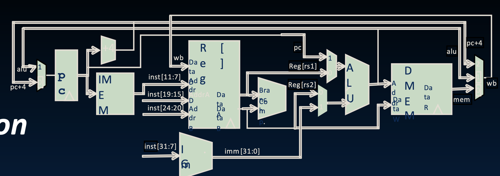
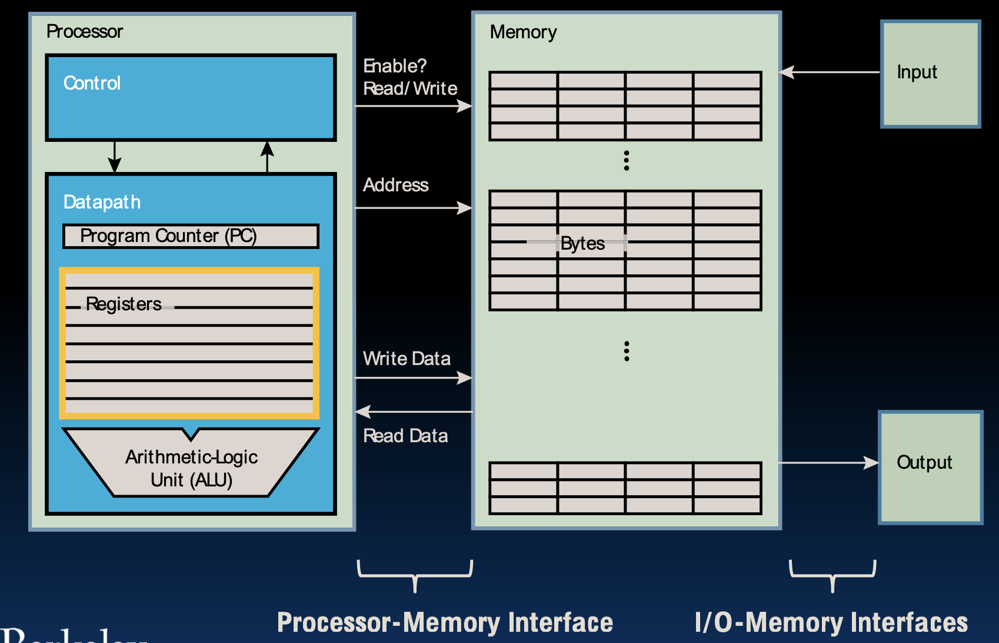
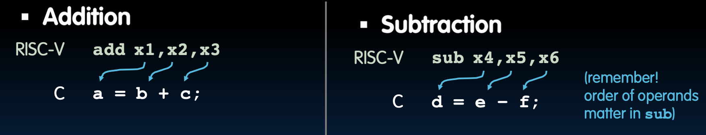

# Lecture 7: Intro to Assembly Language, RISC-V

# Floating Point Discussion

## Floating Point Fallacy

### 浮点数谬误

**浮点数加法具有结合性吗？**

**示例：**

```plaintext
x = -1.5 × 10^38
y = 1.5 × 10^38
z = 1.0

x + (y + z) = -1.5 × 10^38 + (1.5 × 10^38 + 1.0)
             = -1.5 × 10^38 + 1.5 × 10^38
             = 0.0

(x + y) + z = (-1.5 × 10^38 + 1.5 × 10^38) + 1.0
             = 0.0 + 1.0
             = 1.0
```

**结论：**

浮点数加法不具有结合性。结合性是指运算顺序不影响结果的性质。在这个例子中，不同的加法顺序得出了不同的结果。

**原因：**

- 浮点数的表示是近似的，可能会导致精度损失。
- 当数值的差异很大时，较小的数可能被忽略。
- 在示例中， \\(1.5 \times 10^{38}\\) 远大于 1.0，因此 \\(1.5 \times 10^{38} + 1.0\\) 被近似为 \\(1.5 \times 10^{38}\\)。

## Rounding

### 舍入

**在进行浮点运算时，必须对结果进行舍入以适应有限的有效数字字段。**

**浮点硬件通常会保留额外的两位精度，然后进行舍入，以获得更精确的结果。**

**舍入还会在以下情况下发生：**

- 从双精度值转换为单精度值。
- 从浮点数转换为整数。

## IEEE FP’s Four Rounding Modes

### IEEE 浮点数的四种舍入模式

**向 +∞ 舍入：**

- 总是向上舍入：2.001 → 3，-2.001 → -2

**向 -∞ 舍入：**

- 总是向下舍入：1.999 → 1，-1.999 → -2

**截断（Truncate）：**

- 只删除最后的位（向0舍入）。

**无偏舍入（默认）：如果中间值，则向偶数舍入：**

- 正常舍入：2.4 → 2，2.6 → 3
- 中间值向偶数舍入：2.5 → 2，3.5 → 4
- 这种方法确保计算的公平性，平衡了不准确性：
  - 当值正好在边界上时，一半时间向上舍入，另一半时间向下舍入。

**总结**

**浮点数加法的非结合性：**

- 浮点数在计算过程中会出现精度损失，尤其是当操作数的数量级差异很大时。
- 在示例中，由于 \\(1.5 \times 10^{38}\\) 远大于 1.0，浮点数的表示会导致 \\(1.5 \times 10^{38} + 1.0\\) 被近似为 \\(1.5 \times 10^{38}\\)，从而忽略了 1.0 的影响。

**舍入模式的作用：**

- 舍入模式的选择对计算结果有直接影响，不同的模式在不同的应用场景中有不同的用途。
- **向 +∞ 舍入** 和 **向 -∞ 舍入** 在金融计算或误差控制中有特定的应用。
- **截断（Truncate）** 在某些算法中用于快速计算。
- **无偏舍入**（向偶数舍入）则是为了减少系统性误差，广泛用于通用计算中。


## FP Addition

### 浮点数加法

浮点数加法比整数加法更复杂，不能直接相加有效数字。

**我们如何进行浮点数加法？**

1. **去规范化以匹配指数**：
   - 首先将两个浮点数的指数调整到相同的值。选择较大的指数，并将较小指数的数进行相应的调整。
2. **将有效数字相加**：
   - 调整后的两个浮点数的有效数字相加。如果符号不同，执行减法。
3. **保持匹配的指数**：
   - 加法或减法后，保持之前选择的较大指数。
4. **规范化（可能更改指数）**：
   - 如果结果的有效数字不符合规范化形式，需要调整，使结果成为规范化浮点数，可能需要更改指数。

**注意：** 如果符号不同，只需进行减法。

### 详细示例

假设我们要计算：

\\[ A = 1.25 \times 10^3 \\]
\\[ B = 2.75 \times 10^2 \\]

1. **去规范化**：调整B的指数与A相同
\\[ B = 0.275 \times 10^3 \\]

2. **有效数字相加**：
\\[ A + B = 1.25 \times 10^3 + 0.275 \times 10^3 = 1.525 \times 10^3 \\]

3. **保持匹配的指数**：
\\[ 1.525 \times 10^3 \\]

4. **规范化**：
   - 结果已经是规范化形式，不需要进一步调整。

## Casting floats to ints and vice versa

### 浮点数和整数之间的类型转换

在C语言中，可以通过强制类型转换来进行浮点数和整数之间的转换。

**将浮点数转换为整数：**

```c
(int) floating_point_expression
```

- 将浮点数转换为最接近的整数（C语言使用截断）。
- 例如：

```c
int i;
float f = 3.14159;
i = (int) f; // i的值为3
```

**将整数转换为浮点数：**

```c
(float) integer_expression
```

- 将整数转换为最接近的浮点数。
- 例如：

```c
int i = 5;
float f;
f = (float) i; // f的值为5.0
```

## Double Casting Doesn’t Always Work

### 双重类型转换并不总是有效

以下示例说明了浮点数和整数之间的双重类型转换并不总是有效：

```c
int i = ...;
if (i == (int)((float) i))
{
    printf("true");
}
```

- **不会总是打印“true”！**
  - 大多数大整数值没有精确的浮点数表示。
  - 回忆：每个指数只有 \\(2^{23}\\) 个浮点数。

**双精度呢？**

```c
float f = ...;
if (f == (float)((int) f))
{
    printf("true");
}
```

- **不会总是打印“true”！**
  - 小浮点数（<1）没有整数表示。
  - 对于其他数字，舍入错误可能导致结果不准确。

**总结**

- 浮点数的表示是有限精度的。对于非常大的整数，浮点数可能无法精确表示，导致转换回整数时出现误差。
- 例如，一个非常大的整数可能被转换为一个近似的浮点数，而再转换回整数时，由于精度限制，结果可能不同。
- 类似地，小浮点数（小于1）在转换为整数时会被截断为零，再转换回浮点数时就变成了零。

---

# The RISC-V Instruction Set Architecture

## Great Idea #1: Abstraction (Levels of Representation/Interpretation)

### 伟大的理念#1：抽象（表示/解释的层次）

**高层次语言程序（如 C）：**

```c
temp = v[k];
v[k] = v[k+1];
v[k+1] = temp;
```

- 在高级语言中，程序员使用人类可读的语句和结构编写代码。这些语句更接近人类的思维方式，而不是计算机的底层操作。

**编译器（Compiler）：**

```nasm
lw x3, 0(x10)
lw x4, 4(x10)
sw x4, 0(x10)
sw x3, 4(x10)
```

- 编译器将高级语言程序转换为汇编语言。这一步骤涉及将人类可读的代码翻译成机器可以理解的指令。这些指令直接对应于计算机的硬件操作。

**汇编语言程序（如 RISC-V）：**

```plaintext
0000 1100 0000 0000 0000 0000 0000 0000
0000 1100 0001 0000 0000 0000 0000 0000
...
```

- 汇编语言进一步转换为机器语言，即一系列二进制代码，这些代码可以直接由计算机的CPU执行。

**硬件架构描述（例如，块图）：**



- 硬件架构描述包括CPU的设计和功能模块。块图显示了处理器的各个部分如何连接和交互。

**逻辑电路描述（电路原理图）：**


- 电路原理图描述了物理电路的布局和连接方式。这一步骤详细描述了实际硬件组件如何实现逻辑功能。

**抽象的核心思想是：**

- 任何东西都可以表示为一个数字，即数据或指令。通过各层次的抽象，可以将复杂的计算问题分解为简单的操作，从而简化设计和实现过程。

## Assembly Language

### 汇编语言

**CPU的基本工作：执行大量的指令。**

- **指令** 是CPU可能执行的基本操作。每个指令都像一个句子：包含一个操作（动词）和操作数（对象），按顺序执行。

**指令集架构（ISA）**：

- 不同的CPU实现不同的指令集。特定CPU实现的指令集称为指令集架构（ISA）。
- 示例：ARM（手机），Intel x86（i9，i7，i5，i3），IBM/Motorola PowerPC（旧Macs），MIPS，RISC-V。

## Instruction Set Architectures

### 指令集架构

**早期趋势：**

- 在新的CPU上添加越来越多的指令以执行复杂的操作。例如，VAX架构有一个用于多项式乘法的指令。

**精简指令集计算机（RISC）理念：**

- 由John Cocke（IBM）、David Patterson、John Hennessy在1980年代提出。
- 保持指令集小而简单，使得构建快速硬件变得更容易。
- 让软件通过组合简单的操作来完成复杂的操作。这一理念违背了当时的传统智慧，但最终证明是有效的。

## RISC-V Architecture

### RISC-V 架构

**新的开源、免许可证的ISA规范：**

- 支持日益增长的共享软件生态系统。
- 适用于所有级别的计算系统，从微控制器到超级计算机。
- 提供32位、64位和128位变体（课堂和教材通常使用32位）。

**为什么选择RISC-V而不是Intel x86-64？**

- RISC-V简单而优雅，使学习和理解计算机架构更容易。
- 我们可以专注于架构的核心概念，而不必陷入复杂的细节。
- RISC-V在从微控制器到数据中心的各种应用中得到了广泛采用，显示了其灵活性和扩展性。


## RISC-V Origins

### RISC-V 的起源

**始于2010年夏天，支持UC Berkeley的开放研究和教学。**

- RISC-V项目始于加州大学伯克利分校，旨在创建一个开放和灵活的指令集架构（ISA），以支持研究和教学。

**历史背景：**

- 可以追溯到1980年代的RISC-I/II项目。这些早期的项目为现代RISC架构的发展奠定了基础。

**随着项目的成熟，RISC-V基金会成立：**

- 随着RISC-V项目的发展，成立了RISC-V基金会（现为RISC-V国际），以促进RISC-V的标准化和推广。更多信息可访问 [riscv.org](http://www.riscv.org)。

**基于RISC-V的许多商业和研究项目：**

- RISC-V被广泛应用于开源和专有项目中，并且在教育领域也得到了广泛使用。

**阅读更多：**

- [RISC-V History](https://riscv.org/risc-v-history/)
- [RISC-V Genealogy](https://riscv.org/risc-v-genealogy/)


# Elements of Architecture: Registers

## Instruction Set

### 指令集

**特定架构（如RISC-V）的指令集由汇编语言表示。**

- 汇编语言是一种低级编程语言，每一行代码对应计算机的一条指令。

**示例：**

```nasm
add x1, x2, x3
```

- **操作名称（operation name）：** `add` 表示加法操作。
- **寄存器（registers）：** `x1`, `x2`, `x3` 表示操作数存储的位置。

**指令集架构（ISA）**：

- 指令集架构定义了CPU可以执行的基本操作，以及这些操作如何在硬件中实现。RISC-V是一种简化指令集计算机（RISC）架构，专注于提供简洁、高效的指令集。

## Higher-Level Language vs. Assembly Language (1/2)

### 高级语言 vs 汇编语言 (1/2)

**C、Java**

在C语言（以及大多数高级语言）中，变量首先声明并指定类型。

```c
int fahr, celsius;
char a, b, c, d, e;
```

- 变量声明决定了变量可以存储的数据类型，每个变量只能存储其声明类型的值。

在高级语言中，变量类型决定操作。

```c
int *p = ...;
p = p + 2;
int x = 42;
x = 3 * x;
```

- 变量的类型决定了可以对其执行的操作。例如，`int`类型的变量可以进行算术运算，而指针类型的变量可以进行地址运算。

**RISC-V**

在RISC-V汇编语言中，操作数是寄存器。

- **寄存器：** 寄存器是有限数量的特殊存储位置，直接内置于硬件中，用于存储操作数。

```nasm
add x1, x2, x3
```

- 在汇编语言中，寄存器没有类型。寄存器的内容只是位，具体如何解释这些位取决于执行的指令。

操作决定“类型”，即如何处理寄存器内容。例如，作为值、内存地址等。

- 在汇编语言中，同一个寄存器可以在不同的指令中表示不同类型的数据。例如，它可以是一个整数值，也可以是一个内存地址，这取决于指令的具体含义。

通过这些解释，可以更好地理解高级语言和汇编语言之间的差异，以及为什么抽象对于计算机科学如此重要。高级语言提供了更高层次的抽象，使编程更容易理解和维护，而汇编语言提供了更接近硬件的控制，使得优化和低级编程更加高效。


## Registers are Inside the Processor

### 寄存器在处理器内部

**处理器的组成部分：**

- **控制单元（Control Unit）**：负责指挥和协调处理器内部的各种操作，控制指令的执行顺序。
- **数据路径（Datapath）**：包含执行实际运算的组件，如寄存器和ALU。
- **程序计数器（Program Counter, PC）**：存储下一条指令的地址。
- **寄存器（Registers）**：用于存储数据和指令，直接内置于处理器中，非常快速。
- **算术逻辑单元（Arithmetic Logic Unit, ALU）**：执行算术和逻辑运算。



寄存器直接在硬件中，因此速度非常快（比0.25纳秒更快）。

**光速与时钟周期：**

```plaintext
3x10^8 m/s = 0.3m/ns = 30cm/ns = 10cm/0.3ns
```

- 0.3ns是3.33GHz计算机的时钟周期，表示光在0.3ns内可以传播10cm，这与现代处理器内部信号传播的速度相当。

## Great Idea #3: Principle of Locality / Memory Hierarchy

### 伟大的理念#3：局部性原理 / 内存层次结构

**处理器芯片包含多个层次的存储：**

- **CPU核心（CPU Core）**：处理指令的执行。
- **寄存器（Registers）**：处理器内部的高速存储单元。
- **片上缓存（On-Chip Cache）**：快速访问的数据缓存，通常分为L1、L2、L3缓存。
- **片外缓存（Off-Chip Cache）**：与主内存之间的缓存。
- **内存（Memory）**：主存储器，用于存储正在使用的数据和程序。
- **磁盘（Disk）**：长期存储设备，访问速度较慢。
- **磁带/光学存储（Tape/Optical Storage）**：更慢的长期存储设备，用于归档和备份。

**存储延迟类比：**

- 极快、极昂贵、容量极小的存储在处理器内部（如寄存器）。
- 越靠近处理器的存储单元速度越快，但容量和成本也相应增加。

## 32 Registers in RISC-V

### RISC-V中的32个寄存器

**寄存器的数量：**

- 每个指令集架构（ISA）有预定数量的寄存器。
- RISC-V选择32个寄存器，平衡速度和存储容量。
- 更少的寄存器使得访问更快，但太少的寄存器会限制性能和灵活性。

**RISC-V代码组织：**

- RISC-V代码必须非常仔细地组织以有效使用寄存器。
- 现在：编译器在声明、函数调用等过程中将C变量映射到RISC-V寄存器。

**RISC-V寄存器：**

- RISC-V有32个寄存器。
- 每个RISC-V寄存器宽32位（在RV32变体中）。
- 32位一组称为一个字（word）在RV32中。

## Register Names and Numbers

### 寄存器名称和编号

**寄存器编号从0到31：**

- 用编号x0 - x31表示。
- 每个寄存器可以用编号或名称引用。

**x0是特殊的：**

- x0寄存器总是持有值0，因此不能用于存储变量值。
- 因此，实际上只有31个寄存器能够持有变量值。

在后续课程中将详细解释每个寄存器的名称及其用途。


# Add/Sub Instructions

## Higher-Level Language vs. Assembly Language (2/2)

### 高级语言 vs 汇编语言 (2/2)

**C、Java**

- 高级语言中的一行代码可以包含多个操作。

  ```c
  a = b * 2 - (arr[2] + *p);
  ```

  - 这行代码涉及多种操作：乘法、加法、减法、数组访问和指针解引用。
  - 常见操作符包括：`=`, `+`, `-`, `*`, `/`。

**RISC-V**

- 每条汇编语句都是一条指令，通常只能执行一个简单的操作。

  ```python
  add x1, x2, x3   # x1 = x2 + x3
  sub x1, x1, x4   # x1 = x1 - x4
  ```

  - 汇编语言中的每行代码最多包含一条指令。这些指令执行基本操作，如加法、减法、加载和存储。

**编译器的作用：**

- 编译器将高级语言代码翻译为汇编语言指令。因此，高级语言中的复杂表达式通常被分解成多条简单的汇编指令。

## RISC-V Arithmetic Instruction Syntax

### RISC-V 算术指令语法

RISC-V指令遵循严格的语法格式：

```python
opname rd, rs1, rs2
```

- **opname:** 操作名称，例如`add`、`sub`等。
- **rd:** 目标寄存器，用于存储操作结果。
- **rs1:** 源操作数1，第一个源寄存器。
- **rs2:** 源操作数2，第二个源寄存器。

**语法规则的优点：**

- 这种严格的一致性使得硬件设计更加简单和高效。每条指令固定有一个操作符和三个操作数，减少了解析和执行指令的复杂性。

## RISC-V Addition and Subtraction

### RISC-V 加法和减法

**加法**

```python
RISC-V: add x1, x2, x3   # x1 = x2 + x3
C:      a = b + c;
```

**减法**

```python
RISC-V: sub x4, x5, x6   # x4 = x5 - x6
C:      d = e - f;
```



**重要提示：**

- 在执行减法时，操作数的顺序至关重要。例如，`sub x4, x5, x6`表示`x4 = x5 - x6`，而不是`x6 - x5`。

## RISC-V Arithmetic, Example 1

### RISC-V 算术示例 1

**将以下C语句翻译成RISC-V指令：**

```c
a = b + c + d - e;
```

**假设C变量与RISC-V寄存器的映射如下：**

- `x10` 对应 `a`
- `x11` 对应 `b`
- `x12` 对应 `c`
- `x13` 对应 `d`
- `x14` 对应 `e`

**解决方案：分解成多条指令**

1. 先将`b`和`c`相加：

    ```python
    add x10, x11, x12   # x10 = b + c
    ```

2. 然后将`d`加到之前的结果中：

    ```python
    add x10, x10, x13   # x10 = x10 + d
    ```

3. 最后从结果中减去`e`：

    ```python
    sub x10, x10, x14   # x10 = x10 - e
    ```

**注释：**

- 在RISC-V汇编中，行内注释使用 `#`，类似于C99的 `//`。不同于C语言，RISC-V不支持多行注释（`/* ... */`）。


## RISC-V Arithmetic, Example 2

### RISC-V 算术示例 2

**如何实现以下C语句？**

```c
f = (g + h) - (i + j);
```

假设C变量与RISC-V寄存器的映射如下：

- `x19` 对应 `f`
- `x20` 对应 `g`
- `x21` 对应 `h`
- `x22` 对应 `i`
- `x23` 对应 `j`
- `x5` 和 `x6` 为临时寄存器

**解决方案：使用中间临时寄存器！**

```python
add x5, x20, x21    # x5 = g + h
add x6, x22, x23    # x6 = i + j
sub x19, x5, x6     # f = (g + h) - (i + j)
```

**优化方案：**

一个好的编译器可能会将C代码直接翻译成如下RISC-V指令：

```python
f = g + h - i - j;
```

这样做为什么可行？因为可以不使用临时寄存器，通过重排计算顺序直接实现最终结果。

# Immediates

### 立即数

立即数是数值常量。在RISC-V中，经常出现立即数，因此有单独的指令处理它们。

### Add Immediate Instruction

### 加立即数指令

```python
addi x3, x4, 10    # x3 = x4 + 10
```

该指令的语法与 `add` 指令相似，但最后一个操作数必须是一个立即数，而不是寄存器。

**对应的C代码：**

```c
f = g + 10;
```

### 为什么RISC-V没有减立即数指令？

虽然RISC-V有 `add` 和 `sub` 指令，但要减去一个立即数，只需使用 `addi` 指令，并将立即数取反即可。

```python
addi x3, x4, -10    # x3 = x4 - 10
```

**对应的C代码：**

```c
f = g - 10;
```

**RISC-V哲学：** 将操作类型的可能性减少到绝对最小。如果一个操作可以分解成更简单的操作，就不要将其包含在指令集中。

## Register Zero

### 零寄存器

一个特殊的立即数，即数字0（0），在代码中经常出现。RISC-V将寄存器零（`x0`）硬件设定为值0。

```python
add x3, x0, x0    # x3 = 0 + 0
```

这条指令的定义在硬件中，所以执行该指令不会产生任何效果，但它可以用于初始化寄存器或进行其他需要零值的操作。

## Concept Check: True or False?

### 概念检查：真或假？

1. **C语言的类型与声明相关（通常），但在RISC-V中与指令（操作符）相关。**
   - **正确**，我们在前面的解释中已经看到了这一点。

2. **由于只有32个寄存器，我们不能为包含超过32个变量的C表达式编写RISC-V代码。**
   - **错误**，我们已经看到如何将较长的方程式分解成较小的部分，通过使用临时寄存器和分阶段的计算来实现复杂表达式。

3. **如果 `p`（存储在 `x9` 中）是一个指向整数数组的指针，那么 `p++` 将会是 `addi x9, x9, 1`。**
   - **错误**，不要忘记整数（通常）是4字节宽的，所以指令应该是 `addi x9, x9, 4`。

### 详细解释

**第一条：** 
- 在C语言中，变量类型由声明决定，不同类型的变量有不同的操作方法。而在RISC-V汇编语言中，寄存器没有类型，操作类型由指令决定。例如，加法指令操作的寄存器内容被解释为整数，而加载指令操作的寄存器内容被解释为内存地址。

**第二条：**
- 虽然RISC-V只有32个寄存器，但通过使用临时寄存器和分阶段计算，我们可以处理包含超过32个变量的复杂表达式。编译器会智能地分配寄存器，并在必要时使用内存来存储中间结果。

**第三条：**
- 指针运算需要考虑数据类型的大小。对于指向整数的指针，自增操作需要增加指针的值以跳过一个整数的大小，即4字节。因此，正确的RISC-V指令是 `addi x9, x9, 4`，而不是 `addi x9, x9, 1`。