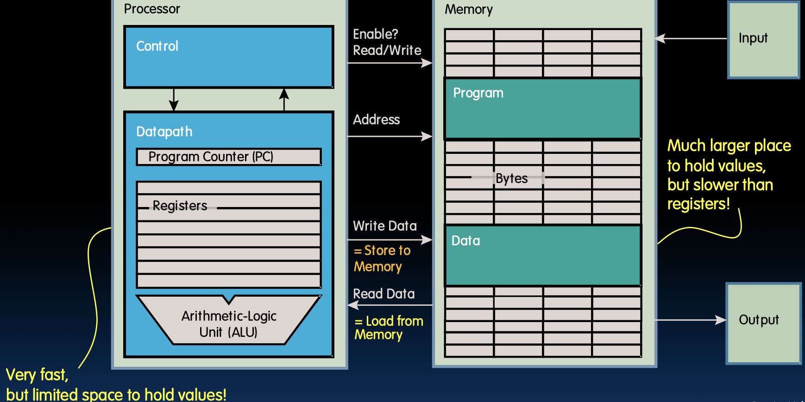
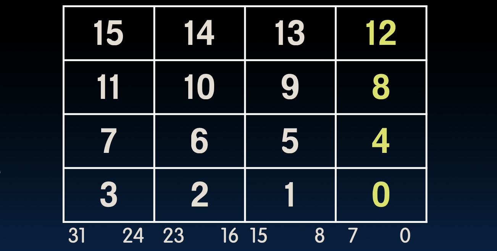
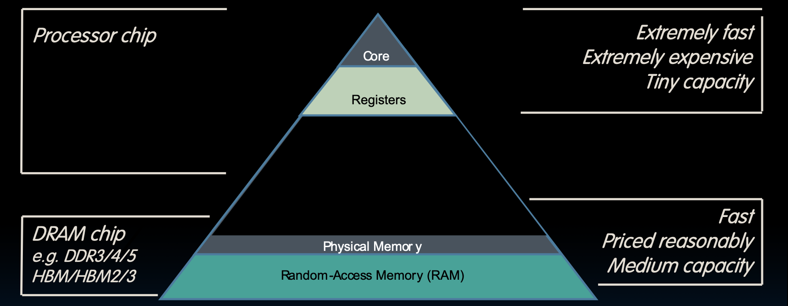

# Lecture 8: RISC-V Data Transfer

### 存储数据与内存
在计算机系统中，存储数据和内存是基础知识。内存用于临时存储数据和指令，以便处理器快速访问和处理。这一部分内容为后续讨论打下了基础。

### 汇编语言与高级语言的区别
汇编语言和高级语言如 C 有显著区别。汇编语言位于更底层，直接与硬件交互。以 RISC-V ISA 为例，汇编语言的指令如 `ADD`、`SUB` 和 `ADDI`，都与寄存器直接相关。这些指令由 Verilog 描述，设计上类似于 C，使得理解和使用更为直观。

### RISC-V 指令集架构 (ISA)
RISC-V 是一种开源指令集架构，其指令都必须编码在 32 位内。指令集包括基本算术运算（如 `ADD` 和 `SUB`）以及带有立即数的运算（如 `ADDI`）。每条指令需要指明源寄存器 (`rs1` 和 `rs2`) 和目标寄存器 (`rd`)。立即数操作使得可以直接在指令中包含常数值。

### 寄存器与操作数
RISC-V 使用寄存器进行数据存储和操作。`rs1` 和 `rs2` 是源寄存器，用于读取数据，`rd` 是目标寄存器，用于存储运算结果。汇编语言中，操作数既可以是寄存器中的值，也可以是立即数（常量）。

### 指令编码
所有 RISC-V 指令都必须在 32 位内编码，这要求在有限的位数内表达多种信息。不同类型的指令在 32 位内有不同的编码方式。例如，浮点数操作需要在 32 位内表达特定的浮点数值，包括无穷大和非数字（NaN）。指令的编码需要在寄存器索引、立即数和操作码之间进行权衡。

### 浮点数操作
在浮点数操作中，32 位用于表示特定的浮点数、无穷大或非数字（NaN）。这使得浮点数操作的编码和处理变得复杂，需要特定的语义和位分配方式。

### 编码限制与资源分配
由于所有指令都必须在 32 位内编码，寄存器数量和立即数大小都受到限制。这种限制要求对资源进行有效分配，即所谓的“无免费午餐”原则。在编码中，必须在操作码、寄存器索引和立即数之间进行平衡，以确保所有信息都能在有限的位数内表示。

### 编码与操作限制
在 RISC-V 中，指令编码的限制带来了寄存器数量和立即数大小的约束。每条指令需要在有限的位数内表达多个元素，这使得寄存器和立即数的设计变得关键。设计者必须在功能性和资源利用之间进行权衡，以实现高效的指令集。

---

# Storing Data in Memory

## RV32 So Far...

### RV32 到目前为止...

### Addition/subtraction

### 加法/减法

```nasm
add rd, rs1, rs2
```
表示：`R[rd] = R[rs1] + R[rs2]`

- `add` 指令将寄存器 `rs1` 和 `rs2` 中的值相加，并将结果存储到寄存器 `rd` 中。

```nasm
sub rd, rs1, rs2
```
表示：`R[rd] = R[rs1] - R[rs2]`

- `sub` 指令将寄存器 `rs1` 中的值减去寄存器 `rs2` 中的值，并将结果存储到寄存器 `rd` 中。

### Add immediate

### 加立即数

```nasm
addi rd, rs1, imm
```
表示：`R[rd] = R[rs1] + imm`

- `addi` 指令将寄存器 `rs1` 中的值与立即数 `imm` 相加，并将结果存储到寄存器 `rd` 中。

> ## Verilog for RV32 Addition and Subtraction
>
> ### Verilog 实现 RV32 的加法和减法
>
> Verilog 是一种用于描述数字和模拟电路的硬件描述语言（HDL）。使用 Verilog 可以实现 RISC-V 指令的硬件逻辑，例如加法和减法。
>
> ### Verilog 基础知识
>
> #### 模块（Module）
>
> Verilog 的基本构建块是模块。模块类似于软件编程中的函数或过程，但用于描述硬件。每个模块都有输入和输出端口。
>
> ```verilog
> module module_name (
>     input wire input_port1, // 输入端口
>     input wire input_port2, // 输入端口
>     output wire output_port // 输出端口
> );
>     // 模块内部逻辑
> endmodule
> ```
>
> #### 端口声明（Port Declaration）
>
> 端口声明定义了模块的输入和输出信号。在 Verilog 中，`input` 和 `output` 关键字用于声明输入和输出端口，`wire` 关键字表示信号类型。
>
> #### 赋值语句（Assignment Statement）
>
> `assign` 语句用于连续赋值，表示信号之间的逻辑关系。
>
> ### 加法指令的 Verilog 实现
>
> 下面是一个实现 RISC-V `add` 指令的 Verilog 模块。`add` 指令将两个寄存器的值相加，并将结果存储到目标寄存器中。
>
> ```verilog
> module add_instruction(
>     input wire [31:0] rs1, // 源寄存器1
>     input wire [31:0] rs2, // 源寄存器2
>     output wire [31:0] rd  // 目标寄存器
> );
>     assign rd = rs1 + rs2; // 将 rs1 和 rs2 相加，并将结果赋值给 rd
> endmodule
> ```
>
> - `input wire [31:0] rs1` 和 `input wire [31:0] rs2`：两个32位宽的输入信号，代表源寄存器的值。
> - `output wire [31:0] rd`：一个32位宽的输出信号，代表目标寄存器的值。
> - `assign rd = rs1 + rs2;`：将 rs1 和 rs2 的值相加，并将结果赋值给 rd。
>
> ### 减法指令的 Verilog 实现
>
> 下面是一个实现 RISC-V `sub` 指令的 Verilog 模块。`sub` 指令将一个寄存器的值减去另一个寄存器的值，并将结果存储到目标寄存器中。
>
> ```verilog
> module sub_instruction(
>     input wire [31:0] rs1, // 源寄存器1
>     input wire [31:0] rs2, // 源寄存器2
>     output wire [31:0] rd  // 目标寄存器
> );
>     assign rd = rs1 - rs2; // 将 rs1 减去 rs2，并将结果赋值给 rd
> endmodule
> ```
>
> - `assign rd = rs1 - rs2;`：将 rs1 的值减去 rs2 的值，并将结果赋值给 rd。
>
> ### 加立即数指令的 Verilog 实现
>
> 下面是一个实现 RISC-V `addi` 指令的 Verilog 模块。`addi` 指令将一个寄存器的值与立即数相加，并将结果存储到目标寄存器中。
>
> ```verilog
> module addi_instruction(
>     input wire [31:0] rs1, // 源寄存器1
>     input wire [31:0] imm, // 立即数
>     output wire [31:0] rd  // 目标寄存器
> );
>     assign rd = rs1 + imm; // 将 rs1 和 imm 相加，并将结果赋值给 rd
> endmodule
> ```
>
> - `input wire [31:0] imm`：一个32位宽的输入信号，代表立即数。
> - `assign rd = rs1 + imm;`：将 rs1 的值与立即数 imm 相加，并将结果赋值给 rd。
>


## Data Transfer: Load from and Store to memory

### 数据传输：从内存加载和存储到内存

数据传输涉及两个操作：从内存加载数据和将数据存储到内存。

- **Processor**（处理器）中的寄存器存储的数据非常快，但存储空间有限。
- **Memory**（内存）中存储的数据空间更大，但访问速度较慢。



在RISC-V中，有多种指令用于加载和存储数据：

- `lw`（加载字）：从内存中加载一个32位字到寄存器。
- `sw`（存储字）：将寄存器中的一个32位字存储到内存。

```python
lw x5, 0(x10)   # 从内存地址 x10 加 0 处加载数据到寄存器 x5
sw x5, 4(x10)   # 将寄存器 x5 中的数据存储到内存地址 x10 加 4 处
```

## Memory Addresses are in Bytes

### 内存地址以字节为单位

- 数据通常小于32位，但很少小于8位（例如，字符类型）。如果所有数据都是8的倍数，则工作良好。
- 8位块称为字节（1字=4字节）。
- 内存地址实际上是以字节为单位的，而不是以字为单位的。
- 字地址相隔4个字节。

### 小端格式

- 小端格式（Little-endian convention）：最低有效字节具有最小地址。

在一个字（32位）中，字节的地址如下所示：



最右边的字节0的地址是最小的。


# Data Transfer Instructions

## Great Idea #3: Principle of Locality / Memory Hierarchy

### 伟大思想 #3：局部性原理/内存层次结构

**内存层次结构**

- **寄存器**（Registers）：非常快、非常昂贵、容量很小。直接内置在CPU中，访问速度在纳秒级别。
- **物理内存**（Physical Memory）：快速、价格合理、中等容量。包括RAM，存取速度在几十纳秒到百纳秒之间。
- **存储层次结构**：从核心（Core）到寄存器（Registers）、物理内存（RAM），再到更大的存储（例如硬盘），存取速度逐渐变慢，但存储容量逐渐变大。硬盘和SSD的存取速度在毫秒到微秒级别。



**局部性原理**

- **时间局部性**（Temporal Locality）：程序访问某一内存位置后，很快可能再次访问该位置。
- **空间局部性**（Spatial Locality）：程序访问某一内存位置后，很可能会访问其附近的位置。

## Speed of Registers vs. Memory

### 寄存器与内存的速度对比

**给定条件：**

- **寄存器**：32个字（128字节）
- **内存**：数十亿字节（例如，笔记本电脑上2GB到96GB）

**物理规律：**

- 较小的物理尺寸更快

**问题：**

- 寄存器比DRAM快多少？

**答案：**

- 寄存器访问速度比DRAM快约50到500倍（单次访问延迟约为几十纳秒）。
- 但在连续访问中，后续字节访问仅需几纳秒。

## Load from Memory to Register

### 从内存加载到寄存器

**C代码示例：**

```c
int A[100];
g = h + A[3];
```

**数据流：**

使用RISC-V中的Load Word指令：

```python
lw x10, 12(x15)  # 从内存地址 x15 + 12 处加载数据到寄存器 x10
add x11, x12, x10  # 将寄存器 x12 和 x10 中的值相加，并将结果存储到寄存器 x11
```

**注意事项：**

- **x15**：基址寄存器（指向数组A的起始地址）
- **12**：偏移量，以字节为单位，对应于数组A中的第3个元素（每个元素4字节）
- 偏移量必须是汇编时的常量

## Store from Register to Memory

### 从寄存器存储到内存

**C代码示例：**

```c
int A[100];
A[10] = h + A[3];
```

**数据流：**

使用RISC-V中的Store Word指令：

```python
lw x10, 12(x15)  # 从内存地址 x15 + 12 处加载数据到寄存器 x10
add x10, x12, x10  # 将寄存器 x12 和 x10 中的值相加，并将结果存储到寄存器 x10
sw x10, 40(x15)  # 将寄存器 x10 中的值存储到内存地址 x15 + 40 处
```

**注意事项：**

- **x15**：基址寄存器（指向数组A的起始地址）
- **12, 40**：偏移量，以字节为单位，分别对应于数组A中的第3个和第10个元素
- 偏移量必须是4的倍数（每个元素4字节）

## Loading and Storing Bytes

### 加载和存储字节

除了字数据传输（lw, sw），RISC-V还具有字节数据传输指令：

- **加载字节**：`lb`
- **存储字节**：`sb`

与 `lw` 和 `sw` 的格式相同。例如：

```python
lb x10, 3(x11)  # 从内存地址 x11 + 3 处加载一个字节到寄存器 x10 的低字节位置
```

**无符号字节加载（`lbu`）：**

- 使用零扩展填充寄存器。例如：

```python
lbu x10, 3(x11)  # 从内存地址 x11 + 3 处加载一个无符号字节到寄存器 x10
```

**没有无符号字节存储（`sbu`）：**

- 存储操作不区分有符号和无符号，因为存储时只是将数据的二进制表示写入内存位置。

> ### 加载和存储字节
>
> 在 RISC-V 中，除了处理字（word）数据传输的指令（如 `lw` 和 `sw`），还有用于字节数据传输的指令。这些指令允许处理更小的数据单元，使得内存操作更加细粒度。
>
> ### 加载字节
>
> - **加载字节（`lb`）**：从内存读取一个字节（8 位）并将其加载到寄存器中。这时，读取的字节会被符号扩展到 32 位寄存器中。
>
> - **无符号字节加载（`lbu`）**：从内存读取一个无符号字节（8 位）并将其加载到寄存器中。读取的字节会被零扩展到 32 位寄存器中。
>
> ### 符号扩展和零扩展
>
> - **符号扩展（Sign Extension）**：符号扩展是指将一个较小的带符号值扩展为较大的位宽，同时保持其符号。例如，当 `lb` 指令从内存加载一个字节（8 位）时，如果该字节的最高位（符号位）是 1（表示负数），则扩展的高位都会填充为 1；如果最高位是 0（表示正数），则扩展的高位会填充为 0。
>
>   ```python
>   # 假设内存地址 x11 + 3 处的字节为 0xFF (十进制 -1)
>   lb x10, 3(x11)  # 加载到 x10 后，x10 的值为 0xFFFFFFFF (十进制 -1)
>   ```
>
> - **零扩展（Zero Extension）**：零扩展是指将一个较小的无符号值扩展为较大的位宽，同时填充高位为零。例如，当 `lbu` 指令从内存加载一个字节（8 位）时，不管该字节的最高位是什么，扩展的高位都会填充为 0。
>
>   ```python
>   # 假设内存地址 x11 + 3 处的字节为 0xFF (十进制 255)
>   lbu x10, 3(x11)  # 加载到 x10 后，x10 的值为 0x000000FF (十进制 255)
>   ```
>
> ### 存储字节
>
> - **存储字节（`sb`）**：将寄存器的低字节（8 位）存储到内存的指定位置。存储操作不会区分有符号和无符号，因为存储的是数据的二进制表示。
>
>   ```python
>   sb x10, 3(x11)  # 将寄存器 x10 的低字节 0x78 存储到内存地址 x11 + 3 处
>   ```
>
> ### 示例
>
> 假设 `x10` 的值为 0x12345678，`x11` 的值为 0x1000。执行以下指令：
>
> ```python
> sb x10, 3(x11)  # 将 x10 的低字节 0x78 存储到内存地址 0x1000 + 3 处
> ```
>
> 存储后，内存地址 0x1003 的内容将变为 0x78。
>
> ### 总结
>
> - **加载字节（`lb`）**：从内存读取一个字节并符号扩展到 32 位寄存器。
> - **无符号字节加载（`lbu`）**：从内存读取一个无符号字节并零扩展到 32 位寄存器。
> - **存储字节（`sb`）**：将寄存器的低字节存储到内存，不区分符号。
>
> 这种设计允许程序在处理字节级别的数据时，可以选择是否保留符号信息，从而更灵活地操作内存数据。

## Example: What is in x12?

### 例子：x12 中的内容是什么？

### 指令

```python
addi x11, x0, 0x93F5  # 将立即数0x93F5加载到寄存器x11中
sw x11, 0(x5)         # 将寄存器x11的内容存储到寄存器x5指向的内存地址中
lb x12, 1(x5)         # 从寄存器x5指向的内存地址中加载字节到寄存器x12中
```

### 寄存器和内存状态

- **x5**：基址寄存器，指向内存中的某个地址
- **x11**：0x93F5（存储的是立即数0x93F5）
- **x12**：加载的字节

### 结果分析

1. `addi x11, x0, 0x93F5` 
   - 立即数0x93F5加载到寄存器x11中，结果：`x11 = 0x93F5`
   
2. `sw x11, 0(x5)`
   - 将寄存器x11的内容0x93F5存储到基址寄存器x5指向的内存地址中。假设x5的值为0x1000，则内存地址0x1000存储0x93F5：
   ```plaintext
   内存地址:    0x1000  0x1001  0x1002  0x1003
   存储数据:     F5      93      00      00
   ```

3. `lb x12, 1(x5)`
   - 从内存地址x5 + 1处加载字节到寄存器x12中。基址寄存器x5的值为0x1000，则内存地址0x1001的内容为0x93：
   - 结果：`x12 = 0x93`

根据上面的分析，x12的最终值是 `0x93`。

## Example: Translate `*x = *y`

### 例子：翻译 `*x = *y`

我们希望将 `*x = *y` 翻译成RISC-V指令，其中`x` 和 `y` 的指针存储在以下寄存器中：

- `x` 的指针存储在：`x3`
- `y` 的指针存储在：`x5`

RISC-V 指令翻译过程如下：

1. `lw x6, 0(x5)`    # x6 = *y ；从y指向的地址加载数据到临时寄存器x6
2. `sw x6, 0(x3)`    # *x = x6；将临时寄存器x6的数据存储到x指向的地址

### 详细过程解释

1. `lw x6, 0(x5)`：
   - 从指针 `y` 指向的内存地址加载数据到临时寄存器 `x6` 中。

2. `sw x6, 0(x3)`：
   - 将寄存器 `x6` 中的数据存储到指针 `x` 指向的内存地址中。

这样，`*x` 就被赋值为 `*y` 的值。

## And in Conclusion...

### 总结

- **内存是按字节寻址的**，但 `lw` 和 `sw` 每次访问一个字（word），即4字节。
- **指针**（由 `lw` 和 `sw` 使用）只是一个内存地址，我们可以加上或减去偏移量。
- **大端序 vs 小端序**：
  - **小端序**（Little-endian）：最低有效字节（Least Significant Byte, LSB）存储在最低地址。
  - **大端序**（Big-endian）：最高有效字节（Most Significant Byte, MSB）存储在最低地址。
  - 小提示：在小端序中，将最低字节绘制在右侧。
  
- **新指令**：
  - `lw`（加载字）：从内存中加载一个32位字到寄存器。
  - `sw`（存储字）：将寄存器中的一个32位字存储到内存。
  - `lb`（加载字节）：从内存中加载一个字节到寄存器。
  - `sb`（存储字节）：将寄存器中的一个字节存储到内存。
  - `lbu`（加载无符号字节）：从内存中加载一个无符号字节到寄存器，使用零扩展。

通过这些指令和概念，我们可以更好地理解和操作RISC-V架构中的内存和寄存器，实现高效的数据处理和存储操作。
