# Lecture 11: RISC-V Instruction Formats I

# Machine Language

### 抽象概念：表示和解释的层次

在计算机系统中，不同的抽象层次允许我们从不同的角度理解和操作计算机。这些抽象层次从高级语言到底层硬件，分别提供了简化设计和编程复杂度的方式：

- **高级语言程序 (如 C)**: 程序员编写的代码。高级语言允许程序员以更加人类可读的形式编写代码，忽略底层实现细节。
- **编译器**: 将高级语言转换为汇编语言。编译器通过分析和优化代码，将其转化为底层汇编代码。
- **汇编语言程序 (如 RISC-V)**: 汇编器将其转换为机器语言。汇编语言是针对特定处理器架构的低级语言。
- **机器语言程序 (RISC-V)**: 二进制代码，可以直接在硬件上运行。机器语言指令由处理器直接执行。
- **硬件架构描述**: 包含例如块图的硬件结构。硬件架构定义了计算机系统的组成部分及其连接方式。
- **逻辑电路描述**: 包含例如电路图的具体逻辑实现。逻辑电路描述了硬件在物理层面上的实现。

每一层都为下一层提供了更高层次的抽象，简化了设计和编程的复杂度。

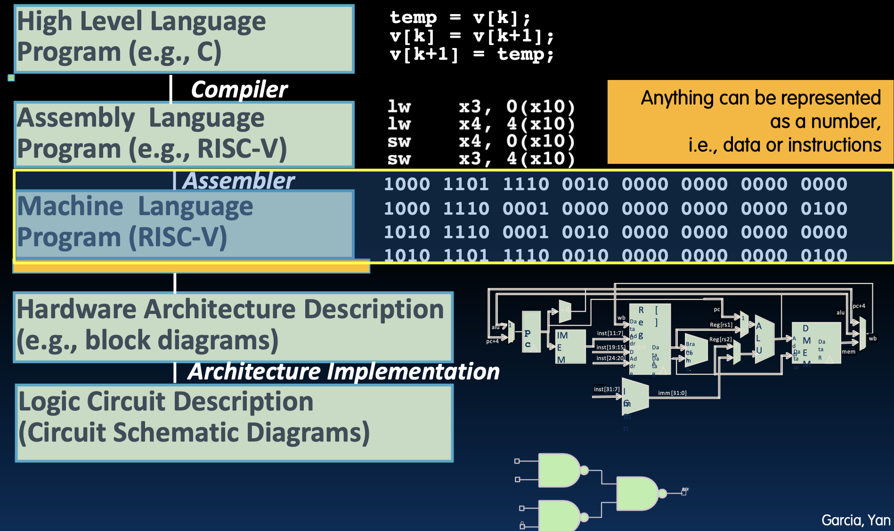

### 快速计算机科学历史：ENIAC（宾夕法尼亚大学，1946年）

ENIAC 是第一个电子通用计算机，能够快速进行计算，例如在2.8毫秒内完成10 x 10的十进制乘法。然而，每次编写新程序都需要2-3天的时间，因为编程需要插接线和开关。

ENIAC 使用了手动插接线和开关配置来编程，这导致了程序更改和调试的极大不便。这种早期计算机的编程方式使得它在灵活性和效率上受到极大限制。

### 快速计算机科学历史：EDSAC（剑桥大学，1949年）

EDSAC 是第一个存储程序的电子计算机，使用17位字（35位双字），二进制补码。其内存为512个字，乘法运算时间为6毫秒，还支持子程序调用。

EDSAC 通过使用存储程序的概念，大大简化了编程和程序更改的过程。存储程序计算机能够在内存中存储和执行程序代码，从而允许快速重新编程。

### 快速计算机科学历史：IBM 701（1952年）

IBM 701 是IBM首个商用科学计算机，使用36位符号-幅度格式的字。其内存使用真空管，总共2048个字。乘法运算时间小于0.5毫秒，拥有两个程序员可访问的寄存器：累加器和乘法器/商法器。

这些历史计算机展示了计算技术的进步，从早期的机械和电子计算设备到现代的快速、灵活的计算系统。了解这些早期计算机的工作原理，有助于我们更好地理解现代计算机架构的设计原则。

## 历史的伟大创意：存储程序计算机

### 存储程序计算机的重要性

存储程序计算机，也称为“冯·诺依曼”计算机，以广泛传播的技术报告命名。这种计算机的关键理念是指令以位模式（即数字）表示，因此整个程序可以像数据一样存储到内存中进行读取或写入。这意味着重新编程可以快速完成（几秒钟），而不需要重接计算机的线（几天）。

存储程序计算机的概念基于EDVAC的讨论，并由Eckert、Mauchly提出，早期由图灵和祖斯预见。

### 存储程序计算机的意义

1. **每个东西（指令、数据字）都有一个内存地址**：
   - 分支和跳转使用指令内存地址。
   - C语言指针只是内存地址，可以指向任何东西。未受限地使用地址会导致严重的错误，需要C程序员来避免这些错误。
   - 程序计数器（PC）寄存器保存要执行的指令地址。PC实质上是指向内存的指针，Intel称其为指令指针（IP）。

2. **程序以二进制形式分发，即汇编机器代码**：
   - 程序每个都绑定到特定的指令集。
   - 不同的指令集，例如手机和PC的指令集不同。
   - 许多指令集是向后兼容的，并且随着时间推移而演变。例如，最新的PC仍然可以运行Intel 8088（1981年）的程序。

### 指令是32位宽的

ISA（指令集架构）将CPU的指令定义到比特级别：

- 计算机只能理解1和0。例如，“add x18, x19, x10”对硬件来说是无意义的。
- 大多数数据以字（32位块）表示。
- RISC-V指令是固定大小的32位字，保持数据和指令的简单性。

### 指令格式

RISC-V的32位指令字被划分为字段，每个字段告诉处理器一些关于指令的信息。RISC-V ISA定义了六种基本的指令格式：

- **R格式**：寄存器到寄存器的算术操作
- **I格式**：寄存器-立即数的算术操作；加载
- **S格式**：存储
- **B格式**：分支（S格式的小变种）
- **U格式**：20位上立即数指令
- **J格式**：跳转（U格式的小变种）

RISC-V追求简洁：避免为每条指令定义不同的字段，而是为相似的指令使用相同的格式。

# R-Format Layout

## R格式指令布局

### 寄存器-寄存器算术指令布局（例如add、xor、sll等）

R格式指令的基本格式如下：

```
opname rd, rs1, rs2
```

指令被分为多个字段，每个字段在指令字中的位置和大小如下图所示：

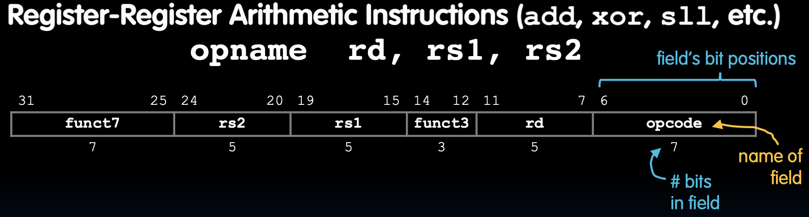

**字段的作用**

- **opcode**：部分指定是哪条指令。所有R格式指令的opcode均为0110011。
- **rd**：目标寄存器字段，包含运算结果的寄存器（5位无符号整数，对应寄存器编号x0到x31）。
- **funct3**：与funct7和opcode组合描述要执行的操作。
- **rs1**：源寄存器1字段，包含第一个操作数（5位无符号整数）。
- **rs2**：源寄存器2字段，包含第二个操作数（5位无符号整数）。
- **funct7**：与funct3和opcode组合描述要执行的操作。

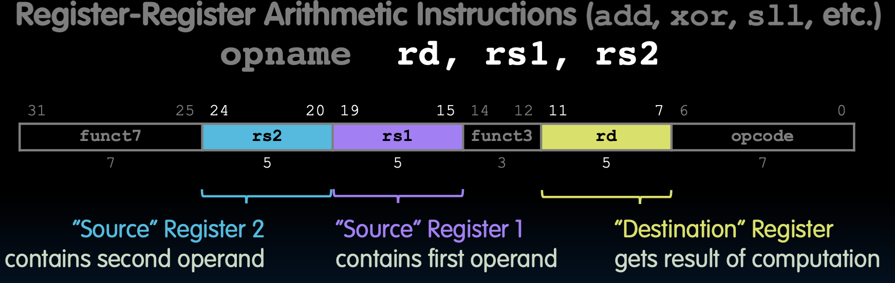

### 为什么不直接使用一个17位字段来表示操作？

虽然使用一个17位的字段来简化可能是一个选择，但分开这些字段的设计可以让指令格式更加灵活和可扩展。例如，可以通过组合不同的funct7和funct3值来增加指令的种类，而不需要改变整体的指令长度或格式。这种设计理念使得RISC-V指令集能够保持简洁和高效，同时提供足够的灵活性以适应未来的扩展和改进。

RISC-V 的这种设计，使其在简化硬件实现的同时，也能够保持指令集的灵活性和扩展性，适应未来的发展需求。


## R格式示例

### 示例：add指令

假设我们有以下指令：

```
add x18, x19, x10
```

这条指令的作用是将寄存器 `x19` 和 `x10` 的值相加，并将结果存储到寄存器 `x18` 中。指令的二进制编码为：

```
0000000 01010 10011 000 10010 0110011
```

具体细分字段如下：

- **funct7**：0000000
- **rs2**：01010 (x10)
- **rs1**：10011 (x19)
- **funct3**：000
- **rd**：10010 (x18)
- **opcode**：0110011

每个字段在指令字中的位置和大小如下图所示：

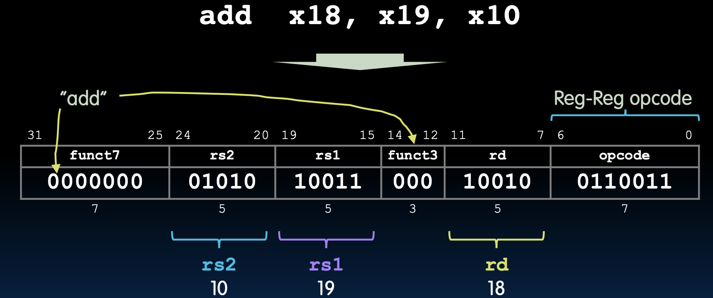

### RV32 R格式指令

以下是RV32 R格式指令的 `funct7` 和 `funct3` 字段编码：

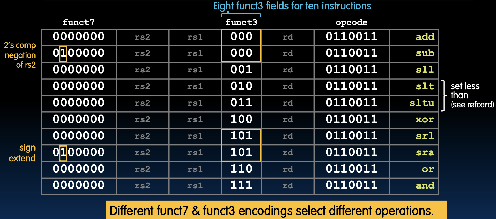

### 如何编码

现在我们尝试编码以下指令：

```
add x4, x3, x2
```

使用查找表，我们得到：

- **funct7**：0000000
- **rs2**：00010 (x2)
- **rs1**：00011 (x3)
- **funct3**：000
- **rd**：00100 (x4)
- **opcode**：0110011

合并所有字段得到二进制编码：

```
0000000 00010 00011 000 00100 0110011
```

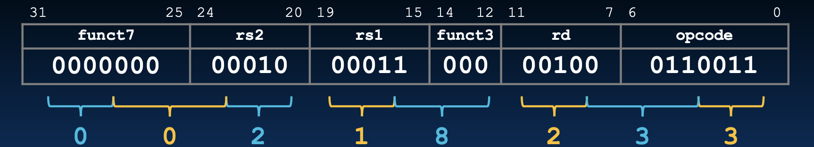

转换为十六进制编码为：

```
0x00218233
```

因此，正确的编码结果是 `0x00218233`。

# I-Format Layout

## 立即数字段需要更宽

### R格式指令

在R格式指令中，操作数来自寄存器，例如：

```
add rd, rs1, rs2
```

指令编码如下：

```
funct7  rs2   rs1   funct3  rd    opcode
0000000 01010 10011 000     10010 0110011
```

### I格式指令布局

为了处理立即数，RISC-V引入了I格式。I格式保留了与R格式的大部分一致性，简化了CPU处理指令的方式。I格式指令布局如下：

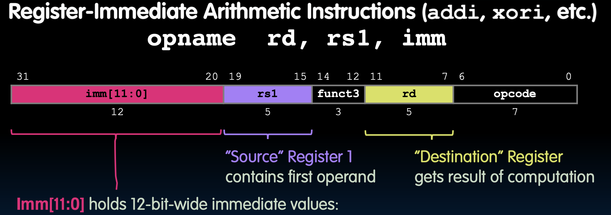

`imm[11:0]` 是12位宽的立即数，可以表示从 -2048 到 2047 的数值。CPU在使用前会将其符号扩展到32位。

### I格式示例

假设我们有以下指令：

```
addi x15, x1, -50
```

这条指令的作用是将寄存器 `x1` 的值与立即数 -50 相加，并将结果存储到寄存器 `x15` 中。指令编码如下：

```
111111100110 00001 000 01111 0010011
```

细分字段如下：

- **imm**：111111100110 (-50)
- **rs1**：00001 (x1)
- **funct3**：000
- **rd**：01111 (x15)
- **opcode**：0010011

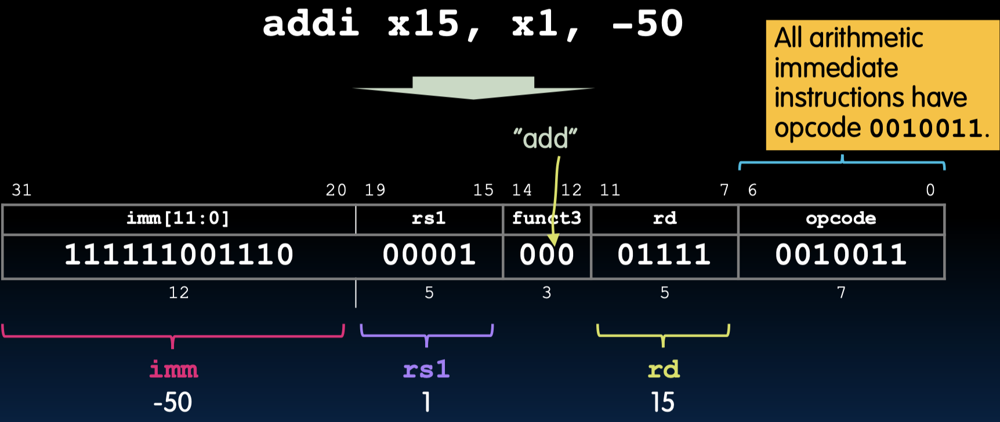

### RV32 I格式算术指令

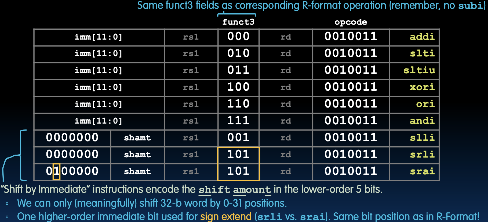

**总结**

I格式主要用于包含立即数的指令，这样可以有效地处理大于5位的数值，并且保持与R格式的一致性，以简化指令处理过程。这种设计允许CPU在执行指令时更高效地处理立即数，并且保持指令集的简洁性和一致性。

# I-Format: Load

## I格式：加载指令

### I格式指令布局：加载

加载指令使用I格式，通过指定偏移量来从内存中加载数据到寄存器中。其基本形式为：

```
loadop rd, imm(rs1)
```

例如，指令：

```
lw x14, 8(x2)
```

其作用是从内存地址 `x2 + 8` 处加载一个字到寄存器 `x14`。指令编码如下：

```
imm[11:0]  rs1  funct3  rd    opcode
000000001000 00010 010    01110 0000011
```

其中：

- **imm**：000000001000（+8）
- **rs1**：00010（x2）
- **funct3**：010
- **rd**：01110（x14）
- **opcode**：0000011

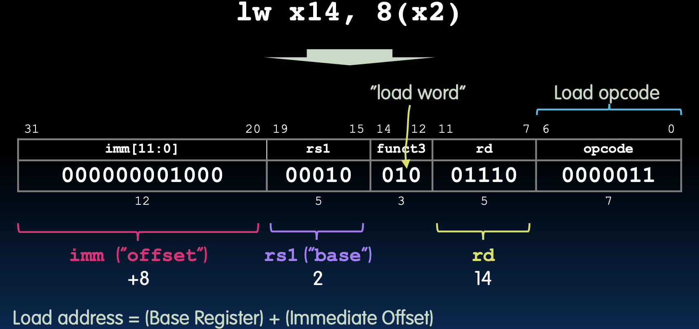

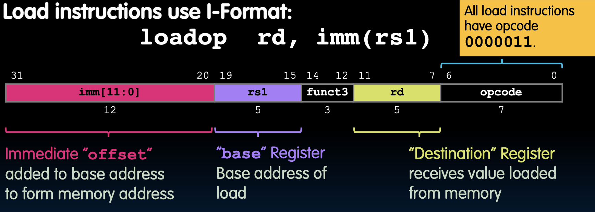

### 所有五种RV32加载指令

RISC-V定义了五种加载指令，每种指令的功能和编码如下：

- **lb**（加载字节）：funct3=000，opcode=0000011
- **lh**（加载半字）：funct3=001，opcode=0000011
- **lw**（加载字）：funct3=010，opcode=0000011
- **lbu**（加载无符号字节）：funct3=100，opcode=0000011
- **lhu**（加载无符号半字）：funct3=101，opcode=0000011

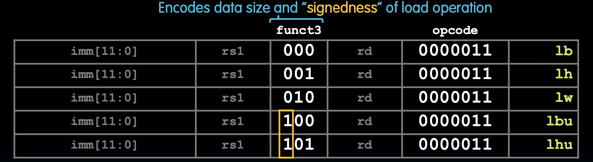

### 加载操作的符号扩展和零扩展

加载操作可能涉及符号扩展或零扩展：

- **lb** 和 **lh**：使用符号扩展，将加载的数据符号扩展到32位。例如，若加载的数据最高位为1，扩展后的高位也全部为1。
- **lbu** 和 **lhu**：使用零扩展，将加载的数据零扩展到32位，即高位填充为0。

### 总结

I格式布局的加载指令通过立即数偏移地址来从内存中加载数据到寄存器中。这种格式的灵活性使得可以有效地处理不同大小和符号的加载操作。

# S-Format Layout (Store)

## S格式指令布局

### 存储指令具有S格式

存储指令使用S格式，将寄存器中的数据存储到内存中。其基本形式为：

```
storeop rs2, imm(rs1)
```

### S-格式指令字段

- **imm[11:5]**: 立即数高7位（bits 31-25）
- **rs2**: 源寄存器（bits 24-20）
  - 存储数据的寄存器
- **rs1**: 基寄存器（bits 19-15）
  - 基地址寄存器
- **funct3**: 功能码（bits 14-12）
- **imm[4:0]**: 立即数低5位（bits 11-7）
- **opcode**: 操作码（bits 6-0）
  - 所有存储指令的操作码为 `0100011`

### 寄存器和立即数用途

- **"source" Register (rs2)**: 存储数据的源寄存器
- **"base" Register (rs1)**: 存储操作的基地址寄存器
- **Immediate "offset" (imm)**: 立即数偏移量，用于计算存储地址

存储地址的计算公式：
```plaintext
Store address = (Base Register) + (Immediate Offset)
```

立即数的高7位和低5位分开存储在指令的不同字段中。这种设计允许更灵活和高效的指令编码。

#### 示例解释

例如，如果我们有一条存储指令 `sw x5, 8(x6)`：

- **x5** 是源寄存器，包含要存储的数据。
- **x6** 是基寄存器，提供基地址。
- **8** 是立即数偏移量。

存储地址的计算如下：
```plaintext
存储地址 = x6 + 8
```

这条指令表示将寄存器x5中的数据存储到计算出的内存地址中。

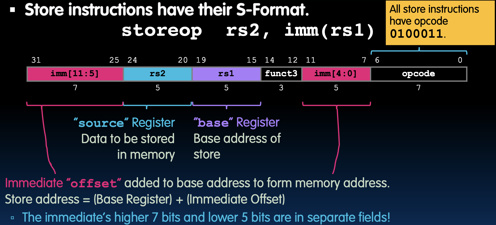

### S格式简化硬件设计

RISC-V设计优先考虑寄存器字段保持在相同的位置，这样硬件实现更加简单，因为寄存器字段位置一致，减少了不同指令格式之间的复杂性。例如，立即数的低5位移到与其他格式中的 `rd` 字段位置相同的位置。S格式的设计使得硬件能够统一指令解码过程，提高指令执行效率。

### S格式示例

例如，指令：

```
sw x14, 36(x2)
```

其作用是将寄存器 `x14` 的值存储到内存地址 `x2 + 36` 处。指令编码如下：

```
imm[11:5] rs2   rs1   funct3 imm[4:0] opcode
0000010   01110 00010 010    00100    0100011
```

具体解释：

- **imm[11:5]**：0000010（高7位）
- **rs2**：01110（x14）
- **rs1**：00010（x2）
- **funct3**：010（表示存储字）
- **imm[4:0]**：00100（低5位）
- **opcode**：0100011（表示存储指令）

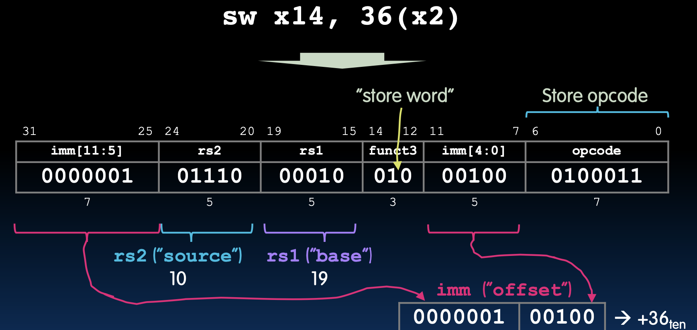

### 所有三种RV32存储指令

RISC-V定义了三种存储指令，分别用于不同的数据宽度：

- **sb**：存储字节（8位），funct3=000
- **sh**：存储半字（16位），funct3=001
- **sw**：存储字（32位），funct3=010

这些指令通过立即数和两个寄存器操作数来指定存储操作的位置和数据内容。

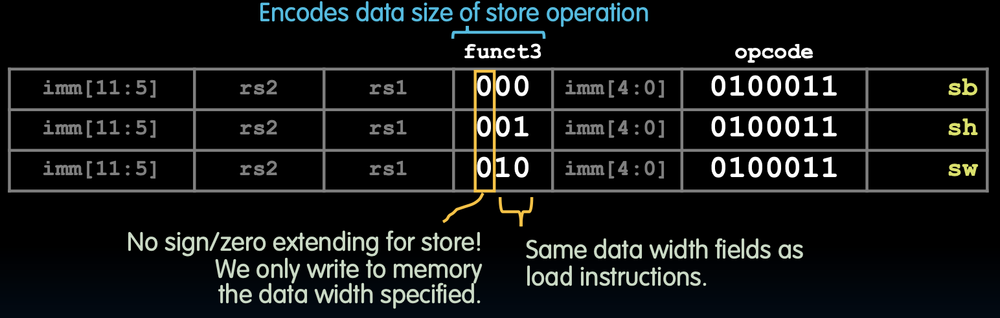

## 结论

RISC-V简化了指令格式，使所有指令的大小与数据字相同（32位），从而使用相同的内存。这种设计简化了指令解码和执行，提高了处理效率。

计算机程序存储为一系列32位数字。RISC-V机器语言指令格式包括：

- **I格式**：用于立即数操作和加载指令
- **R格式**：用于寄存器到寄存器的算术操作
- **S格式**：用于存储指令

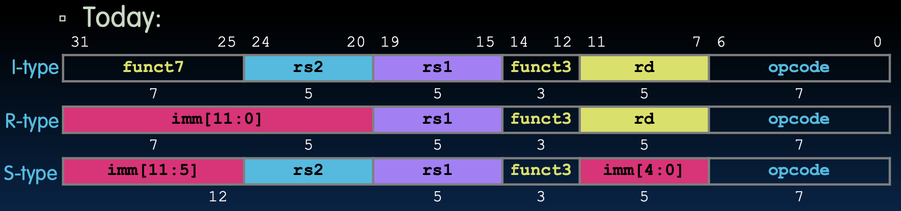

未来还将介绍B格式、U格式和J格式指令格式，这些格式进一步扩展了RISC-V指令集的功能和应用场景。
