# Lecture 12: RISC-V Instruction Formats II

# Updating the Program Counter (PC)

## 程序计数器（PC）

程序计数器（PC）是处理器内部的一个特殊寄存器，用于保存当前执行指令的字节地址。它与32个通用寄存器文件分开，专门用于控制程序的执行流。

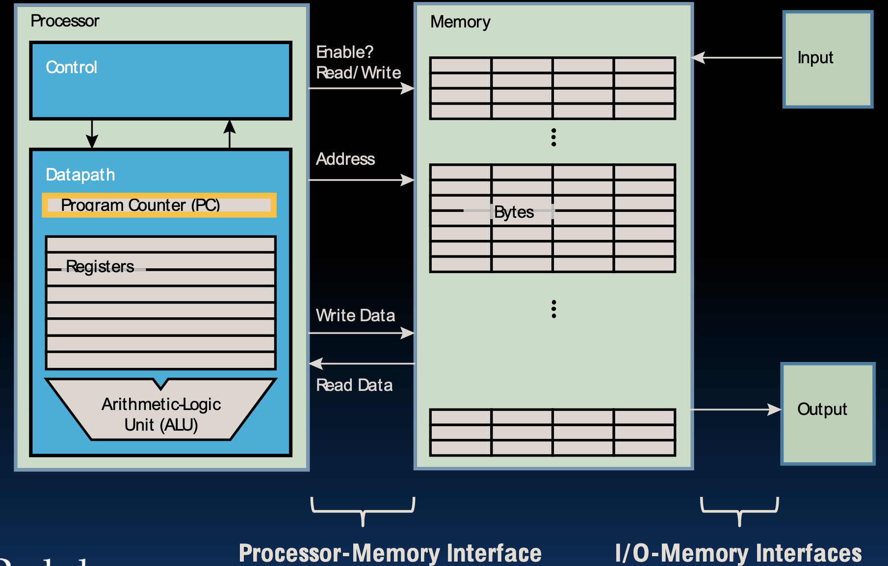

## PC = PC + 4用于大多数指令

对于大多数指令，程序计数器在执行完当前指令后会自动加4，以指向下一条指令。这是因为大多数指令的长度为4个字节。下面的例子展示了程序计数器的变化：

原始汇编代码：

```
0x0c 0x000A9863   Loop: beq x19, x10, End
0x10 0x00A90933         addi x18, x18, x10
0x14 0xFFF989B3         addi x19, x19, -1
0x18 0x0000006F         j Loop
0x1c 0x00000013   End: ...
```

执行前寄存器状态：

```
PC: 0x00000010
```

执行一条指令后：

```
PC: 0x00000014
```

这个机制确保了程序的顺序执行，即逐条指令按顺序被处理。

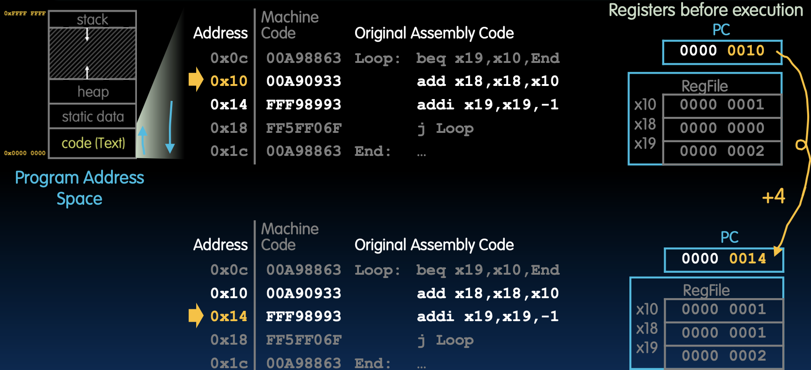

## 分支更新PC以进行“跳转”

分支指令根据条件更新PC的值，实现程序的跳转。分支可以是无条件的，也可以是条件的。

### 无条件分支

无条件分支指令（如 `j`）会直接将PC设置为目标地址，实现跳转。例如：

```
0x18 0x0000006F   j Loop
```

在执行这条指令后，PC会被设置为 `Loop` 标签所在的地址：

```
PC: 0x0000000c
```

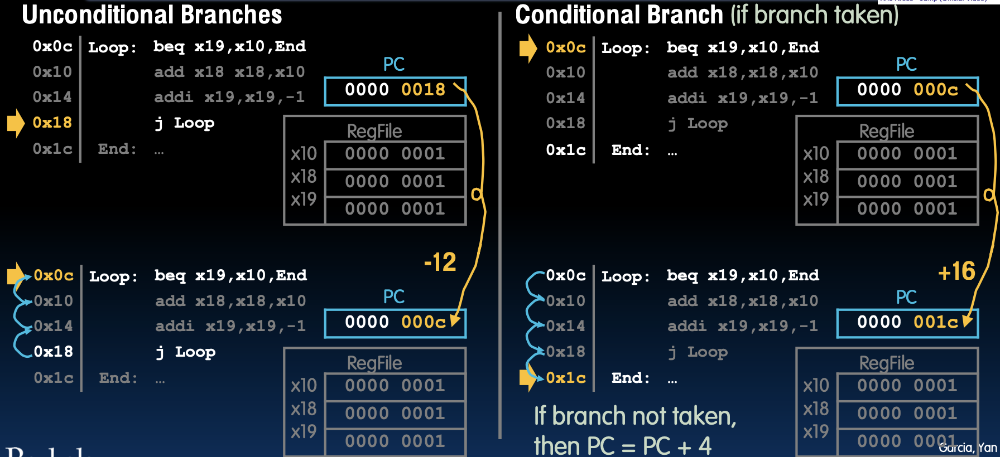

### 条件分支

条件分支指令（如 `beq`）根据条件是否成立来决定PC的更新。如果条件成立，则PC被设置为目标地址；否则，PC加4，继续顺序执行。例如：

```
0x0c 0x000A9863   Loop: beq x19, x10, End
```

如果 `x19 == x10`，则PC被设置为 `End` 标签所在的地址 `0x1c`。否则，PC加4，继续执行下一条指令。

## PC相对寻址

### PC相对寻址：提供一个有符号的偏移量来更新PC

PC相对寻址是一种灵活的跳转方式，通过一个有符号的偏移量来更新PC：

```
PC = PC + byte_offset
```

这种方式使得代码位置无关（Position-Independent Code，PIC），即代码可以在内存中的任何位置执行，而无需修改代码中的地址。这对于动态库和装载程序尤其重要。

例子：

```
0x0c 0x000A9863   Loop: beq x19, x10, End
0x10 0x00A90933         addi x18, x18, x10
0x14 0xFFF989B3         addi x19, x19, -1
0x18 0x0000006F         j Loop
0x1c 0x00000013   End: ...
```

如果 `beq` 分支成立，PC 更新为 `PC + 16`，即 `0x1c`。

如果 `beq` 分支不成立，PC 更新为 `PC + 4`，即 `0x10`。

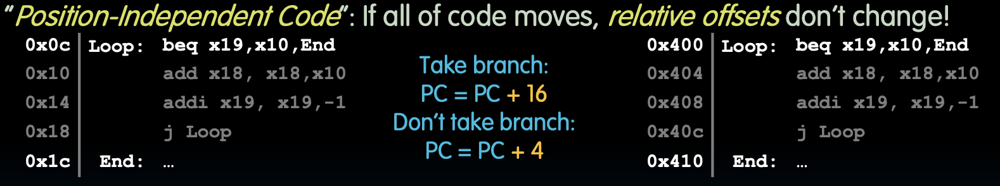

### 与绝对寻址对比

绝对寻址提供新的地址来覆盖PC：

```
PC = new_address
```

绝对寻址较少使用，因为它对代码移动敏感，且需要构建完整的32位立即数。使用绝对地址跳转的代码在重新定位时需要更新所有相关的地址，这增加了代码的维护难度和复杂性。


# B-Format Layout

## RISC-V条件分支指令

### 示例：beq rs1, rs2, Label

条件分支指令在RISC-V中用于根据特定条件跳转到标签位置。它们需要两个读寄存器（类似于S格式），但没有目标寄存器，并使用PC相对寻址来确定跳转位置。

例如，`beq rs1, rs2, Label` 指令的功能是如果 `rs1` 和 `rs2` 相等，则跳转到 `Label`。

### 工作原理

- **如果不分支**：`PC = PC + 4` 字节
- **如果分支**：`PC = PC +（相对字节偏移到Label）`

### B格式字段

B格式指令由以下字段组成：

- **操作码（opcode）**：7位
- **funct3**：3位
- **rs1**：5位
- **rs2**：5位
- **立即数（imm）**：12位表示PC的相对偏移

这些字段总共占用 32 位。12位立即数字段使用有符号的二进制补码表示，可以表示±2048（2^11）单位的偏移。

### 扩展分支范围的偏移量缩放

为了最大化分支范围，条件分支指令的12位立即数字段可以表示为：

#### 单位：1字节
- **覆盖范围**：从PC起±2^11个字节（即±2^9个32位指令）。
- **缺点**：浪费。最低2位总是浪费（始终为00），所以不使用这种方法。

#### 单位：2字节（16位“半字”）
- **覆盖范围**：从PC起±2^10个32位指令。
- **实现方法**：在加到PC之前将偏移量乘以2。
- **优点**：合理利用了全部12位的表示范围，是最佳选择。

#### 单位：4字节（32位字）
- **覆盖范围**：从PC起±2^11个32位指令。
- **实现方法**：在加到PC之前将偏移量乘以4。
- **缺点**：不支持16位压缩指令，因此不适用。

在实际使用中，RISC-V选择了第二种方法，将偏移量乘以2（单位：2字节），因为这种方法在硬件实现上更为合理且有效。

### 分支如何编码PC相对偏移量？

#### 12位立即数字段的使用：
- **单位：1字节**：覆盖范围±2^11个字节，不实际使用。
- **单位：2字节（16位“半字”）**：覆盖范围±2^10个32位指令，RISC-V实际使用的方法。
- **单位：4字节（32位字）**：覆盖范围±2^11个32位指令，不适用。

通过使用这种偏移量缩放的方法，我们可以在条件分支指令中有效地编码更大的跳转范围，确保指令的灵活性和高效性。

## RISC-V特性：16位指令

### RISC-V基本ISA（指令集架构）

- **支持的扩展**：
  - **16位压缩指令**：用于减少代码尺寸，提高存储和带宽效率。
  - **多倍16位长度的可变长指令**：允许更复杂的指令编码。

### 16位指令的分支偏移缩放

RISC-V基本ISA用于RV32、RV64、RV128都采用32位宽指令，但支持16位压缩指令扩展。即使没有16位指令，RISC-V也会将分支偏移缩放2个字节。

- **影响**：
  - 可能的分支目标有一半会变成错误。
  - RISC-V条件分支指令只能到达±2^10个32位指令在PC两侧。

这意味着使用RISC-V处理器的系统在处理分支跳转时需要注意其分支目标范围，以确保不会超出可达范围并导致错误的程序行为。

## B格式指令布局

### B-格式指令布局

B-格式（课本称为SB-类型）接近于S-格式：

- **指令格式**：
  - **格式**：`opname rs1, rs2, Label`
  - **条件分支指令的操作码**：`1100011`
  
- **立即数**：
  - **表示相对偏移量，以2字节（半字）为单位**：
    - **计算新的PC值**：`PC = PC + byte_offset`
    - **12位立即数的范围**：`±2^10个32位指令`：
      - 1位：用于表示二进制补码（允许正负偏移）
      - 1位：用于表示半字/16位指令支持

**偏移量的最低位总是零，因此无需在指令中存储**。

#### B-格式字段
- `imm[12|10:5]`（7位）
- `rs2`（5位）
- `rs1`（5位）
- `funct3`（3位）
- `imm[4:1|11]`（5位）
- `opcode`（7位）

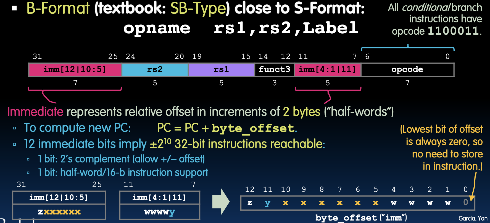

## B格式示例

### 示例1

如何在RISC-V代码中编码`beq`指令？

假设我们有如下指令：

```python
beq x1, x2, Label
```

首先填充字段（除立即数外）：

- **imm[12|10:5]**：立即数的高位和中间部分
- **rs2**：x2
- **rs1**：x1
- **funct3**：000（表示beq指令）
- **imm[4:1|11]**：立即数的低位和最高位
- **opcode**：1100011

然后构建分支偏移量并编码立即数。

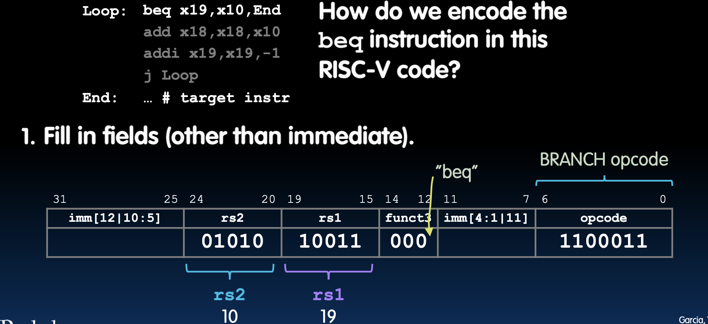

### 示例2

假设目标标签在当前指令后面4个32位指令的位置，则偏移量为16字节：

- 立即数为16字节，对应的二进制表示为：000000000100
- 将立即数字段填充到指令中：

```
0000000 00010 00001 000 0001 1 1100011
```

通过这些步骤，我们可以构建和理解B格式指令的编码和使用方式。

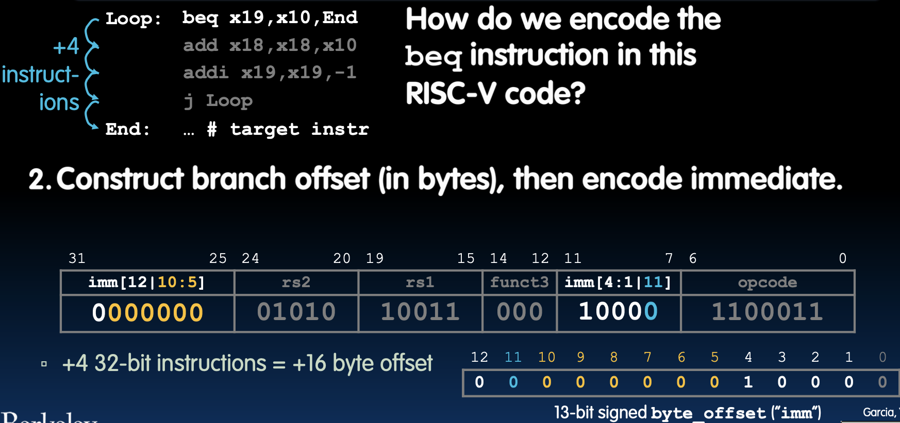

## 为什么要打乱立即数位？硬件设计！

在设计RISC-V时，寄存器字段的位置在指令格式之间是一致的，以简化指令解码和硬件设计。RISC-V也试图保持立即数的位置一致。

不同格式的立即数位置：

- **I型格式**
  - imm[11:0]
- **S型格式**
  - imm[11:5], imm[4:0]
- **B型格式**
  - imm[12|10:5], imm[4:1|11]

在所有格式中，位31总是符号位（最高位用于在立即数中符号扩展）。B型格式具有13位立即数编码，因为在imm位0处有隐含的零。这种设计降低了硬件成本，使得立即数处理更加高效。

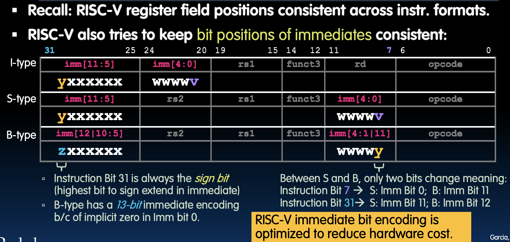

### 所有六个RV32 B格式指令

B格式指令用于条件分支，指令包括：

- beq（等于时分支）
- bne（不等时分支）
- blt（小于时分支）
- bge（大于或等于时分支）
- bltu（无符号小于时分支）
- bgeu（无符号大于或等于时分支）

每个指令对应不同的funct3编码。

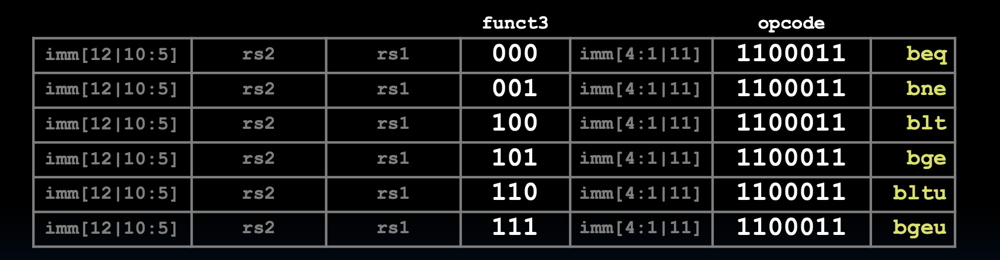

## 进一步的条件分支

条件分支通常用于if-else语句和for/while循环。通常情况下，这些分支范围较小（少于50行C代码），B格式指令的分支范围有限：±210 32位指令。 

如果目标距离超出这个范围，可以使用无条件跳转（unconditional jump）。例如：

```python
beq x10, x0, far  # 如果相等，跳转到far
# 如果不相等，执行下一条指令
bne x10, x0, next
j far  # 如果不相等，再跳转到far
next: # 下一条指令
```

这个方法确保了即使在范围之外的目标地址，也能通过多条指令的组合实现跳转。

# J-Format Layout

### J格式布局

## `jal`指令和`j`伪指令

### `jal`指令的作用

`jal`（Jump and Link）指令用于跳转并链接，即在跳转到目标地址的同时，将下一条指令的地址保存到目标寄存器中：

```python
jal rd, Label
```

这条指令实现了两个功能：

1. 跳转到 `Label`
2. 将下一条指令的地址写入 `rd` 寄存器

### 使用场景

1. **调用函数**：同时将返回地址保存在指定的寄存器中。例如：

```python
jal ra, FuncLabel
```

2. **无条件跳转**：丢弃返回地址，用于跳转到指定位置。`j` 是 `jal` 的伪指令：

```python
j Label
```

如果不需要保存返回地址，可以使用 `jal x0, Label` 实现无条件跳转。

### J格式指令布局

J格式（或UJ类型）专用于 `jal` 指令。其布局如下：

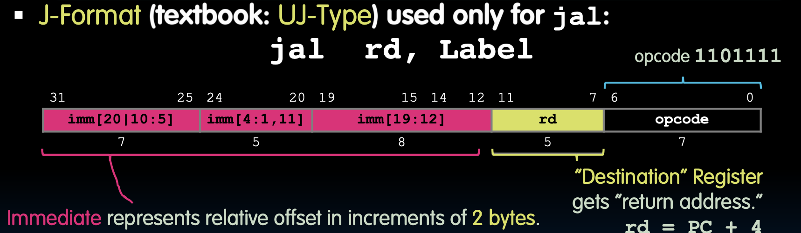

- **opcode**：1101111
- **rd**：目标寄存器，用于存储返回地址

20位立即数表示相对于PC的偏移，以2字节为单位。这意味着可以到达±2^18个32位指令的范围。

# U-Format: Long Immediates

### U格式：长立即数

## U格式指令布局

U格式（Upper Immediate）指令：

- `opname rd, immed`
- `U-Format`指令编码如下：
  - **opcode**（7位）：包括`lui`和`auipc`指令的操作码。
  - **rd**（5位）：目标寄存器。
  - **imm[31:12]**（20位）：表示32位立即数的高20位。

立即数表示32位立即数操作数的高20位，实际值为`immed << 12`。

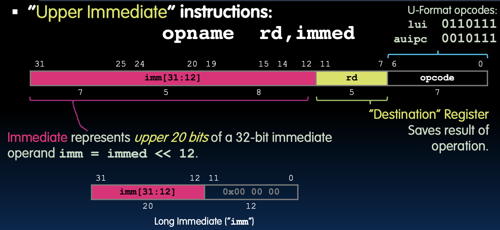

## `lui`和`addi`创建长立即数

### `lui`指令

`lui`指令，即加载上部立即数（Load Upper Immediate），将20位立即数写入寄存器`rd`的高20位，并清除低12位。

- 格式：`lui rd, immed`
- 实际操作：`rd = immed << 12`

### 结合`lui`和`addi`指令

结合`lui`和`addi`指令（用于设置低12位），可以在寄存器中创建任意32位值。

- 示例：
  - `lui x10, 0x87654`  # `x10 = 0x87654000`
  - `addi x10, x10, 0x321`  # `x10 = 0x87654321`

`li`伪指令（Load Immediate）实际上解析为需要时的`lui`和`addi`组合，例如：`li x10, 0x87654321`。

通过使用`lui`和`addi`指令，我们可以有效地处理32位立即数，并将其加载到寄存器中。这种方法极大地提高了RISC-V指令集的灵活性和效率。

## `lui`边界情况：`addi`扩展符号

### 如何设置立即数 0xBOBACAFE？

在 RISC-V 中设置寄存器 `x10` 为 `0xBOBACAFE` 涉及使用 `lui` 和 `addi` 指令。然而，这个过程需要处理符号扩展的问题。以下是详细解释：

1. **基本指令**
   - `lui` (Load Upper Immediate) 将立即数加载到寄存器的高20位。
   - `addi` (Add Immediate) 将立即数与寄存器值相加，结果存储在目标寄存器中，并进行符号扩展。

### 示例说明

假设我们要设置 `x10` 为 `0xBOBACAFE`：

1. **使用 `lui` 加载高20位**
   - `lui x10, 0xBOBAC` 会将 `x10` 设置为 `0xBOBAC000`。

2. **使用 `addi` 添加低12位**
   - `addi x10, x10, 0xAFE` 会将 `x10` 设置为 `0xBOBACAFE`，但存在符号扩展问题。

### 符号扩展问题

在 `addi` 指令中，12位立即数进行符号扩展。如果立即数的符号位为1（表示负数），则会导致错误的结果：

- 例如，`addi x10, x10, 0xAFE`：
  - 0xAFE 的二进制表示是 `101011111110`，符号位为1，表示负数。
  - 符号扩展后变成 `0xFFFFFAFE`。
  - 结果是 `0xBOBAC000 + 0xFFFFFAFE = 0xBOBABAFF`。

### 解决方案

为了正确设置 `x10` 为 `0xBOBACAFE`，在加载高20位时需要加1：

1. **加载高20位并加1**
   - `lui x10, 0xBOBAD` 会将 `x10` 设置为 `0xBOBAD000`。
   
2. **使用 `addi` 添加低12位**
   - `addi x10, x10, 0xAFE` 会将 `x10` 设置为 `0xBOBACAFE`。

### 代码示例

```assembly
lui x10, 0xBOBAD   # x10 = 0xBOBAD000
addi x10, x10, 0xAFE   # x10 = 0xBOBACAFE
```

### 使用伪指令 `li`

RISC-V 提供了伪指令 `li` (load immediate)，自动处理符号扩展问题，使代码更简洁且不易出错：

```assembly
li x10, 0xBOBACAFE   # 自动处理高位加1的问题
```

### 总结

- **符号扩展问题**：在使用 `addi` 指令时，12位立即数符号扩展会导致结果错误。
- **解决方案**：在加载高20位时加1，确保正确计算结果。
- **伪指令 `li`**：自动处理边界情况，简化代码。

这样设置立即数 `0xBOBACAFE` 到寄存器 `x10` 就不会出现符号扩展的问题了。

> 在使用 `addi` 指令时，12 位立即数会被符号扩展。如果符号位为 1，即立即数是负数，那么在进行加法时会影响高 20 位的计算。
>
> `0xAFE` 的二进制表示是 `1010 1111 1110`，进行符号扩展后，它会变成`1111 1111 1111 1111 1111 1010 1111 1110`，即 `0xFFFFFAFE`。
>
> `lui x10, 0xBOBAC` 加载 `0xBOBAC000` 到寄存器 x10。
>
> `addi x10, x10, 0xAFE`结果是 `0xBOBAC000 + 0xFFFFFAFE = 0xBOBABAFF`。
>
> 这里产生了从高20位中减去1的效果。当你在高位加 11...11 的时候，这在某些情况下等效于减 1。这是因为计算机使用补码来表示和计算负数。
>
> 在计算机系统中，负数通常使用补码来表示。在补码表示法中，一个负数的补码是通过将该数的所有位取反（即按位求反）然后加 1 来得到的。例如，负数 -1 的补码表示为 0xFFFFFFFF（32 位）。
>
> 因此，在 `lui` 指令中高位加 1 可以确保计算的准确性，避免由于符号扩展带来的负数影响。


## `auipc`将PC加载到寄存器文件中

### 指令格式

- `auipc rd, immed`
- 将上部立即数添加到PC中。例如：
  - `auipc x5, 0xABCDE`  # `x5 = PC + 0xABCDE000`

### 实践中

- Label: `auipc x5, 0`  # 将标签地址加载到`x5`
- `auipc`通常与`jalr`一起使用，以实现相对地址计算和大偏移量。

通过使用`auipc`，我们可以实现PC相对寻址，并加载非常大的偏移量，这对于复杂的控制流和函数调用非常有用。

## `jalr`指令和`jr`伪指令

### `jalr`指令

**功能**：跳转并链接寄存器 (Jump And Link Register)

- `jalr rd, rs1, imm`
  - 跳转到`rs1 + imm`地址
  - 将下一条指令的地址写入`rd`
  - `PC = rs1 + imm`
  - `rd = PC + 4`

**用例**：

1. **返回调用者**：
   - `jr ra` 等同于 `jalr x0, ra, 0`

### I-格式指令布局：`jalr`

`jalr rd, rs1, imm` 使用 I-格式，立即数和 `rs1` 相加更新 PC。

- `PC = rs1 + imm`

注意：与 B-格式和 J-格式不同，`jalr` 不会将立即数乘以2，因此立即数必须以字节为单位。

### 示例

**返回调用者**：

- `jr ra` 等同于 `jalr x0, ra, 0`

**调用函数并保存返回地址**：

- 跳转到任意32位绝对地址：
  - `lui x1, <hi20bits>`
  - `jalr ra, x1, <lo12bits>`

**PC相对跳转**：

- 使用32位偏移量跳转：
  - `auipc x1, <hi20bits>`
  - `jalr x0, x1, <lo12bits>`

## 总结

- 覆盖了几乎整个 RV32 ISA！
- 练习汇编和反汇编！

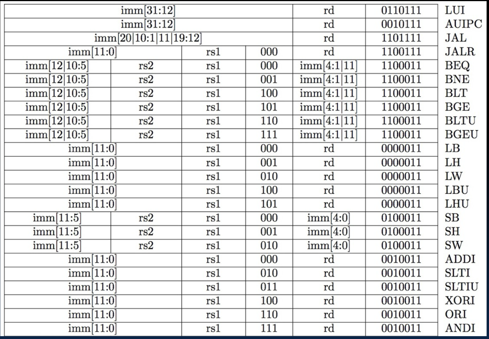

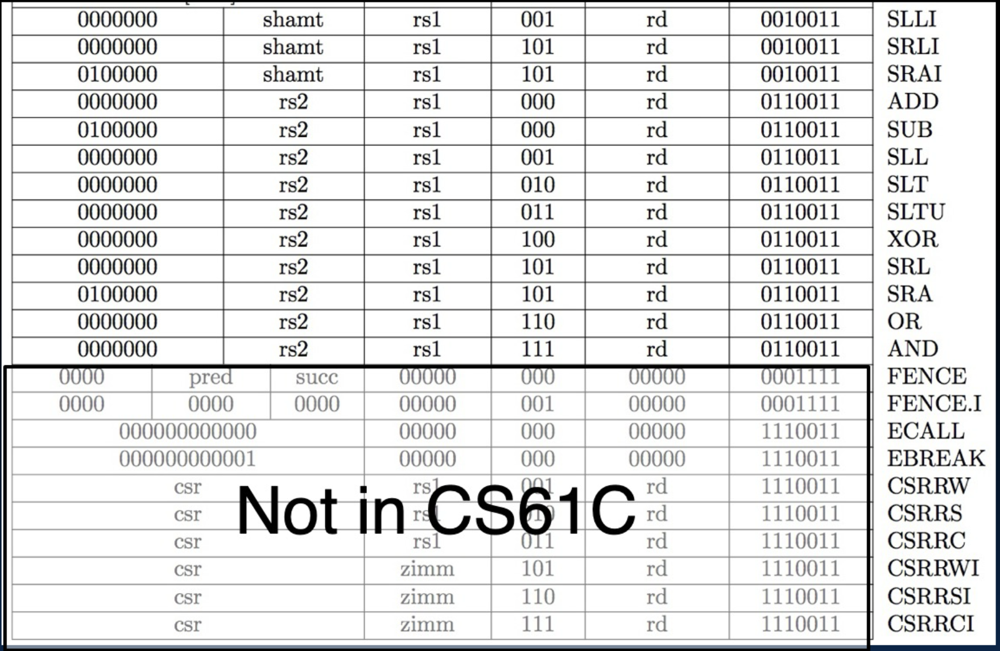

### RISC-V 指令表中文解释

### 第一部分：基本指令

1. **LUI**
   - **功能**：加载立即数到高位
   - **指令格式**：`imm[31:12] | rd | 0110111`
   - **描述**：将立即数的高20位加载到寄存器 `rd` 中

2. **AUIPC**
   - **功能**：将立即数加载到程序计数器上
   - **指令格式**：`imm[31:12] | rd | 0010111`
   - **描述**：将立即数加载到寄存器 `rd` 中，并将PC（程序计数器）加上立即数

3. **JAL**
   - **功能**：跳转并链接
   - **指令格式**：`imm[20|10:1|11|19:12] | rd | 1101111`
   - **描述**：跳转到目标地址并将返回地址存储在 `rd` 中

4. **JALR**
   - **功能**：寄存器跳转并链接
   - **指令格式**：`imm[11:0] | rs1 | 000 | rd | 1100111`
   - **描述**：跳转到 `rs1 + imm` 并将返回地址存储在 `rd` 中

5. **分支指令**
   - **BEQ**：相等时跳转
     - **指令格式**：`imm[12|10:5] | rs2 | rs1 | 000 | imm[4:1|11] | 1100011`
   - **BNE**：不相等时跳转
     - **指令格式**：`imm[12|10:5] | rs2 | rs1 | 001 | imm[4:1|11] | 1100011`
   - **BLT**：小于时跳转
     - **指令格式**：`imm[12|10:5] | rs2 | rs1 | 100 | imm[4:1|11] | 1100011`
   - **BGE**：大于等于时跳转
     - **指令格式**：`imm[12|10:5] | rs2 | rs1 | 101 | imm[4:1|11] | 1100011`
   - **BLTU**：无符号小于时跳转
     - **指令格式**：`imm[12|10:5] | rs2 | rs1 | 110 | imm[4:1|11] | 1100011`
   - **BGEU**：无符号大于等于时跳转
     - **指令格式**：`imm[12|10:5] | rs2 | rs1 | 111 | imm[4:1|11] | 1100011`

6. **加载指令**
   - **LB**：加载字节
     - **指令格式**：`imm[11:0] | rs1 | 000 | rd | 0000011`
   - **LH**：加载半字
     - **指令格式**：`imm[11:0] | rs1 | 001 | rd | 0000011`
   - **LW**：加载字
     - **指令格式**：`imm[11:0] | rs1 | 010 | rd | 0000011`
   - **LBU**：加载无符号字节
     - **指令格式**：`imm[11:0] | rs1 | 100 | rd | 0000011`
   - **LHU**：加载无符号半字
     - **指令格式**：`imm[11:0] | rs1 | 101 | rd | 0000011`

7. **存储指令**
   - **SB**：存储字节
     - **指令格式**：`imm[11:5] | rs2 | rs1 | 000 | imm[4:0] | 0100011`
   - **SH**：存储半字
     - **指令格式**：`imm[11:5] | rs2 | rs1 | 001 | imm[4:0] | 0100011`
   - **SW**：存储字
     - **指令格式**：`imm[11:5] | rs2 | rs1 | 010 | imm[4:0] | 0100011`

8. **立即数运算指令**
   - **ADDI**：立即数加法
     - **指令格式**：`imm[11:0] | rs1 | 000 | rd | 0010011`
   - **SLTI**：立即数小于比较
     - **指令格式**：`imm[11:0] | rs1 | 010 | rd | 0010011`
   - **SLTIU**：立即数无符号小于比较
     - **指令格式**：`imm[11:0] | rs1 | 011 | rd | 0010011`
   - **XORI**：立即数异或
     - **指令格式**：`imm[11:0] | rs1 | 100 | rd | 0010011`
   - **ORI**：立即数或
     - **指令格式**：`imm[11:0] | rs1 | 110 | rd | 0010011`
   - **ANDI**：立即数与
     - **指令格式**：`imm[11:0] | rs1 | 111 | rd | 0010011`

9. **移位指令**
   - **SLLI**：立即数逻辑左移
     - **指令格式**：`0000000 | shamt | rs1 | 001 | rd | 0010011`
   - **SRLI**：立即数逻辑右移
     - **指令格式**：`0000000 | shamt | rs1 | 101 | rd | 0010011`
   - **SRAI**：立即数算术右移
     - **指令格式**：`0100000 | shamt | rs1 | 101 | rd | 0010011`

10. **寄存器运算指令**
    - **ADD**：加法
      - **指令格式**：`0000000 | rs2 | rs1 | 000 | rd | 0110011`
    - **SUB**：减法
      - **指令格式**：`0100000 | rs2 | rs1 | 000 | rd | 0110011`
    - **SLL**：逻辑左移
      - **指令格式**：`0000000 | rs2 | rs1 | 001 | rd | 0110011`
    - **SLT**：小于比较
      - **指令格式**：`0000000 | rs2 | rs1 | 010 | rd | 0110011`
    - **SLTU**：无符号小于比较
      - **指令格式**：`0000000 | rs2 | rs1 | 011 | rd | 0110011`
    - **XOR**：异或
      - **指令格式**：`0000000 | rs2 | rs1 | 100 | rd | 0110011`
    - **SRL**：逻辑右移
      - **指令格式**：`0000000 | rs2 | rs1 | 101 | rd | 0110011`
    - **SRA**：算术右移
      - **指令格式**：`0100000 | rs2 | rs1 | 101 | rd | 0110011`
    - **OR**：或
      - **指令格式**：`0000000 | rs2 | rs1 | 110 | rd | 0110011`
    - **AND**：与
      - **指令格式**：`0000000 | rs2 | rs1 | 111 | rd | 0110011`

### 第二部分：系统指令（Not in CS61C）

1. **FENCE**
   - **功能**：内存顺序指令
   - **指令格式**：`0000 | pred | succ | 00000 | 00000 | 000 | 00000 | 0001111`

2. **FENCE.I**
   - **功能**：指令顺序
   - **指令格式**：`0000 0000 0000 00000 00000 000 00000 0001111`

3. **ECALL**
   - **功能**：环境调用
   - **指令格式**：`000000000000 00000 000 00000 1110011`

4. **EBREAK**
   - **功能**：环境断点
   - **指令格式**：`000000000001 00000 000 00000 1110011`

5. **CSR**
   - **功能**：控制状态寄存器指令
   - **指令格式**：
     - `CSRRW`：`csr | rs1 | 001 | rd | 1110011`
     - `CSRRS`：`csr | rs1 | 010 | rd | 1110011`
     - `CSRRC`：`csr | rs1 | 011 | rd | 1110011`
     - `CSRRWI`：`csr | zimm | 101 | rd | 1110011`
     - `CSRRSI`：`csr | zimm | 110 | rd | 1110011`
     - `CSRRCI`：`csr | zimm | 111 | rd | 1110011`
