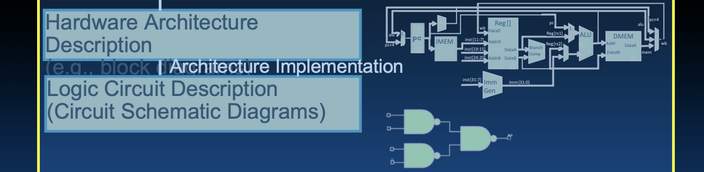

# Lecture 14: Intro to Synchronous Digital Systems

**Switches, Transistors, Signals, & Waveforms**

现在我们开始新的模块——同步数字系统 (SDS)。这部分内容从硬件描述语言和逻辑门电路的底层开始，逐步构建一个完整的系统。

你之前学到的是从上到下的架构，现在我们将从底层开始，一直构建到能够运行ISA的系统。

我们将在这部分课程中，逐层讲解硬件描述和逻辑门，从最底层开始，一直构建到顶层。每一讲都将在前一讲的基础上继续深入，最终你将能够构建一个CPU。

# Switches

## Machine Structures

### 机器结构

在计算机系统中，软件和硬件是相辅相成的。软件包括应用程序、操作系统、编译器和汇编器等，它们运行在硬件之上。硬件则由处理器、内存、输入/输出系统、数据路径和控制、数字设计、电路设计、晶体管和制造工艺等组成。CS61C课程涵盖了这些内容，特别是指令集架构（ISA），这是硬件和软件之间的重要接口。

## New-School Machine Structures

### 新型机器结构

现代计算机系统通过并行处理来实现高性能。这包括：

1. **软件并行请求**：分配给计算机处理，例如搜索“Cats”。
2. **并行线程**：分配给核心处理，例如查找广告。
3. **并行指令**：同时执行多条指令，例如五条流水线指令。
4. **并行数据**：同时处理多个数据，例如同时对四对数据进行加法运算。
5. **硬件描述**：所有门在同一时间并行工作。

通过这些并行处理技术，计算机可以有效地利用资源，提高处理速度和效率。这些技术在各种计算设备中得到了广泛应用，从仓库级计算机到智能手机。

### 并行处理的实现：

- **并行请求**：例如搜索引擎在处理大量查询时。
- **并行线程**：例如在多核处理器中，每个核心处理不同的任务。
- **并行指令**：例如在超标量处理器中，同时执行多条指令。
- **并行数据**：例如在向量处理器中，同时处理多个数据。
- **硬件并行**：所有逻辑门在同一时间并行工作，提高了硬件的整体性能。

## Hardware Descriptions

### 硬件描述

硬件描述是指计算机系统中所有门（逻辑门）在同一时间并行工作的特性。逻辑门是实现计算机功能的基本单元，通过布尔运算来处理二进制数据。硬件描述语言（HDL）如Verilog和VHDL用于描述和模拟这些逻辑电路的行为。

在图中，我们可以看到：

1. **逻辑门（Logic Gates）**：这些是最基本的硬件单元，用于执行基本的逻辑运算（如与门、或门、非门等）。
2. **功能模块（Functional Blocks）**：由多个逻辑门组成，执行更复杂的功能（如加法器、乘法器等）。
3. **执行单元（Execution Units）**：负责执行指令，包括算术运算、逻辑运算等。
4. **主存（Main Memory）**：用于存储指令和数据。
5. **输入/输出（I/O）系统**：用于与外部设备进行交互。
6. **缓存（Cache）**：一种高速存储器，用于减少主存与处理器之间的数据访问延迟。
7. **处理器核心（Core）**：执行指令的基本单元，多个核心可以并行处理任务。
8. **计算单元（Compute Units）**：多个核心和执行单元组成的更高级别的处理单元，用于高性能计算。

这些组件共同构成了现代计算机系统，通过并行处理技术实现高性能计算，从而满足各种应用需求。

## Synchronous Digital Systems

### 同步数字系统

## 硬件架构描述

这部分展示了从高层次的硬件架构设计到底层的逻辑电路描述的过程。这些部分包括：

- **硬件架构描述（例如：块图）**：展示了系统的总体结构和各部分的功能。
- **逻辑电路描述（电路原理图）**：详细描述了逻辑门和其他硬件组件如何连接和协同工作。

硬件架构设计的过程从总体结构开始，逐步细化到具体的电路实现。块图通常用于概述系统的各个模块及其相互连接，而电路原理图则展示了每个模块内部的详细设计。

## 同步数字系统

处理器的硬件（例如RISC-V处理器）是一个同步数字系统。所谓同步，是指所有操作都由中央时钟协调，这个时钟就像系统的“心跳”一样，确保各部分操作的协调一致。

- **同步**：
  - 所有操作由中央时钟协调
  - 系统的“心跳”确保操作的同步和有序进行
  - 时钟周期定义了系统中所有操作的节奏

- **数字**：
  - 所有值都由离散的值表示
  - 电信号被视为1和0，并组合成字
  - 离散信号可以更可靠地表示和处理信息

同步数字系统的设计原则包括时钟信号的分配、时序分析和寄存器传输级设计，这些原则确保了系统的可靠性和性能。

## Logic Design

### 逻辑设计

在接下来的几周内，我们将学习现代处理器是如何构建的，从基本元素作为构建块开始。

### 为什么要学习硬件设计？

- **理解硬件的能力和限制**：
  - 了解硬件在一般情况下和处理器中特别的能力和限制
  - 了解处理器能快速执行哪些操作，以及哪些操作不能快速执行
  - 如果你想让代码运行得快，就要避免慢的操作！

- **为更深入的硬件课程打下基础（如150和152课程）**：
  - 这些基础知识对于更高级的硬件课程非常重要
  - 硬件设计的基础知识可以帮助你在未来的学习中更好地理解和应用高级概念

- **设计自定义硬件以获得额外性能**：
  - 标准处理器能做的事情有限，你可能需要设计自己的自定义硬件来获得额外的性能
  - 了解硬件设计可以让你创造出优化特定任务的高效硬件解决方案

这些学习将帮助我们更好地理解硬件设计的基本原理，以及如何优化硬件以提高系统性能。

## Switches: Basic Element of Physical Circuit

### 开关：物理电路的基本元件

### 实现简单电路

图中展示了如何通过开关实现一个简单的电路：

- 当输入A为1时，闭合开关，点亮灯泡Z。
- 当输入A为0时，断开开关，灯泡Z熄灭。

这个电路的逻辑关系可以表示为：Z 等于 A。

这种简单的电路设计是数字电路的基础，通过控制电流的通断来实现基本的逻辑运算。通过这种基本的开关操作，可以构建更复杂的逻辑电路。

### 组合开关以实现更复杂的逻辑功能（布尔函数）

可以通过组合多个开关来实现更复杂的逻辑功能，例如：

- **与门（AND）**：当A和B都为1时，Z为1。
- **或门（OR）**：当A或B任意一个为1时，Z为1。

这些基本的布尔逻辑运算是所有数字电路的基础，通过这些基本运算，可以构建复杂的数字系统。组合逻辑设计包括各种基本门电路的组合和优化，旨在实现更高效的电路功能。

## Historical Note

### 历史注释

早期的计算机设计师通过开关构建了临时电路，开始注意到他们工作中的一些常见模式，例如与（AND）、或（OR）运算。Claude Shannon的硕士论文将晶体管与19世纪数学家George Boole的工作联系起来，称其为布尔代数（Boolean Algebra），以纪念George Boole。通过数学理论，可以将这些模式应用于硬件设计、最小化等。

布尔代数为硬件设计提供了理论基础，使得设计更高效、更可靠。Claude Shannon的工作奠定了现代数字电路设计的基础。他的研究表明，任何逻辑运算都可以用布尔代数表示，这为设计复杂的逻辑电路提供了理论支持。通过这种方式，硬件设计师能够利用数学方法来简化和优化电路设计。

---

# Transistor

## The Transistor ("born" 1947-12-23)

### 晶体管（诞生于1947年12月23日）

晶体管是半导体设备，用于放大或切换信号，是所有现代电子设备中的关键组件。

- 发明者：John Bardeen、William Shockley、Walter Brattain。
- 在此之前，使用真空管。
- 晶体管之后的发展包括集成电路和微处理器。

晶体管的发明被认为是20世纪最重要的发明之一。它不仅推动了电子技术的发展，也为现代计算机的诞生奠定了基础。晶体管比真空管更小、更高效、寿命更长，且功耗更低，推动了计算设备的小型化和普及。

## Transistor Networks

### 晶体管网络

现代数字系统采用CMOS技术设计：

- CMOS：金属氧化物半导体（Complementary Metal-Oxide-Semiconductor）。
- "C"代表互补：包含通常打开和通常关闭的开关。

CMOS技术使得电路设计更高效、功耗更低，广泛应用于各种电子设备中。CMOS电路利用n沟道和p沟道MOS晶体管的互补特性，在逻辑运算时仅消耗很少的功率，从而实现低功耗和高效率的电路设计。

## MOS Transistors

### MOS晶体管

MOS晶体管有三个端子：漏极（Drain）、栅极（Gate）、源极（Source）。它们的开关动作取决于栅极上的电压。当栅极端子的电压相对于源极端子的电压高（或低）到一定程度时，漏极和源极之间的导电路径会建立或断开。

- **n型晶体管（n-channel MOSFET）**：
  - 当栅极电压（G）低于源极电压（S）时（G < S + ε），通路关闭，S与D之间不导通。
  - 当栅极电压（G）高于源极电压（S）时（G > S + ε），通路打开，S与D之间导通。

- **p型晶体管（p-channel MOSFET）**：
  - 当栅极电压（G）高于源极电压（S）时（G > S + ε），通路关闭，S与D之间不导通。
  - 当栅极电压（G）低于源极电压（S）时（G < S + ε），通路打开，S与D之间导通。

MOS晶体管的工作原理是基于电压控制的开关，n型和p型晶体管的开启和关闭条件相反。

***n型晶体管在栅极电压高时导通，而p型晶体管在栅极电压低时导通*。**

记忆提示

- n型晶体管：通常情况下（"normal"），记住它没有圈。
- p型晶体管：带有一个圈，像字母P的顶部。

## MOS Networks

### MOS网络

MOS网络通过组合n型和p型晶体管实现复杂的逻辑功能。图中展示了一个简单的MOS网络，由一个n型和一个p型晶体管组成，其中电压源为3V（表示“1”），地为0V（表示“0”）。该电路的工作原理如下：

- **x为0V时**：
  - n型晶体管关闭（因为栅极电压低于源极电压，无法形成导电路径）
  - p型晶体管打开（因为栅极电压低于源极电压，形成导电路径）
  - 此时y连接到电压源（3伏），因此y为高电平。
  
- **x为3V时**：
  - n型晶体管打开（因为栅极电压高于源极电压，形成导电路径）
  - p型晶体管关闭（因为栅极电压高于源极电压，无法形成导电路径）
  - 此时y连接到接地（0伏），因此y为低电平。

该电路的逻辑功能可以表示为：
- 当输入x为0V时，输出y为3V；
- 当输入x为3V时，输出y为0V。

这个电路的工作原理是通过控制输入电压x来决定输出电压y的状态，利用n型和p型晶体管的开关特性实现逻辑反转。总结来说，这个电路实现了一个简单的反相器（NOT门），输入信号x的电压高低状态与输出信号y的电压状态相反。

## Transistor Circuit Representation vs. Block Diagram

### 晶体管电路表示与模块图

现代芯片由晶体管和导线组成。小组的晶体管形成有用的构建块。这些构建块被组织成层次结构，以构建更高级别的模块，例如加法器。下图展示了一个与非门（NAND gate）的电路表示与其对应的模块图：

- 左图展示了一个与非门电路，它由三个晶体管和相应的连接组成。
- 右图是这个与非门电路的模块图，表示为一个黑箱，只显示输入和输出。

### 构建逻辑门

我们可以通过组合基本的与非门来构建其他逻辑门，例如：

- **AND门（与门）**：可以通过两个与非门和一个非门来实现。
- **OR门（或门）**：可以通过三个与非门来实现。
- **NOT门（非门）**：可以通过一个与非门来实现。

这些基本逻辑门是构建复杂数字系统的基础，通过它们可以实现各种数字电路和逻辑运算。

在实际设计中，晶体管电路通常被简化为模块图，以便于理解和分析。例如，与非门（NAND gate）的电路表示可以简化为一个黑箱，显示输入和输出。这种表示方法使得设计师能够更容易地组合和构建复杂的电路系统。

通过使用与非门，可以构建几乎所有其他类型的逻辑门和逻辑功能，这使得与非门成为数字电路设计中的基本构建块。

---

# Signals and Waveforms

## Signals and Waveforms: Clocks

### 信号与波形：时钟

在数字系统中，时钟信号是所有操作的核心协调者。时钟信号是一个重复的方波，具有高电平（通常为3伏特）和低电平（通常为0伏特）。时钟周期（T）定义了高电平和低电平的持续时间，并且频率（freq）是时钟周期的倒数。时钟信号的作用是同步所有的操作，使系统的每个部分在同一时间点进行工作，从而确保数据的一致性和正确性。

### 信号

在数字系统中，信号被视为离散的0和1，并通过导线连续传输。传输被认为是瞬时完成的，这意味着在任何给定时间点上，一根导线上只能有一个值。这些信号用于在不同的电路元件之间传递信息，从而实现逻辑运算和数据处理。

信号的传输速度和稳定性直接影响数字系统的性能和可靠性。因此，在设计时需要考虑信号完整性和传输延迟等因素。

## Signals and Waveforms: Noise and Delay

### 信号与波形：噪声和延迟

在实际电路中，信号传输并不是完美的，会受到噪声和延迟的影响：

- **噪声（Noise）**：信号在传输过程中可能会受到干扰，导致信号不稳定或产生错误。噪声源包括电磁干扰（EMI）、热噪声等。
- **延迟（Delay）**：信号从一个电路元件传输到另一个电路元件时，会有一定的延迟。这是由于电路元件的物理特性和信号传输路径的影响。延迟可能由电容、电阻和其他元件特性引起。

在下图中，展示了一个加法器电路中信号传输的情况，黄色箭头指示了噪声和延迟的存在。理解和处理这些因素对于设计可靠的数字系统至关重要。

为了应对噪声和延迟，设计师需要采用各种技术，如屏蔽、滤波和信号调理，以确保信号的完整性和系统的可靠性。

## Signals and Waveforms: Grouping

### 信号与波形：分组

信号分组是为了更好地理解和分析多个信号的交互。在下图中，展示了四个信号X3, X2, X1, X0的分组情况：

- 每个信号在不同的时间点上变化，形成一个复杂的波形。
- 不同信号之间的组合可以表示更多的信息，例如在数字电路中可以表示一个4位的二进制数。

这种分组方式有助于分析信号在不同时间点的状态变化，并理解它们之间的逻辑关系。

信号分组不仅在分析和调试过程中有用，还在设计复杂电路时帮助设计师更好地管理和组织信号。

## Signals and Waveforms: Circuit Delay

### 信号与波形：电路延迟

在同步数字系统中，信号在电路中的传播需要时间，这就是所谓的电路延迟。在一个加法器电路中，输入信号A和B通过加法器得到输出C。输入信号的传播延迟会影响最终输出的时间点。例如，输入A和B分别为[2, 3, 4, 5]和[3, 10, 0, 1]，经过加法器后得到输出C为[5, 13, 4, 6]。在这个过程中，每一对输入信号的传播都会有一定的延迟，导致最终的输出信号出现时间稍晚于输入信号。

电路延迟的主要原因包括信号在导线中的传播时间和逻辑门的处理时间。这些延迟需要在设计电路时进行考虑，以确保电路在预期的时序内正常工作。

电路延迟的管理是设计高性能数字系统的关键。工程师们通过优化导线长度、减少逻辑门数量和使用更快的材料来减少延迟，从而提高系统的整体速度和效率。

> **导线表示法**: 在数字设计中，为了简化表示，我们使用斜线来表示多位导线。例如，一个标有“4”的导线表示两位导线。尽管图中只画了一根线，但实际上它表示的是4根导线。

## Sample Debugging Waveform

### 调试波形示例

调试波形是用于分析和验证数字电路工作情况的重要工具。通过观察波形图，可以了解信号在电路中的传输过程以及各个时间点的状态。在下面的波形图示例中，可以看到多个信号在不同时间点的变化情况：

- 每条水平线代表一个信号，垂直线表示时间。
- 信号的高低电平变化展示了电路在每个时钟周期内的工作状态。

使用波形图，可以检测和修正电路中的时序问题和逻辑错误，确保电路按预期工作。通过波形图，设计师可以直观地看到信号的变化，快速定位和解决问题，提高设计和调试的效率。

## Type of Circuits

### 电路类型

同步数字系统由两种基本类型的电路组成：

1. **组合逻辑电路（Combinational Logic, CL）**：
   - 组合逻辑电路的输出仅取决于当前的输入，例如加法器电路。
   - 类似于数学中的纯函数y=f(x)，即没有存储信息和副作用。
   - 例如，一个加法器电路，其输出是输入信号的和。

2. **状态元素（State Elements）**：
   - 状态元素是用于存储信息的电路。
   - 在时钟信号的驱动下，这些电路可以记住之前的状态，并根据新的输入和当前状态生成新的输出。
   - 例如触发器和寄存器，这些元件能够存储数据，并在时钟信号的作用下更新其状态。

理解这两种电路的区别和作用，对于设计和分析数字系统至关重要。组合逻辑电路负责执行逻辑运算，而状态元素负责存储和管理数据，二者共同构成了完整的数字系统。

## Circuits with STATE (e.g., register)

### 状态电路（例如，寄存器）

状态电路是指能够存储信息的电路。例如，寄存器是一种常见的状态电路。寄存器可以在时钟信号的驱动下存储输入数据，并在需要时输出存储的数据。下面是两个寄存器电路示例：

1. **LOAD寄存器**：
   - 当LOAD信号为高时，寄存器将输入数据存储起来。
   - 输出数据与存储的数据一致。

2. **时钟驱动的寄存器**：
   - 在每个时钟周期，寄存器将输入数据存储起来。
   - 输出数据与存储的数据一致。

这些寄存器在数字系统中起到关键作用，它们用来存储指令、数据和状态信息。寄存器不仅用于简单的数据存储，还用于实现复杂的时序逻辑，如状态机和计数器。

## And in Conclusion...

### 结论

总结本节内容，以下是关键点：

- **时钟控制电路的脉冲**：
  时钟信号是同步数字系统的核心，它控制着电路的操作节奏，就像系统的“心跳”一样。所有的操作都由时钟信号协调，确保系统同步运行。

- **电压是模拟信号，被量化为0和1**：
  虽然电压是连续变化的模拟量，但在数字系统中，电压被量化为离散的0和1表示。通过这种量化，数字系统可以更可靠地处理和传输信息。

- **电路延迟是不可避免的**：
  信号在电路中的传播需要时间，导致延迟。这种延迟在设计和分析电路时必须加以考虑。设计师通过优化电路结构和材料来减少延迟，提高系统性能。

- **两种类型的电路**：
  1. **无状态组合逻辑电路**：
     - 例如，与（AND）、或（OR）、非（NOT）门。
     - 输出仅取决于当前的输入，没有存储功能。组合逻辑电路用于实现基本的逻辑运算。

  2. **状态电路**：
     - 例如，寄存器。
     - 能够存储信息，并在时钟信号的驱动下更新其状态。状态电路用于存储数据和实现复杂的时序逻辑。

通过理解这些基本概念，我们可以更好地掌握现代数字系统的设计和分析方法，从而在实际应用中设计出高效、可靠的数字电路。

