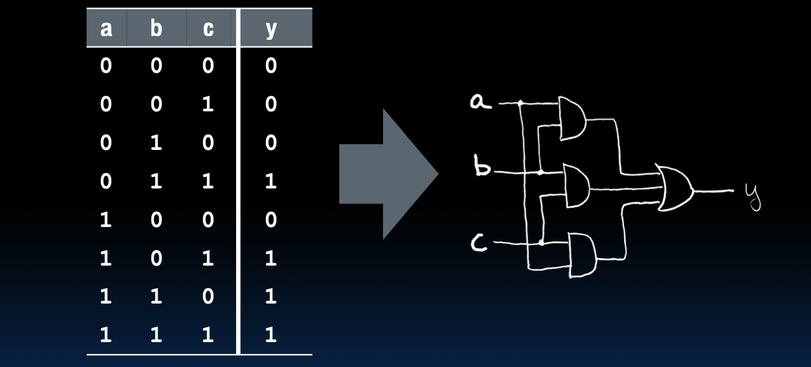
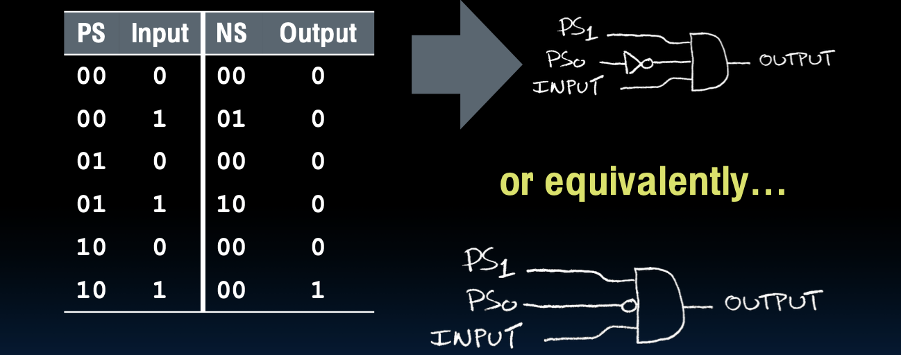
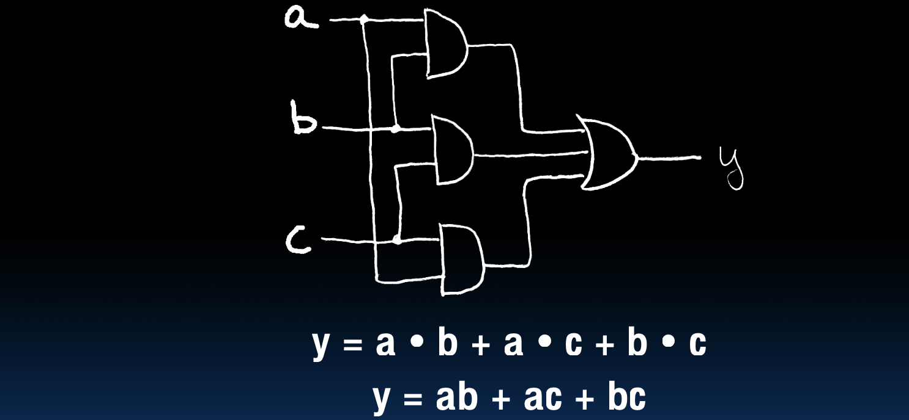
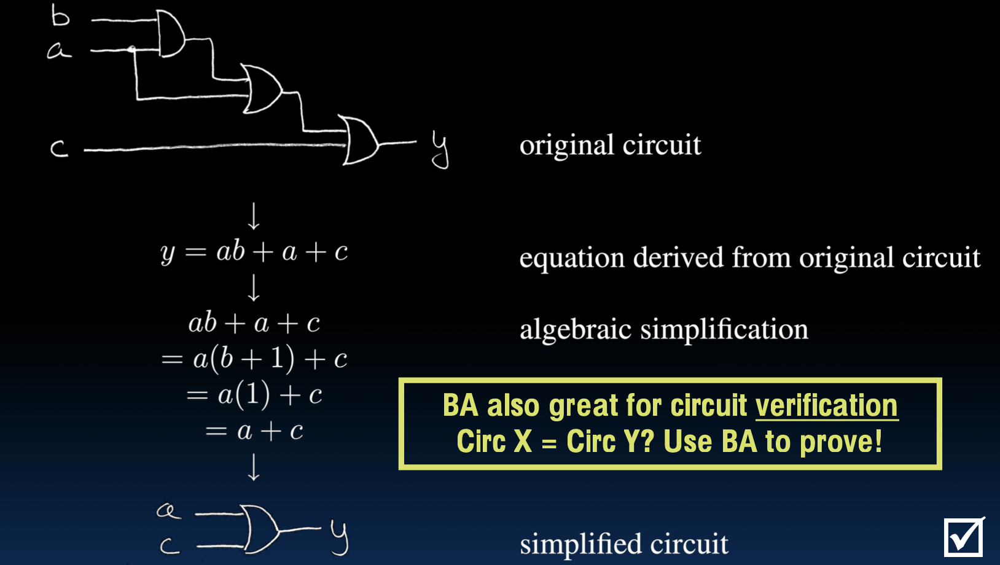
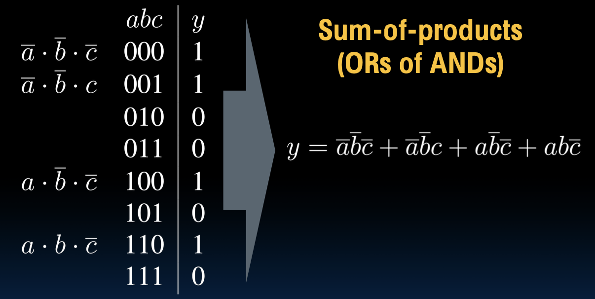
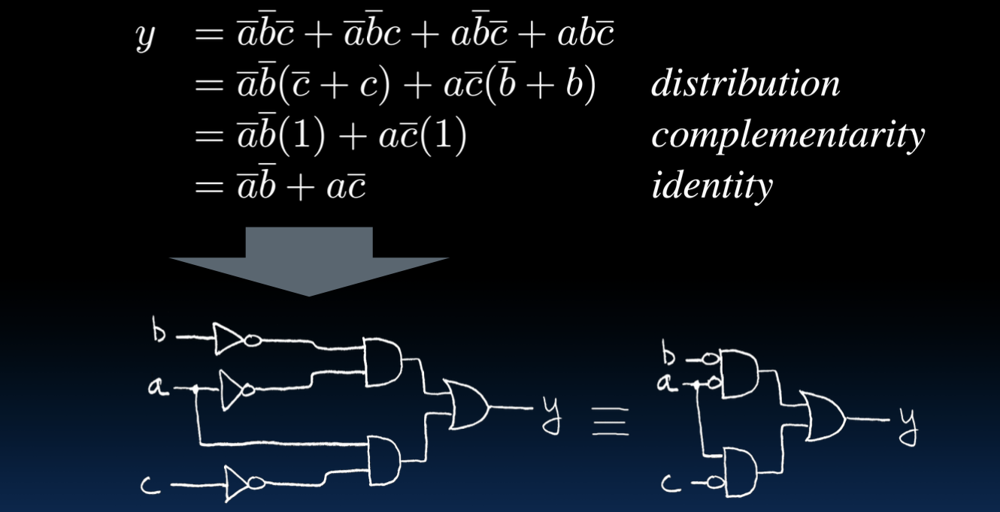

# Lecture 15: Combinational Logic

### 组合逻辑

# Truth Tables

### 真值表

真值表用于列举所有可能的输入组合及其对应的输出结果。它是设计和分析逻辑电路的基本工具。真值表的每一行代表一种输入组合，最后一列代表该输入组合下的输出值。

例如，假设一个逻辑电路有四个输入a、b、c、d和一个输出y，所有可能的输入组合及其对应的输出结果可以表示为：

| a    | b    | c    | d    | y          |
| ---- | ---- | ---- | ---- | ---------- |
| 0    | 0    | 0    | 0    | F(0,0,0,0) |
| 0    | 0    | 0    | 1    | F(0,0,0,1) |
| 0    | 0    | 1    | 0    | F(0,0,1,0) |
| 0    | 0    | 1    | 1    | F(0,0,1,1) |
| 0    | 1    | 0    | 0    | F(0,1,0,0) |
| 0    | 1    | 0    | 1    | F(0,1,0,1) |
| 0    | 1    | 1    | 0    | F(0,1,1,0) |
| 0    | 1    | 1    | 1    | F(0,1,1,1) |
| 1    | 0    | 0    | 0    | F(1,0,0,0) |
| 1    | 0    | 0    | 1    | F(1,0,0,1) |
| 1    | 0    | 1    | 0    | F(1,0,1,0) |
| 1    | 0    | 1    | 1    | F(1,0,1,1) |
| 1    | 1    | 0    | 0    | F(1,1,0,0) |
| 1    | 1    | 0    | 1    | F(1,1,0,1) |
| 1    | 1    | 1    | 0    | F(1,1,1,0) |
| 1    | 1    | 1    | 1    | F(1,1,1,1) |

## TT Example #1: **1** iff one (not both) a,b=1

### 示例真值表 #1：当且仅当a和b其中一个为1时，y才为1

此真值表表示一个特定的逻辑函数，其中输出y在a和b中恰好有一个为1时为1，否则为0。这相当于异或（XOR）逻辑操作。

| a    | b    | y    |
| ---- | ---- | ---- |
| 0    | 0    | 0    |
| 0    | 1    | 1    |
| 1    | 0    | 1    |
| 1    | 1    | 0    |

从这个真值表中可以看出，当a和b的值相同时，y为0；当a和b的值不同时，y为1。这就是XOR逻辑的行为。

## TT Example #2: 2-bit adder

### 示例真值表 #2：2位加法器的真值表

一个2位加法器有两个2位的输入A和B，以及一个3位的输出C。每个输入和输出都由多个位组成，A和B分别由a1、a0和b1、b0表示，C则由c2、c1、c0表示。以下是真值表，列出了所有可能的输入组合及其对应的输出结果。

| A    | B    | C    |
| ---- | ---- | ---- |
| 00   | 00   | 000  |
| 00   | 01   | 001  |
| 00   | 10   | 010  |
| 00   | 11   | 011  |
| 01   | 00   | 001  |
| 01   | 01   | 010  |
| 01   | 10   | 011  |
| 01   | 11   | 100  |
| 10   | 00   | 010  |
| 10   | 01   | 011  |
| 10   | 10   | 100  |
| 10   | 11   | 101  |
| 11   | 00   | 011  |
| 11   | 01   | 100  |
| 11   | 10   | 101  |
| 11   | 11   | 110  |

2位加法器的真值表共有16行，每行代表一种可能的输入组合及其对应的输出结果。

## TT Example #3: 32-bit unsigned adder

### 示例真值表 #3：32位无符号加法器的真值表

对于32位无符号加法器，由于输入A和B各有32位，输出C有33位，因此其真值表将非常庞大，每个输入组合及其对应的输出结果如下表所示：

| A       | B       | C        |
| ------- | ------- | -------- |
| 000...0 | 000...0 | 000...00 |
| 000...0 | 000...1 | 000...01 |
| ...     | ...     | ...      |
| 111...1 | 111...1 | 111...10 |

由于每个输入有32位，所以可能的输入组合数为2^32 * 2^32 = 2^64。真值表将有2^64行，显然实际应用中我们不会列出这么大的真值表。

## TT Example #4: 3-input majority circuit

### 示例真值表 #4：3输入多数电路的真值表

一个3输入多数电路有三个输入a、b、c，以及一个输出y。输出y的值取决于输入中多数输入的值。例如，如果三个输入中有两个或两个以上的值为1，则输出为1；否则输出为0。以下是真值表，列出了所有可能的输入组合及其对应的输出结果。

| a    | b    | c    | y    |
| ---- | ---- | ---- | ---- |
| 0    | 0    | 0    | 0    |
| 0    | 0    | 1    | 0    |
| 0    | 1    | 0    | 0    |
| 0    | 1    | 1    | 1    |
| 1    | 0    | 0    | 0    |
| 1    | 0    | 1    | 1    |
| 1    | 1    | 0    | 1    |
| 1    | 1    | 1    | 1    |

从这个真值表中可以看出，当a、b、c三个输入中有两个或两个以上为1时，输出y为1；否则输出y为0。

---

# Logic Gates 

## 基本逻辑门

### AND 门（与门）

AND 门是一个基本的逻辑门，其输出只有在所有输入均为高电平（1）时才为高电平（1），否则为低电平（0）。

- 符号：

- 真值表：

| a    | b    | c    |
| ---- | ---- | ---- |
| 0    | 0    | 0    |
| 0    | 1    | 0    |
| 1    | 0    | 0    |
| 1    | 1    | 1    |

### OR 门（或门）

OR 门是一个基本的逻辑门，其输出在至少一个输入为高电平（1）时为高电平（1），否则为低电平（0）。

- 符号：

- 真值表：

| a    | b    | c    |
| ---- | ---- | ---- |
| 0    | 0    | 0    |
| 0    | 1    | 1    |
| 1    | 0    | 1    |
| 1    | 1    | 1    |

### NOT 门（非门）

NOT 门是一个基本的逻辑门，其输出是输入的反相。输入为高电平（1）时输出为低电平（0），输入为低电平（0）时输出为高电平（1）。

- 符号：

- 真值表：

| a    | b    |
| ---- | ---- |
| 0    | 1    |
| 1    | 0    |

## 其他逻辑门

### XOR 门（异或门）

XOR 门是一个逻辑门，其输出在两个输入不同（即一个为高电平，一个为低电平）时为高电平（1），否则为低电平（0）。

- 符号：

- 真值表：

| a    | b    | c    |
| ---- | ---- | ---- |
| 0    | 0    | 0    |
| 0    | 1    | 1    |
| 1    | 0    | 1    |
| 1    | 1    | 0    |

### NAND 门（与非门）

NAND 门是一个逻辑门，其输出是 AND 门输出的反相。只有在所有输入均为高电平（1）时输出为低电平（0），否则为高电平（1）。

- 符号：

- 真值表：

| a    | b    | c    |
| ---- | ---- | ---- |
| 0    | 0    | 1    |
| 0    | 1    | 1    |
| 1    | 0    | 1    |
| 1    | 1    | 0    |

### NOR 门（或非门）

NOR 门是一个逻辑门，其输出是 OR 门输出的反相。只有在所有输入均为低电平（0）时输出为高电平（1），否则为低电平（0）。

- 符号：

- 真值表：

| a    | b    | c    |
| ---- | ---- | ---- |
| 0    | 0    | 1    |
| 0    | 1    | 0    |
| 1    | 0    | 0    |
| 1    | 1    | 0    |

这些逻辑门是数字电路的基本构建块，通过组合这些基本逻辑门，可以构建更复杂的逻辑电路。

## 2-input gates extend to n-inputs

### 多输入门扩展

### N-input XOR 门（异或门）

- 在多输入门中，N输入的XOR门是比较特别的。
- 实际上很简单：
  - XOR门在其输入中的1的数量为奇数时输出1。

下图展示了三个输入的XOR门的真值表：

| a    | b    | c    | y    |
| ---- | ---- | ---- | ---- |
| 0    | 0    | 0    | 0    |
| 0    | 0    | 1    | 1    |
| 0    | 1    | 0    | 1    |
| 0    | 1    | 1    | 0    |
| 1    | 0    | 0    | 1    |
| 1    | 0    | 1    | 0    |
| 1    | 1    | 0    | 0    |
| 1    | 1    | 1    | 1    |

## Truth Table -> Gates (e.g., majority circ.)

### 真值表转换为逻辑门（例如，多数电路）

- 真值表展示了输入到输出的逻辑关系。
- 根据真值表，可以画出相应的逻辑电路。

下图展示了三输入多数电路的真值表及其对应的逻辑电路。

## Truth Table -> Gates (e.g., FSM circuit)

### 真值表转换为逻辑门（例如，有限状态机电路）

- 有限状态机（FSM）使用真值表来描述状态转换和输出。
- 根据真值表，可以画出相应的逻辑电路。

下图展示了一个简单的FSM电路的真值表及其对应的逻辑电路：

这里，PS表示当前状态，NS表示下一个状态，Input表示输入信号，Output表示输出信号。逻辑电路可以用与门和或门实现。

---

# Boolean Algebra

### 布尔代数

### George Boole和布尔代数

- George Boole是19世纪的数学家，他开发了一种包含逻辑的数学系统（代数），后来被称为布尔代数。
- 布尔代数的基本函数包括与（AND）、或（OR）和非（NOT）。

### 布尔代数的威力

- 布尔代数的强大之处在于，使用与、或和非门组成的电路与布尔代数中的方程有一一对应关系。
- 在布尔代数中，`+`表示或（OR），`•`表示与（AND），`x̄`表示非（NOT）。

下图展示了一个三输入多数电路的逻辑表达式和对应的布尔代数表达式：

- 逻辑表达式：`y = a • b + a • c + b • c`
- 布尔代数表达式：`y = ab + ac + bc`

这个表达式表示当三个输入中有两个或两个以上为真（1）时，输出为真（1）。

## Boolean Algebra (e.g., for FSM)

### 布尔代数（例如，用于FSM）

### 状态表与逻辑表达式

在图中，我们看到一个有限状态机（FSM）的状态表：

| PS   | INPUT | NS   | OUTPUT |
| ---- | ----- | ---- | ------ |
| 00   | 0     | 00   | 0      |
| 00   | 1     | 01   | 0      |
| 01   | 0     | 00   | 0      |
| 01   | 1     | 10   | 0      |
| 10   | 0     | 00   | 0      |
| 10   | 1     | 00   | 1      |

该状态表表示当输入（INPUT）为1且当前状态（PS）为`10`时，输出（OUTPUT）为1，否则输出为0。状态转移由逻辑电路表示，如图所示。

逻辑电路的输出可以表示为布尔表达式：
\\[ \text{OUTPUT} = \text{PS}_1 \cdot \overline{\text{PS}_0} \cdot \text{INPUT} \\]

## BA: Circuit & Algebraic Simplification

### 电路与代数化简

### 电路与等式

图中显示了一个原始电路，其输出y的表达式为：
\\[ y = ab + a + c \\]

通过布尔代数的化简，我们可以简化这个表达式：

\\( ab + a + c \\)

\\( = a(b + 1) + c \\) （因式分解）

\\( = a(1) + c \\) （因为 \\( b + 1 = 1 \\)）

\\( = a + c \\)

简化后的表达式为：
\\[ y = a + c \\]

原始电路通过化简可以变为更简单的电路，只需要一个或门即可实现上述功能。

布尔代数不仅可以用于电路的化简，还可以用于电路的验证。通过布尔代数，我们可以证明两个电路是否等价。

---

# Laws of Boolean Algebra

### 布尔代数的定律

布尔代数的基本定律如下：

- **互补律（Complementarity）**:
  \\[ x \cdot \overline{x} = 0 \\]
  \\[ x + \overline{x} = 1 \\]

- **零律和单位律（Laws of 0's and 1's）**:
  \\[ x \cdot 0 = 0 \\]
  \\[ x \cdot 1 = x \\]
  \\[ x + 0 = x \\]
  \\[ x + 1 = 1 \\]

- **幂等律（Idempotent Law）**:
  \\[ x \cdot x = x \\]
  \\[ x + x = x \\]

- **交换律（Commutative Law）**:
  \\[ x \cdot y = y \cdot x \\]
  \\[ x + y = y + x \\]

- **结合律（Associative Law）**:
  \\[ (x \cdot y) \cdot z = x \cdot (y \cdot z) \\]
  \\[ (x + y) + z = x + (y + z) \\]

- **分配律（Distribution）**:
  \\[ x \cdot (y + z) = x \cdot y + x \cdot z \\]
  \\[ x + y \cdot z = (x + y) \cdot (x + z) \\]

- **合一律（Uniting Theorem）**:
  \\[ x \cdot (x + y) = x \\]
  \\[ x + x \cdot y = x \\]

- **德摩根定律（DeMorgan's Law）**:
  \\[ \overline{x \cdot y} = \overline{x} + \overline{y} \\]
  \\[ \overline{x + y} = \overline{x} \cdot \overline{y} \\]

这些定律为布尔代数的基础，帮助我们进行逻辑表达式的简化和转换。

## Boolean Algebraic Simplification Example

### 布尔代数化简示例

逻辑表达式 \( y = ab + a + c \) 的化简过程：

1. 原始表达式：
   \\[ y = ab + a + c \\]

2. 应用分配律和恒等律：
   \\[ y = a(b + 1) + c \\]

3. 根据1的定律（任何变量与1相或等于1）：
   \\[ y = a(1) + c \\]

4. 应用恒等律：
   \\[ y = a + c \\]

通过这一过程，我们将原始复杂的逻辑表达式简化为更简单的形式。这不仅减少了逻辑门的数量，还提高了电路的效率和可读性。

---

# Canonical forms 

### 规范形式

布尔表达式的规范形式包括积之和 (Sum-of-Products, SOP) 和和之积 (Product-of-Sums, POS) 形式。规范形式在逻辑电路设计中非常重要，因为它们提供了将逻辑表达式转换为实际逻辑电路的方法。

在图中，我们看到一个示例，该示例展示了如何将一个布尔表达式转换为SOP形式。这个例子的真值表如下：

我们可以看到，对于输出 y 为 1 的每一行，我们可以写出相应的最小项(minterm)。这些最小项可以用与 (AND) 操作组合起来，然后用或 (OR) 操作相连：

简化以下表达式：

\\[ y = \overline{a} \cdot \overline{b} \cdot \overline{c} + \overline{a} \cdot \overline{b} \cdot c + a \cdot \overline{b} \cdot \overline{c} + a \cdot b \cdot \overline{c} \\]

这是积之和的表达形式，每个最小项代表一个输出为1的输入组合。

通过进一步简化上述SOP表达式，我们可以得到更简单的形式：

利用分配律、互补律和恒等律，我们可以简化表达式：

首先，我们可以将表达式分组：

\\[ y = \overline{a} \cdot \overline{b} (\overline{c} + c) + \overline{c} (a \cdot \overline{b} + a \cdot b) \\]

根据互补律 \\(\overline{c} + c = 1\\)，和恒等律 \\(a + \overline{a} = 1\\)，可以简化为：

\\[ y = \overline{a} \cdot \overline{b} \cdot 1 + \overline{c} (a) \\]

\\[ y = \overline{a} \cdot \overline{b} + a \cdot \overline{c} \\]

最终的简化表达式为：

\\[ y = \overline{a} \cdot \overline{b} + a \cdot \overline{c} \\]

我们还可以通过电路图展示这一逻辑：

- 使用两个与门 (AND gates) 分别计算 \\(\overline{a} \cdot \overline{b}\\) 和 \\(a \cdot \overline{c}\\)
- 然后使用一个或门 (OR gate) 将它们相加

电路图如下：

1. **计算 \\(\overline{a} \cdot \overline{b}\\)**：
   - 使用两个 NOT 门将 \\(a\\) 和 \\(b\\) 分别反相。
   - 使用一个 AND 门将反相后的 \\(\overline{a}\\) 和 \\(\overline{b}\\) 进行与操作。

2. **计算 \\(a \cdot \overline{c}\\)**：
   - 使用一个 NOT 门将 \\(c\\) 反相。
   - 使用一个 AND 门将 \\(a\\) 和 \\(\overline{c}\\) 进行与操作。

3. **将上述两项相加**：
   - 使用一个 OR 门将 \\(\overline{a} \cdot \overline{b}\\) 和 \\(a \cdot \overline{c}\\) 进行或操作。

这样，我们就得到了简化后的逻辑电路，实现了所需的逻辑功能。

## Three questions

### 三个问题

1. \\((a+b) \cdot (\overline{a}+b) = b\\)

2. N输入逻辑门可以被看作是级联的两输入逻辑门。I.e., \\((a \Delta b \Delta c \Delta d \Delta e) = a \Delta (b \Delta (c \Delta (d \Delta e)))\\) where \\(\Delta\\) is one of AND, OR, XOR, NAND

3. 可以用 NOR 通过巧妙的连接来模拟 AND, OR 和 NOT。

## Answer

1. \\((a + b) \cdot (\overline{a} + b) = b\\)

   通过布尔代数验证这个表达式是正确的。我们可以通过以下步骤来证明这一点：

   \\[
   (a + b) \cdot (\overline{a} + b) = a \cdot \overline{a} + ab + b\overline{a} + bb = 0 + ab + b\overline{a} + b = b(ab + \overline{a} + 1) = b
   \\]

2. N输入逻辑门可以被看作是级联的两输入逻辑门， \\(\Delta\\) 是 AND, OR, XOR 或 NAND。

   这个假设是错误的。以下为错误的验证：

   \\[
   (a \Delta b \Delta c \Delta d \Delta e) \neq a \Delta (b \Delta (c \Delta (d \Delta e)))
   \\]

   例如，对应XOR操作，结果不一致。

3. 可以用 NOR 通过巧妙的连接来模拟 AND, OR 和 NOT。

   这句话是正确的。NOR门可以通过适当的连接实现任何逻辑函数，包括 AND, OR 和 NOT。

## And in conclusion...

1. 通过流水线设计可以降低组合逻辑电路的延迟，从而提高时钟速度。
2. 有限状态机（FSM）非常有用，你将在更高级的课程如151A, 152, 和164中再次见到它们。
3. 使用我们学习的表格和技术，可以将布尔表达式转换为真值表，再转换为逻辑门图。这些技巧对于逻辑电路的设计和优化非常重要。