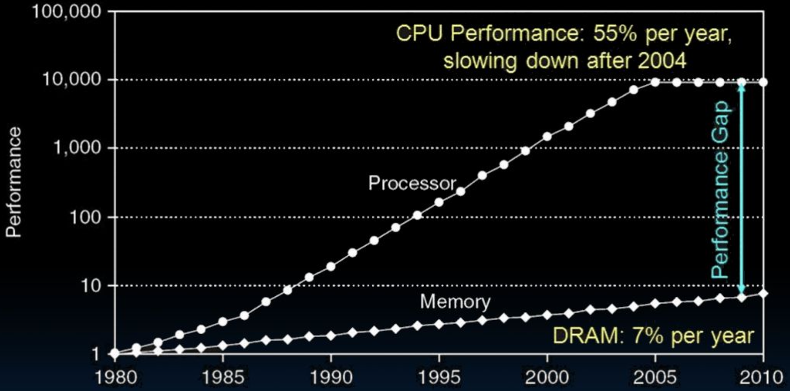
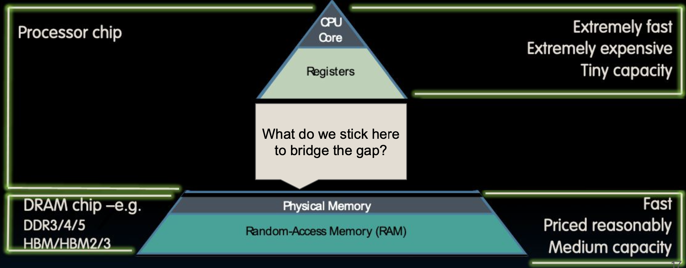

# Lecture 24: Caches - Direct Mapped I

## 回顾

### 数据通路并行性（流水线）

通过在有线组件之间插入寄存器实现数据通路并行性，即流水线：

- 实现内存访问仍然很慢。
- 流水线的基本原理是将一个大的处理任务分解为多个小的阶段，每个阶段在一个时钟周期内完成。通过并行处理不同阶段，可以显著提高处理器的吞吐量。

### 数据依赖性

流水线使数据依赖性以风险的形式非常明显：

- **结构性风险**：当多个指令需要同一硬件资源时出现的冲突。这种问题可以通过增加硬件资源来解决，例如增加多个执行单元。
- **数据风险**：当一个指令依赖于前一个指令的结果时出现。例如，`add x1, x2, x3` 和 `sub x4, x1, x5`。可以通过前推（Forwarding）或插入NOPs（No Operation）指令来解决。
- **控制风险**：主要发生在分支指令中，因为分支的结果会影响后续指令的执行顺序。可以通过分支预测和分支延迟槽（Branch Delay Slot）等技术来解决。

### 通过硬件和逻辑增加来解决问题

使用硬件和逻辑增加来解决这些问题：

- **前推（Forwarding）**：将前一个指令从EX阶段的输出前推到下一个指令的EX输入，基于需要。这可以减少数据风险带来的停顿。
  - 也叫旁路，因为我们绕过了解码寄存器的内容，从ID阶段直接传递。前推机制使得依赖于前一指令结果的指令可以尽快获得数据，减少流水线停顿时间。
- **停顿/NOPs**：基本上是浪费指令周期，直到获得正确的行为。当前推无法完全解决数据风险时，可以插入NOP指令，使得依赖的指令在前一指令执行完成后再继续执行。

流水线设计显著提升了处理器的指令吞吐量，但需要有效解决数据依赖和控制风险，以确保流水线的平稳运行。

## 本节内容

### 复习

- **二进制前缀**
  - 理解不同前缀的意义和使用场景。

- **内存层次结构**
  - 了解不同级别缓存的作用及其工作原理。

### 缓存简介

- **完全关联缓存（Fully Associative Caches）**
  - 缓存中的任何块可以存储在任何缓存行中。这种缓存的灵活性最高，但硬件复杂度和查找时间也较高。

- **直接映射缓存（Direct-Mapped Caches）**
  - 每个内存块只能映射到一个特定的缓存行。实现简单，查找速度快，但灵活性低，容易出现冲突。

## 二进制前缀

### 公制前缀（Kilo, Mega, Giga, Tera, Peta, Exa, Zetta, Yotta）

这些都是常见的使用前缀，即所有SI（国际单位制），也就是我们从初中开始使用的：

- 注意：大写前缀 != 小写前缀在SI中！例如，mm != Mm。
  - mm表示毫米，Mm表示兆米。

### EE/CS领域的前缀差异

然而，大多数电气工程/计算机科学世界的前缀并不是这样：

- 使用十进制很难处理，二进制要容易得多。例如，计算机内存通常是2的幂次方，因此1024（2^10）字节被称为1千字节（KB）。
- 混乱！例如，“千字节”的常见用法是1024字节，但“正确”的SI值是1000字节。这种混乱在存储设备中尤为明显。

### 硬盘制造商和电信公司的使用

硬盘制造商和电信公司是使用SI因子的唯一计算组：

- 广告为1TB的硬盘实际上只有大约90％的预期值，因为操作系统标准和硬盘标准之间的单位差异。
  - 例如，硬盘实际上是 \\(10^{12}\\) 字节，但操作系统用二进制单位计算，导致容量显示低于1TB。
  - 1 Mbit/s连接实际传输 \\(10^6\\) bps，而不是\\(2^{20}\\) bps。

这些扩展讲解提供了关于流水线概念、二进制前缀以及这些前缀在计算机科学和电气工程中的应用的更详细背景。通过理解这些基础知识，可以更好地理解计算机系统的设计和工作原理。

## 单位前缀对照表

在这个对照表中，我们可以看到常用的单位前缀及其对应的因子和SI（国际单位制）中的大小。以二进制表示时，每个前缀对应的因子如下：

| 前缀      | 二进制表示                                       | SI 单位表示                                       |
| --------- | ------------------------------------------------ | ------------------------------------------------- |
| Kilo (K)  | \\(2^{10} = 1,024\\)                             | \\(10^3 = 1,000\\)                                |
| Mega (M)  | \\(2^{20} = 1,048,576\\)                         | \\(10^6 = 1,000,000\\)                            |
| Giga (G)  | \\(2^{30} = 1,073,741,824\\)                     | \\(10^9 = 1,000,000,000\\)                        |
| Tera (T)  | \\(2^{40} = 1,099,511,627,776\\)                 | \\(10^{12} = 1,000,000,000,000\\)                 |
| Peta (P)  | \\(2^{50} = 1,125,899,906,842,624\\)             | \\(10^{15} = 1,000,000,000,000,000\\)             |
| Exa (E)   | \\(2^{60} = 1,152,921,504,606,846,976\\)         | \\(10^{18} = 1,000,000,000,000,000,000\\)         |
| Zetta (Z) | \\(2^{70} = 1,180,591,620,717,411,303,424\\)     | \\(10^{21} = 1,000,000,000,000,000,000,000\\)     |
| Yotta (Y) | \\(2^{80} = 1,208,925,819,614,629,174,706,176\\) | \\(10^{24} = 1,000,000,000,000,000,000,000,000\\) |

## IEC 标准前缀

国际电工委员会 (IEC) 在1999年引入了这些前缀来指定二进制数量：

| 前缀      | 二进制表示                                       |
| --------- | ------------------------------------------------ |
| kibi (Ki) | \\(2^{10} = 1,024\\)                             |
| mebi (Mi) | \\(2^{20} = 1,048,576\\)                         |
| gibi (Gi) | \\(2^{30} = 1,073,741,824\\)                     |
| tebi (Ti) | \\(2^{40} = 1,099,511,627,776\\)                 |
| pebi (Pi) | \\(2^{50} = 1,125,899,906,842,624\\)             |
| exbi (Ei) | \\(2^{60} = 1,152,921,504,606,846,976\\)         |
| zebi (Zi) | \\(2^{70} = 1,180,591,620,717,411,303,424\\)     |
| yobi (Yi) | \\(2^{80} = 1,208,925,819,614,629,174,706,176\\) |

这些名称来自原始SI前缀的缩写形式（发音相同）和bi是“二进制”的缩写，但发音为“bee”。现在SI前缀只有其基于10的意义，不再有基于2的意义。

## 记忆方法

为了帮助记住这些前缀，有一些助记符：

- Kid meets giant Texas people exercising zen-like yoga.
- Kind men give ten percent extra, zestfully, youthfully.
- Kissing mentors gives testy persistent extremists zealous youthfulness.
- Kindness means giving, teaching, permeating excess zeal yourself.
- Killing messengers gives terrible people exactly zero, yo.
- Kindergarten means giving teachers perfect examples (of) zeal (&) youth.
- Kissing mediocre giraffes teaches people (to) expect zero (from) you.
- Kinky mean girls teach people exciting zen yoga.
- Kissing Mel Gibson, Teddy Pendergrass exclaimed: “zesty, yo!”
- Kissing me gives ten percent extra zeal & youth!

## 记忆数字的方法

在这个部分，讲解了如何记忆与2的幂次方相关的数字。比如：

| X 值 | 对应值                                                | 近似 SI 单位           |
| ---- | ----------------------------------------------------- | ---------------------- |
| 0    | \\(2^0 = 1\\)                                         |                        |
| 1    | \\(2^1 = 2\\)                                         |                        |
| 2    | \\(2^2 = 4\\)                                         |                        |
| 3    | \\(2^3 = 8\\)                                         |                        |
| 4    | \\(2^4 = 16\\)                                        |                        |
| 5    | \\(2^5 = 32\\)                                        |                        |
| 6    | \\(2^6 = 64\\)                                        |                        |
| 7    | \\(2^7 = 128\\)                                       |                        |
| 8    | \\(2^8 = 256\\)                                       |                        |
| 9    | \\(2^9 = 512\\)                                       |                        |
| 10   | kibi \\(2^{10} = 1,024\\)                             | \\( \approx 10^3\\)    |
| 20   | mebi \\(2^{20} = 1,048,576\\)                         | \\( \approx 10^6\\)    |
| 30   | gibi \\(2^{30} = 1,073,741,824\\)                     | \\( \approx 10^9\\)    |
| 40   | tebi \\(2^{40} = 1,099,511,627,776\\)                 | \\( \approx 10^{12}\\) |
| 50   | pebi \\(2^{50} = 1,125,899,906,842,624\\)             | \\( \approx 10^{15}\\) |
| 60   | exbi \\(2^{60} = 1,152,921,504,606,846,976\\)         | \\( \approx 10^{18}\\) |
| 70   | zebi \\(2^{70} = 1,180,591,620,717,411,303,424\\)     | \\( \approx 10^{21}\\) |
| 80   | yobi \\(2^{80} = 1,208,925,819,614,629,174,706,176\\) | \\( \approx 10^{24}\\) |

这些扩展的讲解提供了关于单位前缀及其在计算机科学中的应用、更详细的背景信息。通过理解这些基础知识，可以更好地掌握计算机系统中的数据表示和单位转换。

## Components of a Computer

计算机的基本组成部分包括处理器、内存和输入输出设备。处理器负责执行计算任务，内存用于存储数据和指令，输入输出设备则用于与外界进行数据交换。处理器与内存通过处理器-内存接口进行通信，内存与输入输出设备通过I/O-内存接口进行通信。

### 处理器

处理器是计算机的核心部件，负责解释和执行指令，主要包括以下两个部分：

- **控制单元（Control Unit）**：负责从内存中获取指令，解释这些指令，并根据解释的结果控制计算机的各个部分。
- **数据路径（Datapath）**：包括程序计数器（PC）、寄存器组和算术逻辑单元（ALU），用于执行算术和逻辑运算。

### 内存

内存用于存储数据和指令，具有以下特点：

- **存储字节数据**：内存以字节为单位存储数据，每个字节都有一个唯一的地址。
- **处理器访问**：处理器通过读写信号控制内存的访问，可以从内存中读取数据或向内存中写入数据。

### 输入输出设备

输入输出设备用于与外界进行数据交换，包括键盘、鼠标、显示器、打印机等。它们通过I/O接口与内存和处理器进行通信，完成数据的输入和输出操作。

## Why are Large Memories Slow? Library Analogy

使用图书馆类比来解释大内存为什么会慢。假设我们需要写一篇报告，需要查阅图书馆的书籍。这一过程可以类比为内存访问：

- **查找图书**：当我们需要一个内存地址时，就像去图书馆找一本书。
- **搜索和取书**：我们在图书馆中搜索所需的书籍，以及书中的具体章节。找到后，记住内容，再将书放回原处。
- **回到座位**：然后回到座位继续写报告。

这种类比展示了内存访问的步骤，以及每一步可能引入的延迟。

### Larger Libraries and Increased Delay

大图书馆中查找一本书需要更多时间，这个过程包括：

- **搜索书名/作者**：在庞大的目录中搜索书名或作者并找到索引号。
- **取书时间**：走到书架去取书的往返时间。

电子内存也有类似的问题，随着存储密度的增加，技术的限制（如SRAM vs. DRAM vs. 磁盘）会使速度变慢。

这种类比帮助理解为什么更大的内存会增加访问时间，因为存储的容量越大，查找和传输数据所需的时间也就越长。

## Processor-DRAM Gap (Latency)

处理器性能和DRAM性能之间的差距在逐年增大。这种性能差距（Latency Gap）意味着尽管处理器变得越来越快，但内存访问速度却没有相应提高，导致系统整体性能受限于内存访问延迟。以下是性能差距的具体表现：

- **处理器性能提升**：处理器性能每年以55%的速度提高，但在2004年之后有所减缓。
- **DRAM性能提升**：DRAM性能每年仅提高7%。

这种性能差距导致了系统设计中的瓶颈，尽管处理器性能不断提升，但内存的相对慢速访问限制了系统的整体性能。

### 解决方案

为了弥补处理器和内存之间的性能差距，计算机系统引入了多级缓存（cache）机制，通过在处理器和主内存之间添加快速缓存来减少访问延迟。此外，先进的内存管理技术和优化算法也被广泛应用，以提高内存访问效率。

通过理解这些基本概念和性能差距，可以更好地设计和优化计算机系统，提高其整体性能和效率。

# Memory Hierarchy

内存层次结构是一种计算机系统设计，用于组织不同类型的存储器，以实现高效的数据访问和存储。通过将不同速度和容量的存储器进行层次化排列，可以在性能和成本之间取得平衡。

## What To Do: Library Analogy

使用图书馆类比来解释内存层次结构的设计思路：

- **写报告的过程**：假设你正在写一篇关于塞林格的报告，你大概知道需要哪些书。
- **频繁使用的书**：如果你使用了一本书，很可能你还会再次使用它。这对应于计算机中对某些数据的频繁访问。
  - **解决方案**：在家中准备一个书架，可以用来放几本常用的书。当你需要这些书时，可以从图书馆借来放在书架上。
  - **再次使用的书**：如果需要其他书籍，就再去图书馆借新书，但不要把之前借的书还回去，因为你可能还需要它们，直到书架满为止。
- **有限空间的利用**：希望你桌上的约10本书足以完成报告，尽管这10本书只占伯克利大学图书馆藏书的0.00001%。这类比于计算机系统中缓存的有限容量。

## Great Idea #3: Principle of Locality / Memory Hierarchy

### 局部性原理（Principle of Locality）

局部性原理是内存层次结构设计的基础，包含两个方面：

1. **时间局部性（Temporal Locality）**：如果一个数据被访问过，不久后可能会再次被访问。举例来说，当你引用一本书的某一章节时，很可能不久后你会再次引用这本书。
2. **空间局部性（Spatial Locality）**：如果一个数据被访问过，其附近的数据可能也会被访问。就像你在书架上找书时，找到一本书后，可能会顺便查阅与它紧挨着的其他书籍。

## Memory Caching

### 缓存的引入

处理器与内存速度的不匹配促使我们引入了一个新的存储层次——“内存缓存”（memory cache）。缓存通过提供更快的数据访问速度，弥补了处理器和主存之间的速度差异。

### 缓存的实现

缓存通常使用与CPU相同的集成电路技术实现，通常集成在同一芯片上。

- **缓存的类型**：
  - **静态随机存取存储器（SRAM）**：SRAM用于实现缓存，因为它比动态随机存取存储器（DRAM）更快，尽管更昂贵。
  - **动态随机存取存储器（DRAM）**：用于主存，容量大但速度相对较慢。

- **缓存的特点**：
  - **速度更快**：由于使用SRAM，缓存的访问速度比主存快得多。
  - **成本更高**：SRAM的制造成本比DRAM高，因此缓存的容量通常较小。

### 缓存的功能

缓存通常是主内存数据的子集的副本。当我们将数据带入缓存时，实际上是从主内存中复制了一部分数据到缓存中。

- **数据复制和移动**：
  - **复制**：在包含缓存（inclusive cache）中，数据在主内存和缓存中都有副本。
  - **移动**：在排他缓存（exclusive cache）中，数据只存在于主内存或缓存中，而不是同时存在。

- **缓存的类型**：
  - **指令缓存（I$）**：专用于存储指令。
  - **数据缓存（D$）**：专用于存储数据。

这种数据管理方式确保了处理器可以快速访问最近使用的数据，提高了整体系统性能。

## 内存层次结构（Memory Hierarchy）

内存层次结构通过利用局部性原理，将存储器分为多个层次，从而在成本和性能之间取得平衡。各层次如下：

1. **寄存器（Registers）**
   - **速度极快**：寄存器直接与CPU核心相连，速度最快。
   - **容量极小**：每个寄存器仅能存储极少量的数据。
   - **非常昂贵**：由于其高速性，寄存器成本较高。

2. **缓存（Cache）**
   - **高速缓存**：位于CPU和主内存之间，用于临时存储频繁访问的数据。
   - **多级缓存**：通常分为L1、L2、L3等多个级别，越靠近CPU速度越快，容量越小。
   - **提高数据访问速度**：缓存显著减少了访问主内存所需的时间。

3. **主内存（Main Memory/RAM）**
   - **速度较快**：主内存用于存储正在使用的数据和程序。
   - **容量中等**：容量比缓存大，但访问速度较慢。
   - **价格合理**：相比寄存器和缓存，主内存的成本较低。

4. **外存（Secondary Storage/磁盘）**
   - **速度慢**：外存的访问速度较慢，用于长期存储数据。
   - **容量大**：外存容量最大，能够存储大量数据。
   - **价格低廉**：每单位存储的成本最低。

通过这种层次化设计，系统能够在不同存储器之间动态调度数据，确保最频繁访问的数据能够以最快的速度进行访问。这样不仅提升了整体系统性能，也降低了成本。

### 内存层次结构的作用

- **提高性能**：通过将频繁使用的数据放在更靠近CPU的位置，减少了数据访问的延迟时间。
- **降低成本**：结合使用不同成本和速度的存储设备，既满足了性能需求，也控制了系统成本。
- **动态管理**：系统自动根据访问模式调整数据的位置，以优化性能。

这种设计理念广泛应用于现代计算机系统，使其能够高效地处理大量数据和复杂计算任务。

### 内存层次结构的特点

内存层次结构通过将不同速度和容量的存储器分级排列，优化了性能和成本：

- **接近处理器的层次**：
  - **容量更小**：例如，L1缓存通常只有几KB到几十KB。
  - **速度更快**：L1缓存的访问速度非常快，通常在几个时钟周期内完成。
  - **成本更高**：由于使用SRAM，缓存的制造成本较高。

- **远离处理器的层次**：
  - **容量更大**：例如，主存（DRAM）的容量可以达到几GB到几十GB。
  - **速度较慢**：访问主存的时间较长，通常在几十到几百个时钟周期。
  - **成本更低**：DRAM的制造成本相对较低。

### 最低层次

最低层次（通常是硬盘HDD或固态硬盘SSD）包含所有可用数据。它们具有以下特点：

- **容量最大**：硬盘和SSD的容量可以达到TB级别。
- **速度最慢**：与缓存和主存相比，硬盘和SSD的访问速度最慢。
- **成本最低**：每GB的存储成本最低。

内存层次结构为处理器提供了一个非常大且快速的内存幻象，通过动态调度和管理数据，实现了高效的数据访问和处理，同时兼顾了性能和成本。

通过这种设计，系统能够有效地管理和调度数据，确保最频繁访问的数据能够以最快的速度进行访问，从而提升整体系统性能并降低成本。

## Locality, Design, Management

### Memory Hierarchy Basis

内存层次结构的设计基于以下原则：

- **缓存**：作为寄存器与主内存（DRAM）之间的中间层次，缓存能够提供比主内存更快的访问速度。
  - DRAM可以视为缓存的缓存，也可以视为磁盘的缓存。
- **数据副本**：缓存包含当前使用的内存数据副本，而内存包含当前使用的磁盘数据副本。
- **局部性原理**：缓存的有效性基于时间局部性和空间局部性。

### 局部性原理

- **时间局部性（Temporal Locality）**：如果一个数据被访问过，不久后可能会再次被访问。设计缓存时要将最近访问的数据项尽量靠近处理器存放。
- **空间局部性（Spatial Locality）**：如果一个内存位置被访问过，其附近的内存位置可能也会很快被访问。设计缓存时要将由连续字组成的块移动到靠近处理器的位置。

### Cache Design

### 如何组织缓存？

缓存的组织方式主要有三种：

1. **直接映射缓存（Direct-mapped Cache）**：
   - 内存中的每个位置只能映射到缓存中的一个特定位置。
   - 简单且实现成本低，但冲突率较高。

2. **全关联缓存（Fully-associative Cache）**：
   - 内存中的任何位置都可以映射到缓存的任意位置。
   - 冲突率低，但实现复杂且成本高。

3. **组相联缓存（N-way Set Associative Cache）**：
   - 介于直接映射和全关联缓存之间。缓存分为若干组，每组包含若干缓存块。
   - 内存位置映射到特定组内的任意块，平衡了冲突率和实现成本。

### 每个内存地址映射到哪里？

- 缓存是内存的子集，因此多个内存地址会映射到缓存中的相同位置。
- 映射方式取决于缓存的组织类型。

### 如何知道哪些元素在缓存中？

- 在执行内存操作时，首先尝试访问缓存，如果需要再访问内存。
- 使用标签（Tag）、索引（Index）和偏移量（Offset）对内存地址进行细分，帮助快速定位缓存中的数据。

### TIO (Tag-Index-Offset) 细分

- **标签（Tag）**：用于区分不同块的唯一标识。
- **索引（Index）**：用于定位缓存中的特定组或块。
- **偏移量（Offset）**：用于定位块内的具体数据。

这种结构使得缓存能够快速定位和访问数据，提高了整体系统的性能。通过结合时间局部性和空间局部性的设计原则，缓存能够有效减少内存访问的延迟，提升处理器的运行效率。

## How is the hierarchy managed?

### 层次结构的管理方式

在计算机系统中，不同层次的存储器由不同的组件进行管理：

- **寄存器与内存的关系**
  - 由编译器（或汇编级程序员）管理：编译器负责将高层代码翻译为低层汇编代码，并决定何时将数据从内存加载到寄存器，以及何时将数据从寄存器写回内存。
  
- **缓存与主存的关系**
  - 由缓存控制器硬件管理：缓存控制器硬件负责自动将频繁访问的数据从主存加载到缓存中，并在需要时将修改后的数据从缓存写回主存。这种自动管理使得程序员无需手动处理缓存操作。

- **主存与磁盘（辅助存储）的关系**
  - 由操作系统（虚拟内存）管理：操作系统通过虚拟内存机制，将主存和磁盘结合起来使用。当主存不足时，操作系统会将不常使用的数据移到磁盘上，以腾出主存空间。
  - 由硬件（地址转换后备缓冲区，TLB）辅助进行虚拟地址到物理地址的映射：TLB是一种高速缓存，用于存储虚拟地址到物理地址的映射，减少地址转换的时间开销。
  - 由程序员（文件）管理：程序员通过文件系统管理磁盘上的数据，通过文件操作来读写数据。

### 缓存的管理

缓存是一个重要的存储层次，用于弥合处理器和主存之间的速度差距。通过使用缓存，处理器可以快速访问频繁使用的数据，而不必每次都从主存中读取。缓存的管理依赖于以下几个关键技术：

- **缓存控制策略**：包括缓存替换策略（如LRU、FIFO等）和写策略（如写直达、写回等），这些策略决定了何时替换缓存中的数据以及如何处理写操作。
- **缓存一致性**：在多处理器系统中，确保各处理器缓存中的数据一致性是一个挑战。常用的缓存一致性协议包括MESI、MOESI等。

### 操作系统的管理

操作系统负责主存和磁盘之间的数据管理，主要通过以下机制实现：

- **分页**：将内存和磁盘分割成固定大小的块（页），并在需要时将页从磁盘加载到内存或将页从内存写回磁盘。
- **页表**：操作系统使用页表来维护虚拟地址到物理地址的映射，并通过TLB加速地址转换。

## And in conclusion...

### 总结

- **缓存的作用**：缓存为处理器提供了一种幻觉，使其感觉到内存是无限大且无限快的。
- **多层次存储结构**：通过引入多级缓存（如L1、L2、L3缓存），可以进一步减少内存访问的延迟。
- **局部性原理**：利用时间局部性和空间局部性，可以有效地提高缓存的命中率，从而提升系统性能。
- **性能评估**：在实际应用中，需要评估缓存性能，确定缓存设计是否能够满足系统的需求。

### Can we do even better?

- **更多级别的缓存**：在寄存器和主存之间增加更多级别的缓存，可以进一步填补速度差距。例如，L1缓存紧贴处理器，L2缓存稍慢但容量更大，L3缓存容量更大但速度更慢。
- **缓存性能的衡量**：理论上缓存可以显著提升性能，但实际效果取决于缓存的设计和使用场景。需要通过实际测量和分析来评估缓存性能。

### Future Topics

- **缓存类型**：我们将进一步探讨不同类型的缓存，包括直接映射缓存、全相联缓存和N路组相联缓存。
- **多级缓存**：了解多级缓存的设计和作用。
- **缓存性能评估**：学习如何衡量和优化缓存性能。

通过这些学习，我们可以更好地理解和优化计算机系统的存储层次结构，提高整体系统的性能和效率。

