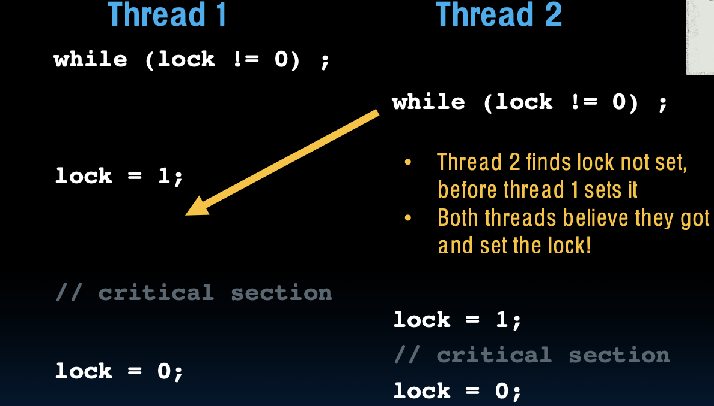

# Lecture 30: Parallelism II: OpenMP, Sharing Issues

## 支持并行编程的语言

### 并行编程语言的多样性

在并行编程领域，存在多种编程语言和框架，每种都有其特定的优势和适用场景。根据并行计算模型的不同，这些语言可以分为数据并行、任务并行、混合并行等类别。选择合适的语言和并行模型对实现高效的并行算法至关重要。以下是一些支持并行编程的语言及其特点：


- **Cilk**：一种用于多线程并行计算的扩展C语言，专注于任务并行性。Cilk通过轻量级线程和动态负载平衡实现高效并行计算，适用于递归算法和图形计算等场景。

- **CUDA**：由NVIDIA开发的并行计算平台和编程模型，专门用于GPU编程。CUDA允许开发者直接在GPU上编写并行算法，特别适合数据并行计算，如矩阵运算、图像处理和深度学习。

- **OpenMP**：一种基于共享内存架构的并行编程接口，广泛用于C、C++和Fortran。OpenMP提供了一组编译器指令、库函数和环境变量，允许程序员简单地并行化代码中的循环和部分计算，适合科学计算和工程应用。

- **Java和Scala**：这两种语言通过多线程和Actor模型支持任务并行性。Java的`java.util.concurrent`库和Scala的Akka框架都提供了强大的并行和分布式计算支持，适合Web服务、并发应用程序和大数据处理。

- **MPI（Message Passing Interface）**：一种标准的消息传递库，广泛用于分布式计算和高性能计算（HPC）。MPI允许多个独立的计算节点通过消息传递进行通信，适合大规模并行计算和跨多个物理计算节点的应用。

> ### Rust 与并行编程
>
> Rust 在设计上非常重视内存安全和并发性。其主要特点如下：
>
> - **所有权系统**：Rust 的所有权系统确保了数据在被使用时不会发生竞态条件。这一系统通过在编译时检查所有权、借用和生命周期，防止数据竞争和内存泄漏，从而提供了比大多数其他语言更高的并发安全性。
>
> - **线程安全**：Rust 的类型系统内置了对线程安全的支持。例如，Rust 的标准库提供了`std::thread`模块，可以轻松地创建和管理线程。此外，Rust 的 `Send` 和 `Sync` trait 确保了在线程之间传递数据时的安全性。
>
> - **无数据竞争的并发**：Rust 提供了多种并发原语，如 `Mutex`、`RwLock`、`Channel` 等，使得编写安全的并发代码变得更加容易。这些原语结合 Rust 的所有权系统，可以确保在并发环境中避免数据竞争。
>
> - **高效的内存管理**：Rust 的零成本抽象和对内存管理的严格控制，使得并行代码在高效执行的同时不会产生内存安全问题。这种高效性使得 Rust 非常适合用于需要高度并行处理的系统级编程。

### 为什么有这么多并行编程语言？

并行编程领域的复杂性导致了多种并行编程语言的存在。每种语言或框架都针对特定的并行计算模型或硬件平台进行了优化，无法一概而论地解决所有问题。

## 内在函数的重要性

“内在函数”（intrinsics）是硬件特定的低级别函数，允许程序员直接调用处理器指令集中的并行特性，而不依赖于编译器的自动优化。由于现有编译器可能无法充分利用处理器的并行计算能力，特别是在复杂的计算场景中，内在函数为程序员提供了直接控制硬件的能力，以实现更高的性能。

例如，使用内在函数可以直接控制SIMD（单指令多数据）指令集，从而在向量化计算中实现显著的性能提升。这对计算密集型应用，如图像处理、物理仿真和金融建模等至关重要。

## 并行编程的现状

尽管并行编程已经成为现代计算的主流，自动将顺序代码转化为高效的并行代码仍然是一个巨大的挑战。编译器技术虽然已经取得了很大进展，但在很多情况下，仍然依赖于程序员的手动优化。特别是对于复杂的并行算法，自动化的编译器技术往往无法替代程序员的专业知识。

因此，掌握并行编程技术，特别是针对特定硬件平台的优化技能，仍然是程序员实现高效并行计算的关键。这不仅涉及到选择合适的编程语言和工具，还需要深入理解硬件架构和并行算法的本质。

## 并行编程语言的选择

并行编程语言的多样性表明，没有一种通用语言可以适应所有并行计算需求。每个应用场景都有其特定的需求，例如：

- **科学计算**：通常需要处理大规模的矩阵运算和数值模拟，适合使用CUDA或OpenMP。
- **Web服务器**：需要处理大量的并发请求，适合使用Java或Scala进行任务并行处理。
- **高性能计算**：通常需要跨多个节点的并行计算，适合使用MPI进行分布式计算。

在计算机科学课程，如CS 61C中，学生将接触到一些实际的并行编程语言和工具，如OpenMP，以学习如何将这些技术应用于高性能计算。

并行编程语言的发展反映了计算机架构和计算需求的多样化。通过学习和掌握适合的并行编程语言和工具，程序员可以有效地应对不同类型的并行计算任务，从而提高程序的性能和效率。在课程中，将进一步探讨这些语言的实际应用，帮助学生理解并行计算的基本原理和实现方法。

# OpenMP

## 并行循环

在串行执行中，循环体的每次迭代都是按顺序依次执行的。如下例所示：

```c
for (int i = 0; i < 100; i++) {
   // 循环体内容
}
```

在这种串行执行方式下，下一次迭代必须等待前一次迭代完全结束后才能继续进行。虽然这种方式简单直观，但当循环迭代次数很大时，效率会变得非常低，因为处理器的计算资源没有得到充分利用。

为了提高效率，可以将循环的不同部分分配到多个处理器上同时执行，这就是并行循环的概念。例如，将100次迭代分成4个部分，每个部分各自执行25次迭代，可以让4个处理器并行处理，如下所示：

```c
for (int i = 0; i < 25; i++) { 
    // 处理器1处理 
}
for (int i = 25; i < 50; i++) { 
    // 处理器2处理 
}
for (int i = 50; i < 75; i++) { 
    // 处理器3处理 
}
for (int i = 75; i < 100; i++) { 
    // 处理器4处理 
}
```

这种方式显著提高了执行效率，因为它充分利用了多核处理器的并行计算能力。

### OpenMP中的并行for循环

为了简化并行化过程，OpenMP提供了一种简单的方法来将循环并行化。通过在循环前使用`#pragma omp parallel for`指令，可以将循环体的不同迭代自动分配到多个线程上执行。例如：

```c
#include <omp.h>

#pragma omp parallel for
for (int i = 0; i < 100; i++) {
   // 并行执行的循环体内容
}
```

在这段代码中，OpenMP会自动将循环的不同迭代分配给可用的多个线程，借助并行执行来加快处理速度。

### OpenMP示例

以下是一个使用OpenMP进行并行计算的实际示例：

```c
#include <stdio.h>
#include <omp.h>

int main() {
    // 设置使用的线程数量
    omp_set_num_threads(4);
    
    int a[] = { 0, 1, 2, 3, 4, 5, 6, 7, 8, 9 };
    int N = sizeof(a)/sizeof(int);

    // 并行for循环
    #pragma omp parallel for
    for (int i = 0; i < N; i++) {
        printf("Thread %d, i = %d\n", omp_get_thread_num(), i);
        a[i] = a[i] + 10 * omp_get_thread_num();
    }

    // 输出结果
    for (int i = 0; i < N; i++) 
        printf("%02d ", a[i]);
    
    printf("\n");

    return 0;
}
```

在这个示例中，程序设置了4个线程，并通过并行for循环分别处理数组`a`中的每个元素。`omp_get_thread_num()`函数用于获取当前正在执行代码的线程编号，程序根据线程编号对数组元素进行不同的加法操作。结果显示每个线程处理的数组元素以及最终计算后的结果。


在并行计算中，如何有效地划分任务至关重要。OpenMP 提供了 `omp_get_max_threads()` 函数，用于获取系统中可用的最大线程数。这在实际开发中非常有用，尤其是在动态分配任务时，可以根据系统资源合理配置并行任务的规模。

## OpenMP

OpenMP 是一种用于并行编程的 API，它是对 C、C++ 和 Fortran 编程语言的扩展。借助 OpenMP，开发者可以轻松实现多线程共享内存并行计算，而无需学习新的编程语言。OpenMP 通过编译指令（如 `#pragma`）和运行时库函数（如 `#include <omp.h>`）来实现这一目标。其中，`#pragma` 指令在不支持 OpenMP 的编译器上会被忽略，这使得同一份代码能够在不同的硬件架构（如单核和多核处理器）上无缝执行。

### OpenMP 的适用范围

值得注意的是，OpenMP 仅适用于共享内存环境，这意味着所有线程共享同一块内存空间。这种特性使得 OpenMP 非常适合多核处理器或多处理器系统中的并行编程，但在分布式内存系统（如计算集群）中使用时则不适用。

## OpenMP 编程模型

OpenMP 的编程模型基于“分叉-合并”（Fork-Join）模式。这一模型可以通过以下过程来理解：

1. **单线程开始**：程序最初作为单个进程（主线程）运行。此时，所有代码按顺序在单个线程中执行。

2. **并行分叉**：当程序运行到一个并行区域时，主线程“分叉”出一组并行线程，这些线程将同时执行指定的任务。这些线程在执行时共享同一个内存空间。

3. **线程合并**：在并行区域的末尾，所有并行线程会“合并”，只保留主线程继续执行接下来的代码。


这个过程会在程序中每个并行区域重复。OpenMP 的这种模型有时会受到 Amdahl 定律的限制——随着程序中串行部分的比例增加，并行化的收益会逐渐减小。

### 线程类型

OpenMP 的线程是由操作系统管理的（软件）线程。操作系统将 OpenMP 请求的线程分配给可用的硬件线程上运行。理想情况下，每个 OpenMP 线程都会分配到一个真实的硬件线程上，从而避免操作系统级别的时间多路复用，这样可以最大化并行执行的效率。

然而，在实际应用中，机器上的其他任务也可能会与 OpenMP 线程竞争硬件资源。因此，在进行项目计时测试或性能分析时，必须特别小心，以避免因操作系统时间队列或资源竞争引发的不准确结果。

## OpenMP 示例 2：计算 π

在这个示例中，我们使用数值积分的方法来计算圆周率 π。首先，我们利用两个积分公式来表示 π：

1. \\(\int_{0}^{1} 4\sqrt{1-x^2} \, dx = \pi\\)
2. \\(\int_{0}^{1} \frac{4}{1+x^2} \, dx = \pi\\)

### 数值积分的实现

这些积分公式通过在 [0,1] 区间内对函数进行积分，可以近似计算出 π 的值。数值积分方法将积分区域划分为多个小矩形，矩形的总面积近似于整个函数的积分值。具体来说，每个矩形的宽度为 \\(\Delta x\\)，高度为函数 \\(F(x)\\) 的值。因此，矩形的面积为 \\(\Delta x \times F(x)\\)，将这些小矩形的面积累加起来，就可以近似计算出 π。

### 图形解释

在相关的图形解释中，\\(\frac{4}{1+x^2}\\) 的曲线在 [0,1] 区间内被分割成多个小矩形。通过将这些小矩形的面积累加，可以近似求出 π 的值。这种方法简单直观，且易于并行化——每个线程可以负责计算一部分矩形的面积，从而加快计算速度。

通过 OpenMP 的并行化处理，这种数值积分方法可以被高效地分配到多个线程上执行，从而显著提高计算效率。每个线程负责计算一部分积分的值，最后将所有线程的结果汇总即可得出近似的 π 值。这种方法不仅提高了计算速度，还展示了 OpenMP 在处理复杂计算任务时的强大能力。


## 顺序计算 π

在这个例子中，给出了一段 C 语言代码，通过顺序计算的方法来近似 π 的值：

```c
#include <stdio.h>

void main () {
    const long num_steps = 10;
    double step = 1.0/(double)num_steps;
    double sum = 0.0;
    for (int i=0; i<num_steps; i++) {
        double x = (i+0.5)*step;
        sum += 4.0*step/(1.0+x*x);
    }
    printf ("pi = %.6f\n", sum);
}
```

- **num_steps**：这是矩形的数量，即积分的步数。步数越多，计算结果越精确。较小的步数会导致结果的精度降低。
- **step**：这是每个矩形的宽度 \\(\Delta x\\)，计算时使用`1.0 / num_steps`。
- **sum**：这个变量用于累加所有矩形的面积，总面积即为近似的 π 值。
- **for 循环**：遍历每个矩形，计算其面积并累加到 `sum` 中。每个矩形的面积计算公式为 `4.0*step/(1.0+x*x)`。

通过 `gcc` 编译并运行这段代码，得出的 π 值为 3.142426。这个值与真实的 π 值接近，但由于步数较少，精度仍然有限。增大 `num_steps` 会提高结果的精度。

这个方法利用了数值积分的思想，即将曲线下方的面积分割成多个小矩形并累加其面积，从而近似求解整个积分的值。在本例中，采用的公式是 \\(\pi = 4 \times \int_{0}^{1} \frac{1}{1+x^2} \, dx\\)。

## 并行化 π 的计算（第一次尝试）

为了提高计算 π 的速度，我们可以尝试并行化这个计算过程。并行化的思路是将计算任务分成多个部分，并在多个处理器或内核上同时执行。下面是使用 OpenMP 并行化的初步尝试：

```c
#include <stdio.h>
#include <omp.h>

void main () {
    const long num_steps = 10;
    double step = 1.0/(double)num_steps;
    double sum = 0.0;

    #pragma omp parallel for
    for (int i=0; i<num_steps; i++) {
        double x = (i+0.5)*step;
        sum += 4.0*step/(1.0+x*x);
    }

    printf ("pi = %.6f\n", sum);
}
```

- **\#pragma omp parallel for**：这条 OpenMP 指令告诉编译器将 `for` 循环中的任务并行执行。每个线程都会计算部分矩形的面积。OpenMP 会自动处理线程的创建和任务分配。

### 竞态条件（Race Condition）

尽管并行化能加快计算速度，这段代码存在一个严重的问题：所有线程都在访问并修改共享变量 `sum`，这会导致竞态条件（race condition）。多个线程可能会同时读取和修改 `sum`，导致最终结果不正确。这种情况发生在多个线程同时操作共享资源（如变量 `sum`）时，可能导致部分更新被覆盖或丢失，导致结果错误。

> ### 解决竞态条件
>
> 要解决竞态条件问题，可以使用以下几种方法：
>
> 1. **Critical 区域**：可以将对 `sum` 的更新操作放在一个 `#pragma omp critical` 块中，以确保每次只有一个线程能够更新 `sum`。但这种方法会导致每次更新时的线程排队等待，影响并行效率。
>
>    ```c
>    #pragma omp parallel for
>    for (int i=0; i<num_steps; i++) {
>        double x = (i+0.5)*step;
>        #pragma omp critical
>        sum += 4.0*step/(1.0+x*x);
>    }
>    ```
>
> 2. **Reduction 操作**：更好的方法是使用 OpenMP 的 `reduction` 操作符，它可以在每个线程中维护一个局部 `sum`，并在所有线程完成后将这些局部 `sum` 合并为全局的 `sum`。这样可以避免竞态条件，且不会显著影响并行效率。
>
>    ```c
>    double sum = 0.0;
>    
>    #pragma omp parallel for reduction(+:sum)
>    for (int i=0; i<num_steps; i++) {
>        double x = (i+0.5)*step;
>        sum += 4.0*step/(1.0+x*x);
>    }
>    ```
>
> 通过 `reduction`，每个线程会独立计算其部分的 `sum`，最终在所有线程完成后，OpenMP 会自动将所有部分结果汇总为最终结果，避免了竞态条件带来的问题。

虽然使用 OpenMP 并行化循环能显著提高计算效率，但在并行化过程中必须特别注意共享变量的同步问题，否则会导致结果的不确定性和错误。通过使用 `critical` 区域或 `reduction` 操作，可以有效地解决这些问题，确保并行计算的正确性和效率。


## 并行化 π 的计算（二）

在这一部分，我们进一步讨论了如何通过并行化技术来优化 π 的计算。

### 分割积分区间进行并行计算

为实现并行计算，可以将积分区间分割为多个部分，每个部分由不同的线程分别计算。最后，将各个线程计算的结果汇总，即可得到最终的 π 值。

在图示中，积分区间被分割成了两个部分，分别由 `sum[0]` 和 `sum[1]` 计算各自区间的面积。然后，两个部分的结果通过 `sum = sum[0] + sum[1]` 汇总，得到最终的结果。

### 并行 π 计算的试运行

以下代码展示了一个简单的并行化实现例子，使用 OpenMP 进行并行计算：

```c
#include <stdio.h>
#include <omp.h>

void main () {
    const int NUM_THREADS = 4;
    const long num_steps = 10;
    double step = 1.0/(double)num_steps;
    double sum[NUM_THREADS];
    for (int i=0; i<NUM_THREADS; i++) sum[i] = 0;
    omp_set_num_threads(NUM_THREADS);

    #pragma omp parallel
    {
        int id = omp_get_thread_num();
        for (int i=id; i<num_steps; i+=NUM_THREADS) {
            double x = (i+0.5)*step;
            sum[id] += 4.0*step/(1.0+x*x);
            printf("i = %d, id = %d\n", i, id);
        }
    }

    double pi = 0;
    for (int i=0; i<NUM_THREADS; i++) pi += sum[i];
    printf ("pi = %.12f\n", pi);
}
```

### 代码解析

1. **NUM_THREADS**：定义了并行计算中使用的线程数量。在这个例子中，设为4。
2. **sum[NUM_THREADS]**：这是一个数组，用来存储每个线程计算的部分和。每个线程独立计算其对应的部分和，然后存入数组的对应位置。
3. **omp_set_num_threads(NUM_THREADS)**：设置使用的线程数量为 NUM_THREADS。
4. **并行计算**：
   - 在 `#pragma omp parallel` 代码块中，程序进入并行模式，OpenMP 自动创建指定数量的线程。
   - 每个线程使用 `omp_get_thread_num()` 获取其唯一的线程 ID，然后在 `for` 循环中，按照线程 ID 分配任务，计算各自负责的部分和。
   - 每个线程将其计算结果累加到 `sum[id]` 中，确保不同线程的计算结果被正确地分开存储。
5. **结果汇总**：在并行计算结束后，主线程将所有线程的计算结果累加，得到最终的 π 值。

通过在输出中打印每个线程的工作过程，可以清楚地看到每个线程在并行计算中分别负责哪些任务。

## 进一步扩展：增加计算精度

为提高 π 计算的精度，可以增加 `num_steps` 的数量，使得积分区间的分割更细化。以下代码展示了将 `num_steps` 增加到 \\(10^6\\) 时的实现：

```c
#include <stdio.h>
#include <omp.h>

void main () {
    const int NUM_THREADS = 4;
    const long num_steps = 1000000;
    double step = 1.0/(double)num_steps;
    double sum[NUM_THREADS];
    for (int i=0; i<NUM_THREADS; i++) sum[i] = 0;
    omp_set_num_threads(NUM_THREADS);

    #pragma omp parallel
    {
        int id = omp_get_thread_num();
        for (int i=id; i<num_steps; i+=NUM_THREADS) {
            double x = (i+0.5)*step;
            sum[id] += 4.0*step/(1.0+x*x);
        }
    }

    double pi = 0;
    for (int i=0; i<NUM_THREADS; i++) pi += sum[i];
    printf ("pi = %.12f\n", pi);
}
```

### 增加精度的效果

当 `num_steps` 增加到 \\(10^6\\) 时，每个线程将计算更多的矩形面积，从而使得最终计算的 π 值更加精确。最后输出的 π 值为 3.141592653590，接近真实的 π 值，显示了更高的计算精度。

通过将计算任务划分为多个线程并行执行，不仅可以显著提高计算效率，还能提升计算结果的精度。在并行计算中，合理管理线程之间的共享变量非常重要，以避免竞态条件导致的错误。这种方法在处理大量计算任务时尤其有效，例如在科学计算和高性能计算中常用的 π 值计算。


## 并行计算 `sum` 的问题？

在并行化计算 `sum` 的过程中，出现了潜在的竞态条件问题，这使得计算结果出现了显著的误差，且在不同的运行之间结果不一致。通过下面的代码示例，我们来探讨这个问题的根源及其解决方法。

### 问题示例代码

```c
#include <stdio.h>
#include <omp.h>

void main () {
    const int NUM_THREADS = 1000;
    const long num_steps = 100000;
    double step = 1.0/(double)num_steps;
    double sum[NUM_THREADS];
    for (int i=0; i<NUM_THREADS; i++) sum[i] = 0;
    double pi = 0;
    omp_set_num_threads(NUM_THREADS);

    #pragma omp parallel
    {
        int id = omp_get_thread_num();
        for (int i=id; i<num_steps; i+=NUM_THREADS) {
            double x = (i+0.5)*step;
            sum[id] += 4.0*step/(1.0+x*x);
        }
        pi += sum[id]; // 问题所在
    }
    printf ("pi = %.12f\n", pi);
}
```

### 问题分析

在这段代码中，`pi += sum[id];` 这一行存在问题。虽然每个线程独立计算自己的 `sum[id]`，但所有线程都并行地更新全局变量 `pi`。由于这些线程可能会同时读取 `pi` 的值，然后各自计算并存储回去，这会导致多个线程使用相同的中间值进行计算，最终导致计算结果的不确定性。

这种现象被称为**竞态条件**（Race Condition）。竞态条件是在并行程序中，当多个线程同时访问并修改同一个变量时，由于执行顺序的不确定性，导致最终结果不确定的情况。

### 竞态条件的具体表现

在这段代码中，每个线程尝试将其计算结果 `sum[id]` 累加到全局变量 `pi` 上，但由于缺乏同步控制，可能会出现以下情况：

1. **线程A和线程B同时读取 `pi`**：假设 `pi` 当前为 `3.14`，两个线程同时读取这个值。
2. **线程A和线程B分别计算 `pi + sum[id]`**：两个线程分别计算出结果，但尚未将结果写回 `pi`。
3. **线程A和线程B依次写回 `pi`**：由于线程之间没有同步控制，线程B可能会覆盖线程A的结果，导致最终的 `pi` 值仅包含线程B的贡献，而线程A的计算结果被丢失。

正因为这种竞态条件的存在，`pi` 的最终值在不同运行之间会有所不同，且通常偏离预期的结果。

### 解决方法

为了解决这个竞态条件问题，可以使用 OpenMP 提供的同步机制来确保每个线程在更新 `pi` 时不会被其他线程打断。具体而言，我们可以使用 `#pragma omp critical` 语句来同步对 `pi` 的更新操作：

```c
#pragma omp parallel
{
    int id = omp_get_thread_num();
    for (int i=id; i<num_steps; i+=NUM_THREADS) {
        double x = (i+0.5)*step;
        sum[id] += 4.0*step/(1.0+x*x);
    }
    #pragma omp critical
    pi += sum[id];
}
```

- **`#pragma omp critical`**：这个指令确保在同一时刻只有一个线程可以执行 `critical` 区域内的代码，从而避免多个线程同时修改 `pi` 导致的竞态条件。这样，线程在更新 `pi` 时可以独占访问权限，确保每个线程的计算结果都被正确地累加到 `pi` 中。

- **性能权衡**：虽然 `#pragma omp critical` 能有效解决竞态条件，但它也引入了同步开销，可能降低并行计算的效率。每次只有一个线程能更新 `pi`，其他线程则必须等待。因此，使用 `critical` 区域要谨慎，尤其是在高并发场景下。

通过并行化计算可以大幅提高程序的执行效率，但在多线程编程中，竞态条件是一个需要特别关注的问题。为避免竞态条件，必须合理使用同步机制来确保共享变量的安全访问。尽管同步可能会引入一定的性能开销，但它对于确保计算结果的正确性至关重要。在设计并行算法时，始终需要在性能和正确性之间取得平衡。


# Synchronization

在并行计算中，**同步** 是指限制对共享资源的访问，使得在同一时间只有一个执行体（线程或进程）可以访问这些资源。同步是多线程编程中的一个关键概念，因为多个线程同时访问和修改共享资源时，可能会引发数据不一致或竞态条件的问题。

## 同步的现实例子

一个常见的现实例子是多人使用同一个麦克风发言的情况。设想在会议中，只有一个人能同时使用麦克风讲话，其他人必须等待，直到麦克风空闲。这与编程中的资源共享类似，如果多个线程同时试图修改一个共享变量，就可能导致数据混乱。因此，我们需要一种机制来确保在同一时刻，只有一个线程能够对共享资源进行操作。

在编程中，这种确保独占访问的机制称为**同步控制**。

## Locks

**锁（Locks）**是实现同步的一种常见机制。锁的作用类似于麦克风的占用规则，只有获取锁的线程可以访问共享资源，其他线程必须等待锁的释放。

锁通常通过一个变量来实现，例如：

```c
int lock;
// 0 表示未上锁（解锁状态）
// 1 表示已上锁（锁定状态）
```

这个变量用于指示资源的当前状态。当一个线程要访问共享资源时，它必须先检查锁是否处于解锁状态（即变量值为 0）。如果锁已经被占用（即变量值为 1），线程必须等待；一旦锁被释放（变量值变为 0），线程才能继续，并将锁设置为已锁定状态（变量值设为 1），以确保其他线程不会同时访问该资源。

### 锁的基本操作

使用锁的基本操作包括：

1. **获取锁（Lock/Acquire）**：线程在访问共享资源之前尝试获取锁。如果锁已被占用（即变量为 1），则线程进入等待状态，直到锁被释放。如果锁是未占用状态（即变量为 0），线程成功获取锁，并将变量设置为 1，表明锁已被占用。

2. **释放锁（Unlock/Release）**：线程在完成对共享资源的访问后，释放锁，将变量重新设置为 0，表示锁现在是空闲状态。其他等待的线程现在可以\\)访问资源。

#### 锁的实现

锁的实现可以通过硬件支持的原子操作来确保多个线程在尝试获取和释放锁时不会发生竞态条件。例如，在 x86 架构中，可以使用 `xchg` 指令实现一个简单的自旋锁。

```c
void lock(int *lock_var) {
    while (__sync_lock_test_and_set(lock_var, 1)) {
        // 自旋等待直到锁被释放
    }
}

void unlock(int *lock_var) {
    __sync_lock_release(lock_var);
}
```

上述代码片段中，`__sync_lock_test_and_set` 是一个原子操作，它将 `lock_var` 的值设置为 1，并返回其先前的值。如果返回值是 0（表示锁未被占用），则线程成功获取锁；如果返回值是 1，线程将进入自旋等待状态，直到锁被释放。

## Synchronization with Locks

在多线程编程中，锁是用于同步共享资源访问的关键机制。以下代码展示了如何使用锁来实现同步：

```c
while (lock == 1);  // 等待锁被释放
lock = 1;           // 获取锁，进入临界区
// 临界区代码，访问共享资源
lock = 0;           // 释放锁
```

在这段代码中，线程首先检查锁的状态。使用一个 `while` 循环，线程会持续等待，直到锁被释放（即 `lock == 0`）。一旦锁被释放，线程将锁设置为已占用状态（`lock = 1`），然后进入临界区，执行对共享资源的操作。在操作完成后，线程释放锁（`lock = 0`），允许其他线程访问该资源。

这种锁机制保证了在任何时候，只有一个线程可以进入临界区，从而防止多个线程同时修改共享资源，避免数据冲突和混乱。然而，使用锁也有一些缺点。虽然锁能够确保线程安全，但它会导致线程在获取锁时等待，从而串行化本可以并行执行的操作。这种等待降低了并行计算的效率，尤其是在锁争用严重的情况下，正如Amdahl定律所描述的那样。

## Lock Synchronization

下图展示了两个线程同时尝试获取同一个锁的情况：

- **Thread 1** 和 **Thread 2** 同时检测到锁处于未锁定状态（`lock == 0`），于是它们都试图设置锁（`lock = 1`）。
- 由于没有适当的同步机制，这两个线程可能都会认为自己已经成功获取了锁，并同时进入临界区进行操作。



这种情况就是所谓的**竞态条件（Race Condition）**。竞态条件是并行编程中的常见问题，多个线程竞争同一资源时，如果没有同步控制，操作顺序是不可预测的，最终可能导致数据不一致或程序行为不确定。

### 解决竞态条件的关键

为了避免竞态条件，需要确保锁操作是**原子的**。原子操作是指在执行期间不会被中断的操作，其他线程不能在这个过程中干涉或修改共享资源。在没有硬件支持的情况下，传统的锁操作无法实现真正的原子性，因此我们必须引入专门的硬件指令或机制来保证操作的原子性。

现代处理器通常提供了支持原子操作的指令，如**Test-and-Set**、**Compare-and-Swap**等，用于在汇编级别实现锁同步。这些指令确保当一个线程正在获取或释放锁时，其他线程无法同时进行这些操作，从而避免竞态条件。

## And, in Conclusion

本页总结了并行编程中的几个关键点：

1. **OpenMP**：OpenMP 是一种简单的 C 语言扩展，通过 `#pragma omp parallel for` 等指令，开发者可以快速实现多线程编程。由于 OpenMP 的语法与 C 语言非常接近，因此很容易学习和使用。然而，随着并行任务的复杂性增加，编程中容易出现问题，特别是在处理共享资源时。

2. **竞态条件（Race Conditions）**：这是并行编程中的一个常见问题。当多个线程没有适当的同步机制而同时访问共享资源时，程序的结果可能会不可预测。为了确保程序的正确性和安全性，必须在关键区域使用锁或其他同步机制。

3. **锁同步问题**：在多线程环境中，锁同步对于确保共享资源的正确访问至关重要。随着课程的深入，我们将进一步探讨如何使用汇编级别的指令来实现高效的锁同步，解决竞态条件问题。

在未来的讨论中，我们将深入研究更底层的同步机制，探讨如何在汇编级别上实现安全、高效的线程同步。理解这些机制对于开发健壮的并行应用至关重要。


## 锁的扩展：互斥量（Mutex）

**互斥量（Mutex）** 是一种更高级的锁机制，专门用于在多线程环境下控制对共享资源的访问。互斥量可以确保在任何时候，只有一个线程能够进入临界区（即访问共享资源的代码段）。

大多数现代编程语言和操作系统都提供了对互斥量的支持。例如，在 C 语言中可以使用 POSIX 线程库（pthread）中的 `pthread_mutex_t` 来实现互斥锁。

```c
pthread_mutex_t lock;

pthread_mutex_init(&lock, NULL);

pthread_mutex_lock(&lock);
// 访问共享资源的代码
pthread_mutex_unlock(&lock);

pthread_mutex_destroy(&lock);
```

这种机制比简单的自旋锁更高效，尤其是在锁的占用时间较长的情况下，因为自旋锁可能会浪费 CPU 资源，而互斥量会让线程进入睡眠状态，等待锁的释放，从而提高系统整体效率。

### 同步的重要性

同步不仅用于防止数据竞争和保持数据一致性，还用于实现线程之间的正确协调。例如，在生产者-消费者问题中，生产者线程生成数据并将其放入缓冲区，而消费者线程从缓冲区取出数据。为了确保数据不会丢失或重复处理，生产者和消费者必须使用同步机制来协调它们对缓冲区的访问。

总的来说，理解并正确使用锁和其他同步机制对于开发可靠的多线程应用至关重要。锁的选择和使用需要仔细考虑，以平衡性能和正确性之间的关系。


